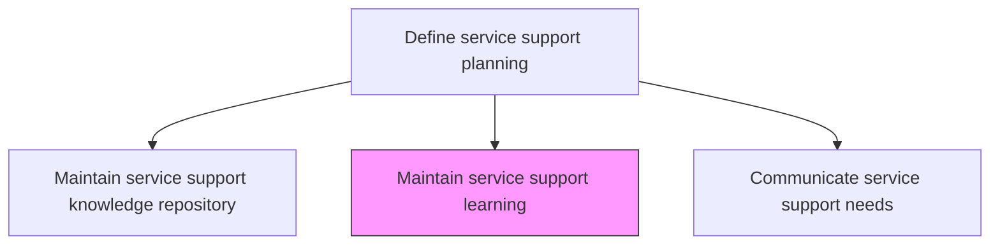
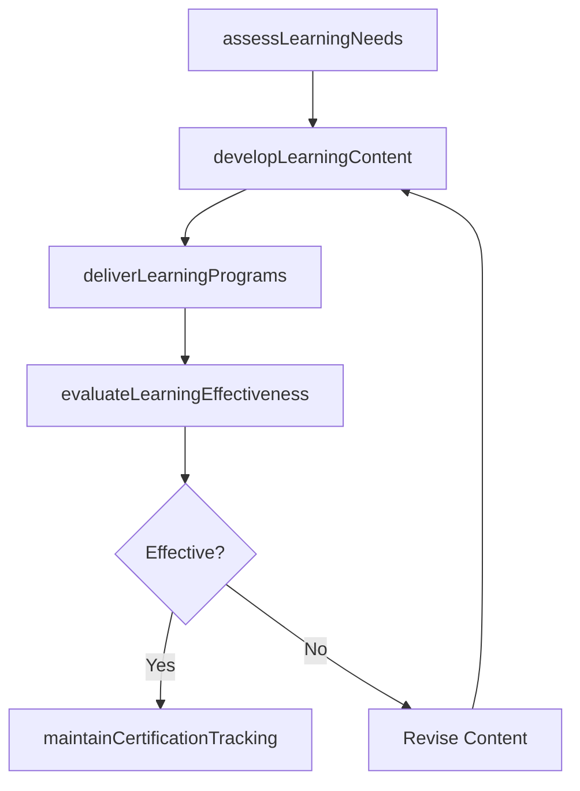

# Maintain service support learning

> Business-as-Code definition for maintaining and delivering ongoing learning and training programs that keep IT support staff current with evolving technologies, processes, and service offerings.

## Overview

Maintaining and transfer of knowledge towards service support with the change/upgrade in technology over a stipulated period. Ensure IT staff is well trained and tested on the new learning of service support.

## Process Hierarchy



## GraphDL

```yaml
maintain:
  object: Service Support Learning
  actor: SupportLearningManager
  result: LearningProgramStatus
```

## Actions

| Action | Description |
|--------|-------------|
| assessLearningNeeds | Identify training gaps based on skill assessments, new technologies, and process changes |
| developLearningContent | Create or procure training materials covering technical skills and support processes |
| deliverLearningPrograms | Facilitate training through instructor-led, e-learning, and on-the-job methods |
| evaluateLearningEffectiveness | Measure training impact on support quality and resolution performance |
| maintainCertificationTracking | Track staff certifications, expirations, and renewal requirements |

## Events

| Event | Description |
|-------|-------------|
| learningNeedsAssessed | Training gaps identified from assessments and change data |
| learningContentDeveloped | Training materials created or procured |
| learningProgramsDelivered | Training facilitated through approved delivery methods |
| learningEffectivenessEvaluated | Training impact on support quality measured |
| certificationTrackingMaintained | Staff certifications and renewals tracked |

## Searches

| Search | Description |
|--------|-------------|
| getLearningPrograms | Retrieve learning programs filtered by topic, audience, or delivery method |
| getCertificationStatus | Access staff certification status and renewal dates |
| getLearningMetrics | Get training effectiveness metrics and completion rates |

## Process Flow



## RACI Matrix

| Activity | Responsible | Accountable | Consulted | Informed |
|----------|-------------|-------------|-----------|----------|
| assessLearningNeeds | SupportLearningManager | ServiceDeskDirector | TeamLeads | HRTrainingTeam |
| deliverLearningPrograms | SupportLearningManager | ITTrainer | SubjectMatterExperts | TeamLeads |
| evaluateLearningEffectiveness | SupportLearningManager | ServiceDeskDirector | QualityTeam | HRDirector |

## Related Processes

| Process | Relationship |
|---------|-------------|
| 8.7.5.2 Determine required support resource levels | Upstream - resource planning identifies skill requirements |
| 8.7.5.3 Maintain service support knowledge repository | Related - knowledge base content supports learning programs |
| 8.7.5.7 Manage IT service support resources | Related - learning outcomes improve resource capabilities |

## Related Departments

| Department | Role |
|-----------|------|
| IT Training | Develops and delivers support learning programs |
| Service Desk | Participates in training and provides performance feedback |
| Human Resources | Tracks certifications and supports professional development |

## Related Occupations

| Occupation | Involvement |
|-----------|-------------|
| Support Learning Manager | Plans and manages support training programs |
| IT Trainer | Develops and delivers technical training content |
| Certification Coordinator | Tracks certifications and manages renewal schedules |

## KPIs

| KPI | Description | Unit |
|-----|-------------|------|
| Training Completion Rate | Percentage of required training modules completed on time | % |
| Certification Currency Rate | Percentage of staff with current required certifications | % |
| Post-Training Performance Lift | Improvement in resolution metrics after training | % |
| Learning Satisfaction Score | Average participant satisfaction with training programs | Score (1-5) |

## Usage

```typescript
import { maintainServiceSupportLearning } from '@headlessly/maintain-service-support-learning'

const learning = maintainServiceSupportLearning()

// Get learning programs
const programs = await learning.getLearningPrograms({
  topic: 'cloud-infrastructure',
  audience: 'tier-2-support'
})

// Get certification status
const certs = await learning.getCertificationStatus({
  team: 'network-support',
  status: 'expiring-soon'
})
```
