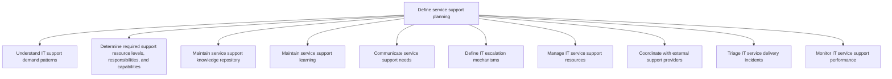
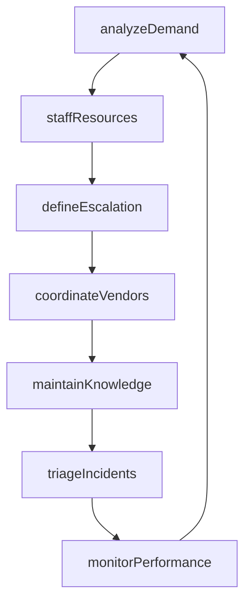

# Define service support planning

> Business-as-Code definition for planning IT service support operations, including demand analysis, resource staffing, knowledge management, escalation mechanisms, vendor coordination, incident triage, and performance monitoring.

## Overview

Develop strategies and methodologies to provide service support. Examine service levels, support complexity, stakeholder requirements to offer service support.

## Process Hierarchy



## GraphDL

```yaml
define:
  object: Service Support Planning
  actor: SupportPlanningManager
  result: SupportOperationalPlan
```

## Actions

| Action | Description |
|--------|-------------|
| analyzeDemand | Evaluate IT support demand patterns and volume trends |
| staffResources | Determine and allocate required support resource levels |
| maintainKnowledge | Update and curate the service support knowledge repository |
| defineEscalation | Establish escalation mechanisms and severity-based routing |
| coordinateVendors | Manage relationships and coordination with external support providers |
| triageIncidents | Sort and prioritize incoming service delivery incidents |
| monitorPerformance | Track and measure IT service support performance metrics |

## Events

| Event | Description |
|-------|-------------|
| demandAnalyzed | Support demand patterns and volume trends evaluated |
| resourcesStaffed | Support resource levels determined and allocated |
| knowledgeMaintained | Knowledge repository updated with latest solutions |
| escalationDefined | Escalation mechanisms and routing rules established |
| vendorsCoordinated | External support provider coordination completed |
| incidentsTriaged | Service delivery incidents prioritized and assigned |
| performanceMonitored | Support performance metrics collected and reported |

## Searches

| Search | Description |
|--------|-------------|
| getDemandForecast | Retrieve support demand projections by category and period |
| getKnowledgeArticles | Search the knowledge repository for solutions by topic |
| getEscalationPaths | List escalation paths by severity and service category |
| getPerformanceMetrics | Retrieve support performance metrics for a given period |
| findVendorContracts | List external support provider contracts and SLAs |

## Process Flow



## RACI Matrix

| Activity | Responsible | Accountable | Consulted | Informed |
|----------|-------------|-------------|-----------|----------|
| analyzeDemand | SupportAnalyst | SupportPlanningManager | ServiceDeskManager | Finance |
| staffResources | SupportPlanningManager | VP IT Operations | HumanResources | SupportStaff |
| defineEscalation | SupportPlanningManager | VP IT Operations | TechnicalLeads | ServiceDesk |
| monitorPerformance | PerformanceAnalyst | SupportPlanningManager | ServiceDeskManager | ExecutiveTeam |

## Sub-Processes

| ID | Name | Description |
|----|------|-------------|
| 8.7.5.1 | Understand IT support demand patterns | Evaluate criticality catered by the IT support and expectations to resolve raised or identified issu |
| 8.7.5.2 | Determine required support resource levels, responsibilities, and capabilities | Determining levels of required support resources along with their responsibilities, and capabilities |
| 8.7.5.3 | Maintain service support knowledge repository | Create and maintain service support knowledge repository. Store, maintain, access, revise, and use k |
| 8.7.5.4 | Maintain service support learning | Maintaining and transfer of knowledge towards service support with the change/upgrade in technology  |
| 8.7.5.5 | Communicate service support needs | Conveying service support needs within the organization, with the objective of providing required su |
| 8.7.5.6 | Define IT escalation mechanisms | Determining mechanisms to report for a higher degree of decision making depending on the criticality |
| 8.7.5.7 | Manage IT service support resources | Managing resources required for administration of IT service support. Establish sources that will ma |
| 8.7.5.8 | Coordinate with external support providers | Developing a strategy that will make use of multiple resources to coordinate with external support p |
| 8.7.5.9 | Triage IT service delivery incidents | Sorting the incidents of IT service delivery in certain order so that the services could be delivere |
| 8.7.5.10 | Monitor IT service support performance | Defining methodology and frequency of assessment for measuring and monitoring performance of various |

## Related Processes

| Process | Relationship |
|---------|-------------|
| 8.7.2 Define and develop service support strategy | Upstream - support strategy guides planning activities |
| 8.7.8 Operate IT user support | Downstream - support plan defines how user support operates |
| 8.7.6 Develop and manage service delivery operations | Parallel - support planning aligns with delivery operations |

## Related Departments

| Department | Role |
|-----------|------|
| Service Desk | Executes support based on the planning framework |
| Knowledge Management | Maintains the support knowledge repository |
| Vendor Management | Coordinates with external support providers |
| Workforce Planning | Staffs support teams based on demand analysis |

## Related Occupations

| Occupation | Involvement |
|-----------|-------------|
| Support Planning Manager | Develops the support operational plan |
| Knowledge Manager | Curates the support knowledge repository |
| Workforce Planner | Forecasts staffing based on demand patterns |

## KPIs

| KPI | Description | Unit |
|-----|-------------|------|
| Demand Forecast Accuracy | Variance between forecasted and actual support volume | % |
| Knowledge Article Utilization | Percentage of incidents resolved using knowledge articles | % |
| Escalation Rate | Percentage of incidents requiring escalation to higher tiers | % |
| Vendor SLA Compliance | Percentage of external vendor responses within contracted SLAs | % |
| Support Staff Utilization | Average utilization of support personnel | % |

## Usage

```typescript
import { defineServiceSupportPlanning } from '@headlessly/define-service-support-planning'

const planning = defineServiceSupportPlanning()

// Analyze support demand
const demand = await planning.analyzeDemand({
  period: '2025-Q3',
  categories: ['hardware', 'software', 'network', 'access']
})

// Define escalation paths
await planning.defineEscalation({
  severity: 'P1',
  initialTeam: 'service-desk',
  escalationPath: ['tier-2-apps', 'tier-3-engineering', 'vendor-support'],
  timeThresholds: [15, 60, 240]
})

// Monitor performance
const metrics = await planning.getPerformanceMetrics({
  period: '2025-Q2',
  metrics: ['first-contact-resolution', 'mean-time-to-resolve', 'customer-satisfaction']
})
```
