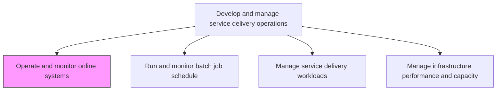
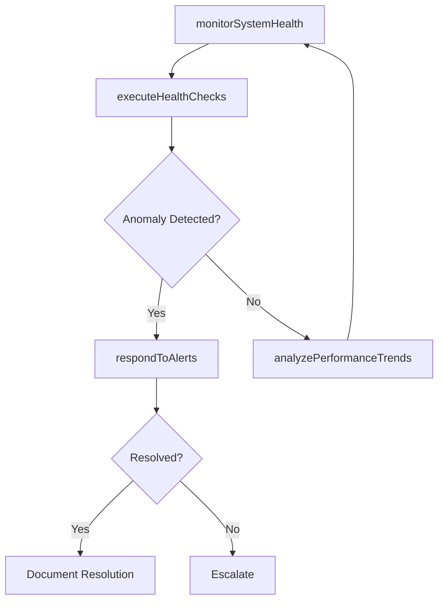

# Operate and monitor online systems

> Business-as-Code definition for online systems operations and monitoring. Models the continuous supervision, health checking, performance measurement, and incident detection of production IT systems and services.

## Overview

Operating online systems and defining methodologies for assessing, measuring, and monitoring their performance against expected service levels. This process encompasses real-time surveillance of application and infrastructure health, automated alerting when thresholds are breached, trend analysis to detect degradation before it impacts users, and proactive capacity management to maintain system availability. It ensures that all production systems meet their defined service level objectives and that operations teams can respond rapidly to anomalies.

## Process Hierarchy



## GraphDL

```yaml
operate:
  object: And Monitor Online Systems
  actor: ITOperationsEngineer
  result: SystemHealthReport
```

## Actions

| Action | Description |
|--------|-------------|
| monitorSystemHealth | Continuously track availability, response time, and error rates of online systems |
| configureAlerts | Define thresholds and notification rules for system performance metrics |
| analyzePerformanceTrends | Review historical data to identify degradation patterns and capacity risks |
| executeHealthChecks | Run automated and manual health checks against production systems |
| respondToAlerts | Investigate triggered alerts and initiate corrective actions |

## Events

| Event | Description |
|-------|-------------|
| systemHealthMonitored | System health metrics collected and dashboards updated |
| alertsConfigured | Performance thresholds and notification rules deployed |
| performanceTrendsAnalyzed | Historical performance analysis completed with findings |
| healthChecksExecuted | Automated health check cycle completed across systems |
| alertResponded | Triggered alert investigated and corrective action initiated |

## Searches

| Search | Description |
|--------|-------------|
| getSystemStatus | Retrieve current health and availability status of online systems |
| findActiveAlerts | List currently active alerts by severity, system, or time range |
| getPerformanceHistory | Query historical performance metrics for trend analysis |
| findDegradedSystems | Identify systems operating below defined service level thresholds |

## Process Flow



## RACI Matrix

| Activity | Responsible | Accountable | Consulted | Informed |
|----------|-------------|-------------|-----------|----------|
| monitorSystemHealth | ITOperationsEngineer | ITOperationsManager | ApplicationOwners | ServiceDeskManager |
| configureAlerts | ITOperationsEngineer | ITOperationsManager | EnterpriseArchitect | IncidentManager |
| respondToAlerts | ITOperationsEngineer | IncidentManager | ApplicationSupport | BusinessOwners |
| analyzePerformanceTrends | PerformanceAnalyst | ITOperationsManager | CapacityPlanner | CIO |

## Related Processes

| Process | Relationship |
|---------|-------------|
| 8.7.6.4 Manage infrastructure performance and capacity | Parallel - capacity management uses monitoring data |
| 8.7.6.5 Respond to unplanned operational issues | Downstream - monitoring alerts trigger incident response |
| 8.7.3.1 Plan operational activities for IT service delivery | Upstream - operational plans define monitoring requirements |

## Related Departments

| Department | Role |
|-----------|------|
| IT Operations | Primary owner of system monitoring and health management |
| Network Operations Center | Provides 24/7 monitoring coverage and initial alert response |
| Application Support | Responds to application-layer issues identified by monitoring |
| IT Security | Reviews monitoring data for security anomalies |

## Related Occupations

| Occupation | Involvement |
|-----------|-------------|
| IT Operations Engineer | Executes monitoring, alert response, and health checks |
| Systems Administrator | Maintains monitoring infrastructure and configurations |
| Performance Analyst | Analyzes trends and recommends capacity improvements |

## KPIs

| KPI | Description | Unit |
|-----|-------------|------|
| System Availability | Percentage of time online systems are operational | % |
| Mean Time to Detect | Average time between incident occurrence and alert trigger | Minutes |
| Alert Noise Ratio | Percentage of alerts that are false positives | % |
| SLA Compliance Rate | Percentage of systems meeting defined service level targets | % |

## Usage

```typescript
import { operateAndMonitorOnlineSystems } from '@headlessly/operate-and-monitor-online-systems'

const operations = operateAndMonitorOnlineSystems()

// Monitor system health
const status = await operations.monitorSystemHealth({
  systems: ['crm-prod', 'erp-prod', 'web-frontend'],
  metrics: ['availability', 'response-time', 'error-rate']
})

// Configure alert thresholds
await operations.configureAlerts({
  system: 'crm-prod',
  rules: [
    { metric: 'response-time', threshold: 2000, unit: 'ms', severity: 'warning' },
    { metric: 'error-rate', threshold: 5, unit: 'percent', severity: 'critical' }
  ]
})

// Analyze performance trends
const trends = await operations.analyzePerformanceTrends({
  system: 'erp-prod',
  period: '30-days',
  granularity: 'hourly'
})
```
