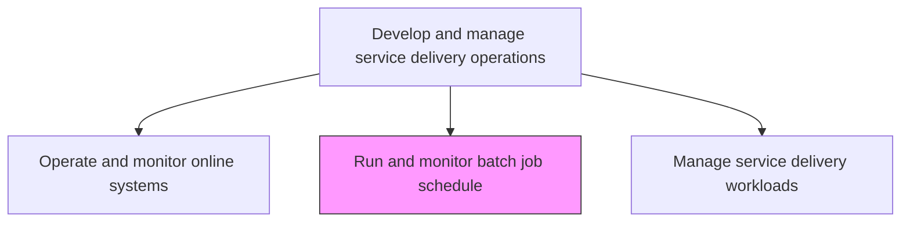
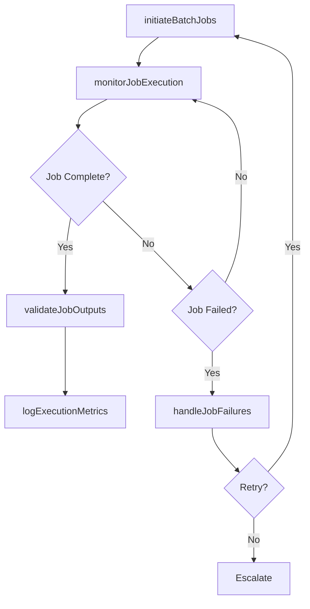

# Run and monitor batch job schedule

> Business-as-Code definition for executing and monitoring automated batch job schedules in the production environment, ensuring jobs complete successfully within defined windows and triggering alerts for failures.

## Overview

Operate and monitor the application of scheduling batch jobs to be run in the background at a certain date and time.

## Process Hierarchy



## GraphDL

```yaml
run:
  object: And Monitor Batch Job Schedule
  actor: BatchOperationsEngineer
  result: BatchExecutionReport
```

## Actions

| Action | Description |
|--------|-------------|
| initiateBatchJobs | Start scheduled batch jobs according to the approved execution calendar |
| monitorJobExecution | Track real-time progress, resource consumption, and completion status of running jobs |
| handleJobFailures | Detect failed jobs, execute retry logic, and escalate persistent failures |
| validateJobOutputs | Verify batch job outputs for completeness and data integrity |
| logExecutionMetrics | Record job execution times, resource usage, and success/failure statistics |

## Events

| Event | Description |
|-------|-------------|
| batchJobsInitiated | Scheduled batch jobs started per execution calendar |
| jobExecutionMonitored | Real-time progress and resource consumption tracked |
| jobFailuresHandled | Failed jobs detected and retry or escalation executed |
| jobOutputsValidated | Batch outputs verified for completeness and integrity |
| executionMetricsLogged | Execution times and statistics recorded |

## Searches

| Search | Description |
|--------|-------------|
| getBatchJobStatus | Retrieve real-time status of running and completed batch jobs |
| getJobExecutionHistory | Access historical execution metrics for specific batch jobs |
| getFailedJobs | List failed batch jobs with error details and retry status |

## Process Flow



## RACI Matrix

| Activity | Responsible | Accountable | Consulted | Informed |
|----------|-------------|-------------|-----------|----------|
| initiateBatchJobs | BatchOperationsEngineer | ITOperationsManager | BatchScheduleAdmin | ApplicationTeams |
| handleJobFailures | BatchOperationsEngineer | ITOperationsManager | ApplicationSupport | DatabaseAdmin |
| validateJobOutputs | BatchOperationsEngineer | DataQualityAnalyst | ApplicationTeams | BusinessUsers |

## Related Processes

| Process | Relationship |
|---------|-------------|
| 8.7.3.1.2 Maintain/optimize batch job schedule | Upstream - optimized schedule executed in operations |
| 8.7.6.3 Manage service delivery workloads | Related - batch jobs contribute to overall workload management |
| 8.7.6.5 Respond to unplanned operational issues | Downstream - batch failures may trigger operational response |

## Related Departments

| Department | Role |
|-----------|------|
| IT Operations | Executes and monitors batch job schedules |
| Application Support | Provides job-specific troubleshooting for failures |
| Data Management | Validates data integrity of batch outputs |

## Related Occupations

| Occupation | Involvement |
|-----------|-------------|
| Batch Operations Engineer | Initiates, monitors, and troubleshoots batch jobs |
| Workload Automation Specialist | Manages automation tooling for batch execution |
| Data Quality Analyst | Validates output integrity and completeness |

## KPIs

| KPI | Description | Unit |
|-----|-------------|------|
| Batch Job Success Rate | Percentage of batch jobs completing successfully | % |
| Batch Window Adherence | Percentage of jobs completing within scheduled windows | % |
| Mean Time to Recovery | Average time to recover from batch job failures | Minutes |
| Output Validation Pass Rate | Percentage of batch outputs passing integrity checks | % |

## Usage

```typescript
import { runAndMonitorBatchJobSchedule } from '@headlessly/run-and-monitor-batch-job-schedule'

const batchOps = runAndMonitorBatchJobSchedule()

// Get batch job status
const status = await batchOps.getBatchJobStatus({
  window: 'overnight',
  status: 'running'
})

// Get failed jobs
const failures = await batchOps.getFailedJobs({
  date: '2024-12-01',
  retryStatus: 'exhausted'
})
```
