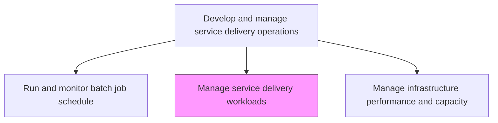
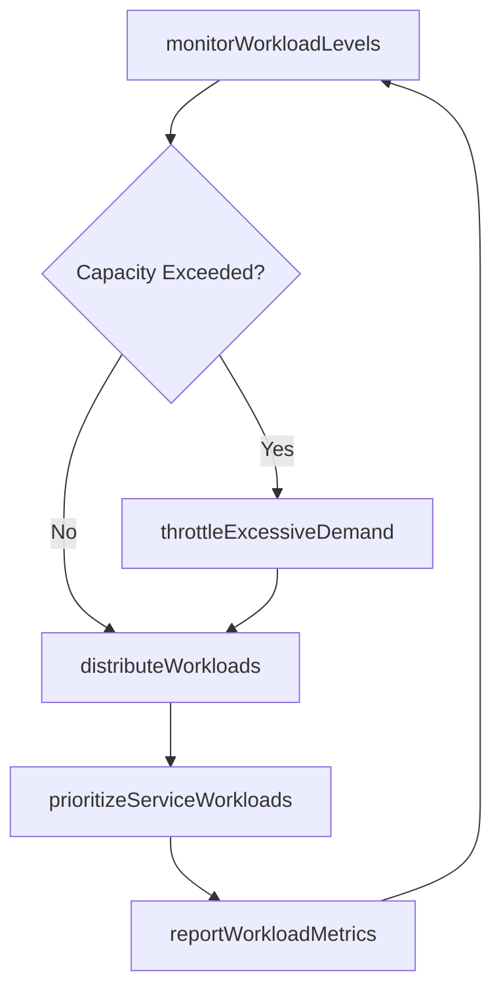

# Manage service delivery workloads

> Business-as-Code definition for managing IT service delivery workloads by monitoring, distributing, and optimizing processing demands across infrastructure to maintain service performance and availability.

## Overview

Analyze and manage workload needs in relation to service delivery. Plan resources and mechanism around those workload needs so that services could be delivered smoothly.

## Process Hierarchy



## GraphDL

```yaml
manage:
  object: Service Delivery Workloads
  actor: WorkloadManager
  result: WorkloadManagementReport
```

## Actions

| Action | Description |
|--------|-------------|
| monitorWorkloadLevels | Track real-time processing demand and queue depths across service delivery systems |
| distributeWorkloads | Route processing requests to available resources using load balancing strategies |
| throttleExcessiveDemand | Apply rate limiting and queuing when demand exceeds available capacity |
| prioritizeServiceWorkloads | Assign processing priority based on service criticality and business impact |
| reportWorkloadMetrics | Produce workload distribution and performance reports for operations management |

## Events

| Event | Description |
|-------|-------------|
| workloadLevelsMonitored | Processing demand and queue depths tracked in real time |
| workloadsDistributed | Processing requests routed using load balancing |
| excessiveDemandThrottled | Rate limiting applied when demand exceeds capacity |
| serviceWorkloadsPrioritized | Processing priorities assigned by criticality |
| workloadMetricsReported | Distribution and performance reports produced |

## Searches

| Search | Description |
|--------|-------------|
| getWorkloadMetrics | Retrieve current workload levels and distribution across systems |
| getQueueDepths | Access processing queue depths and wait times by service |
| getWorkloadHistory | Get historical workload patterns for capacity trending |

## Process Flow



## RACI Matrix

| Activity | Responsible | Accountable | Consulted | Informed |
|----------|-------------|-------------|-----------|----------|
| monitorWorkloadLevels | WorkloadManager | ITOperationsManager | InfrastructureTeam | CapacityPlanner |
| distributeWorkloads | WorkloadManager | ITOperationsManager | NetworkTeam | CloudOperations |
| prioritizeServiceWorkloads | WorkloadManager | ServiceLevelManager | BusinessLiaison | ITDirector |

## Related Processes

| Process | Relationship |
|---------|-------------|
| 8.7.3.1.5 Balance operational workloads across available infrastructure components | Related - workload balancing supports delivery management |
| 8.7.6.4 Manage infrastructure performance and capacity | Downstream - workload levels drive capacity management actions |
| 8.7.6.1 Operate and monitor online systems | Related - online system operations generate workloads |

## Related Departments

| Department | Role |
|-----------|------|
| IT Operations | Manages day-to-day workload distribution and monitoring |
| Capacity Management | Provides capacity data for workload distribution decisions |
| Cloud Operations | Manages cloud-based workload scaling and distribution |

## Related Occupations

| Occupation | Involvement |
|-----------|-------------|
| Workload Manager | Monitors and distributes processing workloads |
| Site Reliability Engineer | Ensures workload distribution maintains service reliability |
| Capacity Planner | Provides capacity projections for workload planning |

## KPIs

| KPI | Description | Unit |
|-----|-------------|------|
| Workload Balance Index | Evenness of workload distribution across infrastructure | Score (0-1) |
| Queue Wait Time | Average time requests spend waiting in processing queues | Seconds |
| Throttle Event Frequency | Number of times rate limiting was triggered per day | Count/Day |
| Service Priority Compliance | Percentage of workloads processed at correct priority level | % |

## Usage

```typescript
import { manageServiceDeliveryWorkloads } from '@headlessly/manage-service-delivery-workloads'

const workloads = manageServiceDeliveryWorkloads()

// Get workload metrics
const metrics = await workloads.getWorkloadMetrics({
  system: 'api-gateway',
  period: 'last-1-hour'
})

// Get queue depths
const queues = await workloads.getQueueDepths({
  service: 'order-processing',
  status: 'active'
})
```
