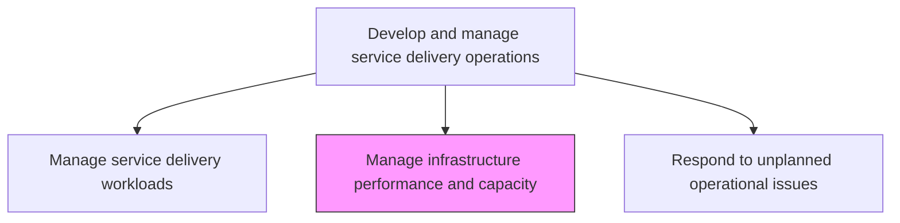
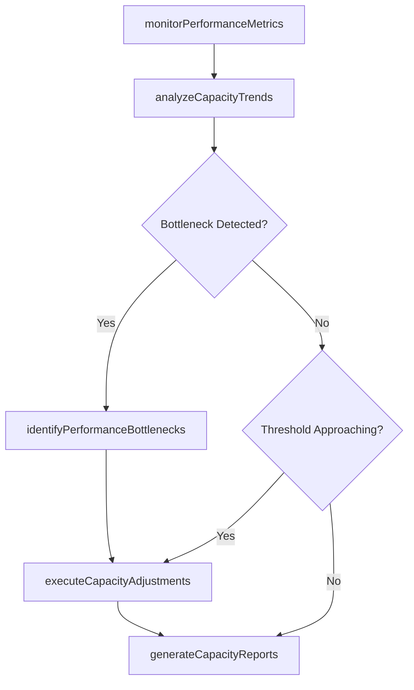

# Manage infrastructure performance and capacity

> Business-as-Code definition for managing IT infrastructure performance and capacity by monitoring resource utilization, identifying bottlenecks, and ensuring infrastructure meets current and projected service demands.

## Overview

Managing the performance and capacity of infrastructure by using key performance indicators to routinely track the performance and capacity levels. Review performance. Evaluate the efficiency and effectiveness of the infrastructure.

## Process Hierarchy



## GraphDL

```yaml
manage:
  object: Infrastructure Performance And Capacity
  actor: CapacityPerformanceManager
  result: PerformanceCapacityReport
```

## Actions

| Action | Description |
|--------|-------------|
| monitorPerformanceMetrics | Track CPU, memory, disk, network, and application response time metrics continuously |
| analyzeCapacityTrends | Evaluate resource consumption trends to project future capacity needs |
| identifyPerformanceBottlenecks | Detect components or services degrading overall system performance |
| executeCapacityAdjustments | Scale resources up or down based on current demand and projections |
| generateCapacityReports | Produce capacity utilization and performance trend reports for planning |

## Events

| Event | Description |
|-------|-------------|
| performanceMetricsMonitored | Infrastructure performance metrics tracked continuously |
| capacityTrendsAnalyzed | Resource consumption trends evaluated for projections |
| performanceBottlenecksIdentified | Components degrading performance detected |
| capacityAdjustmentsExecuted | Resources scaled based on demand and projections |
| capacityReportsGenerated | Utilization and trend reports produced |

## Searches

| Search | Description |
|--------|-------------|
| getPerformanceMetrics | Retrieve real-time performance metrics by component or service |
| getCapacityForecasts | Access capacity utilization forecasts and exhaustion projections |
| getBottleneckAlerts | List active performance bottleneck alerts with severity |

## Process Flow



## RACI Matrix

| Activity | Responsible | Accountable | Consulted | Informed |
|----------|-------------|-------------|-----------|----------|
| monitorPerformanceMetrics | CapacityPerformanceManager | ITOperationsManager | InfrastructureTeam | ApplicationTeams |
| identifyPerformanceBottlenecks | CapacityPerformanceManager | InfrastructureManager | NetworkTeam | DatabaseAdmin |
| executeCapacityAdjustments | InfrastructureEngineer | CapacityPerformanceManager | CloudArchitect | FinanceTeam |

## Related Processes

| Process | Relationship |
|---------|-------------|
| 8.7.6.3 Manage service delivery workloads | Upstream - workload levels drive capacity management actions |
| 8.7.4.3 Determine ongoing IT infrastructure capabilities | Related - capability assessments inform performance baselines |
| 8.7.6.5 Respond to unplanned operational issues | Downstream - performance degradation triggers operational response |

## Related Departments

| Department | Role |
|-----------|------|
| Capacity Management | Monitors utilization and produces capacity forecasts |
| Infrastructure Engineering | Executes capacity adjustments and scaling |
| IT Operations | Monitors performance and responds to bottleneck alerts |

## Related Occupations

| Occupation | Involvement |
|-----------|-------------|
| Capacity Performance Manager | Oversees performance monitoring and capacity planning |
| Infrastructure Engineer | Executes scaling and performance optimization tasks |
| Performance Analyst | Analyzes trends and produces capacity forecasts |

## KPIs

| KPI | Description | Unit |
|-----|-------------|------|
| Infrastructure Availability | Percentage uptime of critical infrastructure components | % |
| Capacity Utilization | Average resource utilization across infrastructure | % |
| Performance SLA Compliance | Percentage of performance metrics within SLA targets | % |
| Capacity Forecast Accuracy | Deviation between forecast and actual capacity needs | % |

## Usage

```typescript
import { manageInfrastructurePerformanceAndCapacity } from '@headlessly/manage-infrastructure-performance-and-capacity'

const perfCapacity = manageInfrastructurePerformanceAndCapacity()

// Get performance metrics
const metrics = await perfCapacity.getPerformanceMetrics({
  component: 'database-cluster',
  metric: 'responseTime'
})

// Get capacity forecasts
const forecast = await perfCapacity.getCapacityForecasts({
  resource: 'storage',
  horizon: '6-months'
})
```
