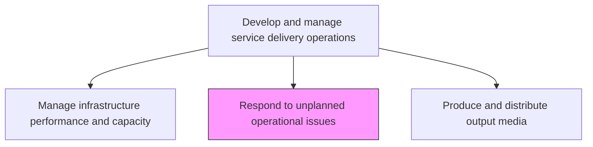
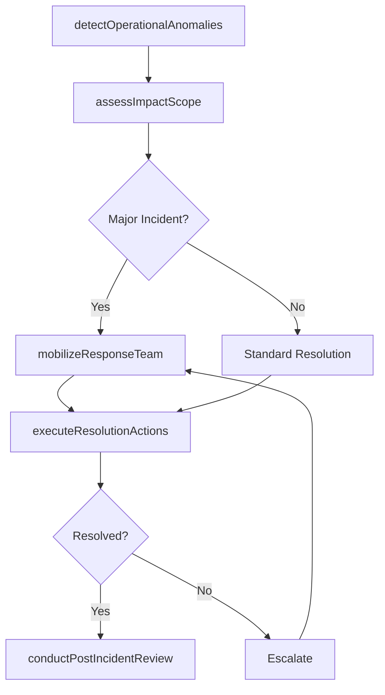

# Respond to unplanned operational issues

> Business-as-Code definition for responding to unplanned operational issues such as system outages, performance degradation, and infrastructure failures through rapid detection, diagnosis, and resolution.

## Overview

Addressing to an issue in operational activities within the IT function, that occur outside of normal routine or preventative maintenance.

## Process Hierarchy



## GraphDL

```yaml
respond:
  object: To Unplanned Operational Issues
  actor: OperationalResponseLead
  result: IncidentResponseRecord
```

## Actions

| Action | Description |
|--------|-------------|
| detectOperationalAnomalies | Identify system anomalies through monitoring alerts and user reports |
| assessImpactScope | Determine the scope and business impact of the operational issue |
| mobilizeResponseTeam | Assemble the appropriate technical team to diagnose and resolve the issue |
| executeResolutionActions | Implement fixes, workarounds, or failover procedures to restore service |
| conductPostIncidentReview | Analyze the incident to identify root causes and preventive measures |

## Events

| Event | Description |
|-------|-------------|
| operationalAnomaliesDetected | System anomalies identified through monitoring or user reports |
| impactScopeAssessed | Scope and business impact of issue determined |
| responseTeamMobilized | Technical team assembled for diagnosis and resolution |
| resolutionActionsExecuted | Fixes or failover procedures implemented to restore service |
| postIncidentReviewConducted | Root causes analyzed and preventive measures identified |

## Searches

| Search | Description |
|--------|-------------|
| getActiveIncidents | Retrieve active operational incidents with status and severity |
| getIncidentTimeline | Access detailed timeline of events for a specific incident |
| getPostIncidentReviews | Get post-incident review reports with root cause analysis |

## Process Flow



## RACI Matrix

| Activity | Responsible | Accountable | Consulted | Informed |
|----------|-------------|-------------|-----------|----------|
| detectOperationalAnomalies | OperationalResponseLead | ITOperationsManager | MonitoringTeam | ServiceDeskManager |
| mobilizeResponseTeam | OperationalResponseLead | IncidentManager | TierLeads | ITDirector |
| conductPostIncidentReview | OperationalResponseLead | ProblemManager | AllResolvers | ITServiceDirector |

## Related Processes

| Process | Relationship |
|---------|-------------|
| 8.7.6.4 Manage infrastructure performance and capacity | Upstream - performance monitoring detects operational issues |
| 8.7.5.9 Triage IT service delivery incidents | Related - incident triage feeds operational response |
| 8.7.6.8 Manage IT infrastructure/data recovery | Downstream - recovery procedures invoked for major outages |

## Related Departments

| Department | Role |
|-----------|------|
| IT Operations | Leads operational incident detection and response |
| Incident Management | Coordinates major incident response and communications |
| Problem Management | Conducts post-incident reviews and root cause analysis |

## Related Occupations

| Occupation | Involvement |
|-----------|-------------|
| Operational Response Lead | Coordinates detection, diagnosis, and resolution of issues |
| Incident Manager | Leads major incident response and stakeholder communications |
| Problem Manager | Conducts root cause analysis and preventive planning |

## KPIs

| KPI | Description | Unit |
|-----|-------------|------|
| Mean Time to Detect | Average time from issue occurrence to detection | Minutes |
| Mean Time to Resolve | Average time from detection to full service restoration | Minutes |
| Major Incident Frequency | Number of major operational incidents per month | Count/Month |
| Post-Incident Action Completion | Percentage of post-incident actions completed on time | % |

## Usage

```typescript
import { respondToUnplannedOperationalIssues } from '@headlessly/respond-to-unplanned-operational-issues'

const incidentResponse = respondToUnplannedOperationalIssues()

// Get active incidents
const incidents = await incidentResponse.getActiveIncidents({
  severity: 'critical',
  status: 'in-progress'
})

// Get post-incident reviews
const reviews = await incidentResponse.getPostIncidentReviews({
  period: 'last-quarter',
  actionStatus: 'overdue'
})
```
