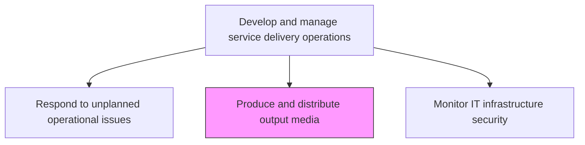
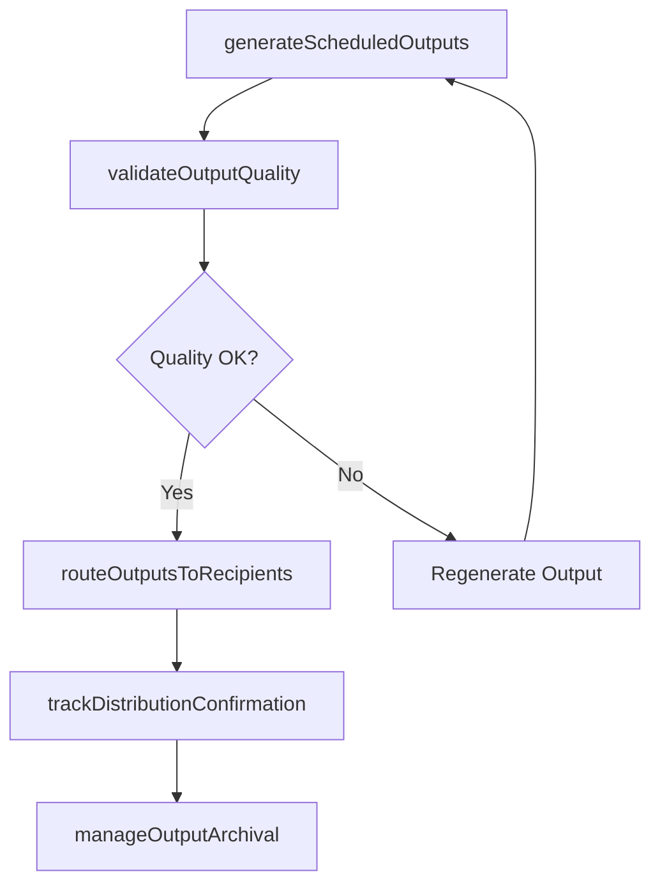

# Produce and distribute output media

> Business-as-Code definition for producing and distributing output media including printed reports, electronic documents, data exports, and scheduled deliverables generated by IT processing systems.

## Overview

Identify and introduce resources to display output in a viewable form to key decision makers and evaluators.

## Process Hierarchy



## GraphDL

```yaml
produce:
  object: And Distribute Output Media
  actor: OutputMediaManager
  result: OutputDistributionRecord
```

## Actions

| Action | Description |
|--------|-------------|
| generateScheduledOutputs | Produce reports, data exports, and documents on defined schedules |
| validateOutputQuality | Verify output completeness, formatting, and data accuracy before distribution |
| routeOutputsToRecipients | Distribute outputs to designated recipients through appropriate channels |
| manageOutputArchival | Archive produced outputs according to retention policies and compliance requirements |
| trackDistributionConfirmation | Confirm delivery receipts and monitor recipient acknowledgment of outputs |

## Events

| Event | Description |
|-------|-------------|
| scheduledOutputsGenerated | Reports and data exports produced on schedule |
| outputQualityValidated | Output completeness and accuracy verified |
| outputsRoutedToRecipients | Outputs distributed through appropriate channels |
| outputArchivalManaged | Outputs archived per retention policies |
| distributionConfirmationTracked | Delivery receipts and acknowledgments monitored |

## Searches

| Search | Description |
|--------|-------------|
| getOutputSchedule | Retrieve the output production schedule filtered by type, recipient, or frequency |
| getDistributionStatus | Access delivery status for distributed outputs |
| getOutputArchive | Search archived outputs by type, date, or recipient |

## Process Flow



## RACI Matrix

| Activity | Responsible | Accountable | Consulted | Informed |
|----------|-------------|-------------|-----------|----------|
| generateScheduledOutputs | OutputMediaManager | ITOperationsManager | ApplicationTeams | ReportingTeam |
| validateOutputQuality | OutputMediaManager | DataQualityAnalyst | BusinessUsers | ComplianceTeam |
| routeOutputsToRecipients | OutputMediaManager | ITOperationsManager | DistributionTeam | Recipients |

## Related Processes

| Process | Relationship |
|---------|-------------|
| 8.7.6.2 Run and monitor batch job schedule | Upstream - batch jobs produce outputs for distribution |
| 8.4.4.1 Maintain business information feeds and repositories | Related - output media feeds information repositories |
| 8.7.6.1 Operate and monitor online systems | Related - online systems generate real-time outputs |

## Related Departments

| Department | Role |
|-----------|------|
| IT Operations | Manages output production and distribution schedules |
| Report Management | Validates output quality and manages distribution routing |
| Data Management | Ensures output data accuracy and archival compliance |

## Related Occupations

| Occupation | Involvement |
|-----------|-------------|
| Output Media Manager | Coordinates output production and distribution |
| Report Analyst | Validates output quality and formatting |
| Distribution Coordinator | Routes outputs and tracks delivery confirmations |

## KPIs

| KPI | Description | Unit |
|-----|-------------|------|
| Output Delivery Timeliness | Percentage of outputs delivered on or before scheduled time | % |
| Output Quality Rate | Percentage of outputs passing quality validation on first attempt | % |
| Distribution Confirmation Rate | Percentage of outputs with confirmed delivery receipts | % |
| Archive Compliance Rate | Percentage of outputs archived per retention policies | % |

## Usage

```typescript
import { produceAndDistributeOutputMedia } from '@headlessly/produce-and-distribute-output-media'

const outputMedia = produceAndDistributeOutputMedia()

// Get output schedule
const schedule = await outputMedia.getOutputSchedule({
  type: 'financial-reports',
  frequency: 'monthly'
})

// Check distribution status
const status = await outputMedia.getDistributionStatus({
  outputId: 'monthly-sales-report-nov',
  recipient: 'finance-team'
})
```
