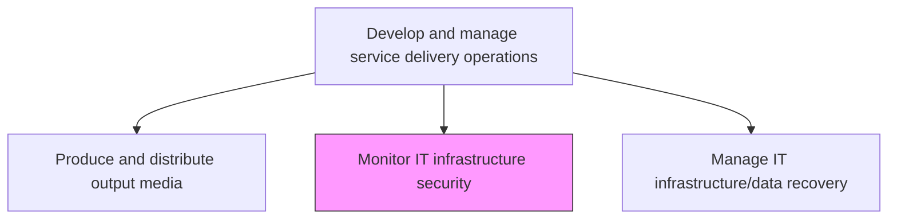
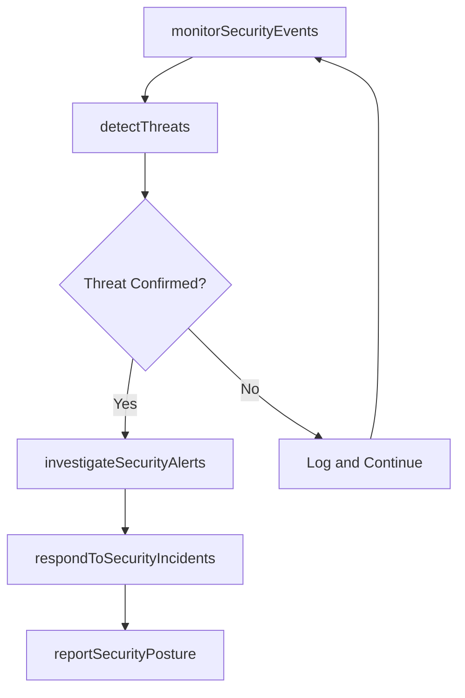

# Monitor IT infrastructure security

> Business-as-Code definition for monitoring IT infrastructure security by detecting threats, vulnerabilities, and unauthorized access attempts through continuous surveillance of network, system, and application security events.

## Overview

Identifying, examining, and recognizing any flaw or breach in security of IT infrastructure. Ensure that protocols and guidelines for individual IT components are being followed and there is no misuse of information and breach of individual or organizational privacy.

## Process Hierarchy



## GraphDL

```yaml
monitor:
  object: IT Infrastructure Security
  actor: SecurityOperationsAnalyst
  result: SecurityMonitoringReport
```

## Actions

| Action | Description |
|--------|-------------|
| monitorSecurityEvents | Continuously analyze security logs, alerts, and events from infrastructure components |
| detectThreats | Identify potential security threats using SIEM correlation, anomaly detection, and threat intelligence |
| investigateSecurityAlerts | Analyze flagged security events to determine if they represent genuine threats |
| respondToSecurityIncidents | Execute containment, eradication, and recovery procedures for confirmed threats |
| reportSecurityPosture | Generate security posture reports with threat summaries and risk assessments |

## Events

| Event | Description |
|-------|-------------|
| securityEventsMonitored | Security logs and alerts analyzed from infrastructure components |
| threatsDetected | Potential security threats identified through analysis |
| securityAlertsInvestigated | Flagged events analyzed for genuine threat determination |
| securityIncidentsResponded | Containment and recovery executed for confirmed threats |
| securityPostureReported | Security posture reports generated with risk assessments |

## Searches

| Search | Description |
|--------|-------------|
| getSecurityAlerts | Retrieve security alerts filtered by severity, source, or type |
| getSecurityIncidents | Access security incident records with investigation status |
| getSecurityPosture | Get current security posture metrics and risk scores |

## Process Flow



## RACI Matrix

| Activity | Responsible | Accountable | Consulted | Informed |
|----------|-------------|-------------|-----------|----------|
| monitorSecurityEvents | SecurityOperationsAnalyst | SOCManager | InfrastructureTeam | NetworkTeam |
| respondToSecurityIncidents | SecurityOperationsAnalyst | IncidentResponseManager | ForensicsTeam | ITDirector |
| reportSecurityPosture | SOCManager | CISO | RiskManagement | ExecutiveTeam |

## Related Processes

| Process | Relationship |
|---------|-------------|
| 8.7.6.4 Manage infrastructure performance and capacity | Related - security monitoring leverages infrastructure metrics |
| 8.7.6.8 Manage IT infrastructure/data recovery | Downstream - security incidents may trigger recovery procedures |
| 8.7.6.5 Respond to unplanned operational issues | Related - security events are a category of operational issues |

## Related Departments

| Department | Role |
|-----------|------|
| Security Operations Center (SOC) | Monitors security events and responds to threats |
| IT Security | Defines security monitoring policies and threat intelligence |
| Risk Management | Assesses security risk and posture reporting |

## Related Occupations

| Occupation | Involvement |
|-----------|-------------|
| Security Operations Analyst | Monitors events and investigates security alerts |
| Incident Response Analyst | Leads containment and recovery for security incidents |
| Threat Intelligence Analyst | Provides threat context and indicators of compromise |

## KPIs

| KPI | Description | Unit |
|-----|-------------|------|
| Mean Time to Detect | Average time from threat occurrence to detection | Minutes |
| False Positive Rate | Percentage of security alerts that are false positives | % |
| Incident Response Time | Average time from detection to containment | Minutes |
| Security Event Coverage | Percentage of infrastructure components with active monitoring | % |

## Usage

```typescript
import { monitorItInfrastructureSecurity } from '@headlessly/monitor-it-infrastructure-security'

const securityMonitor = monitorItInfrastructureSecurity()

// Get security alerts
const alerts = await securityMonitor.getSecurityAlerts({
  severity: 'high',
  source: 'firewall',
  status: 'open'
})

// Get security posture
const posture = await securityMonitor.getSecurityPosture({
  scope: 'enterprise',
  period: 'current-month'
})
```
