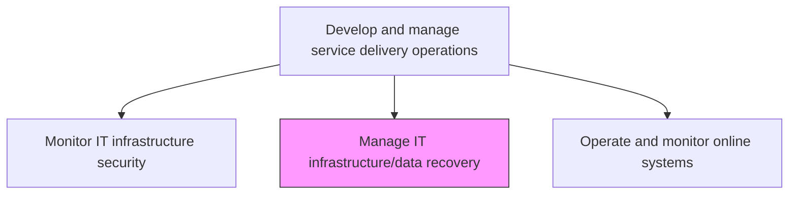
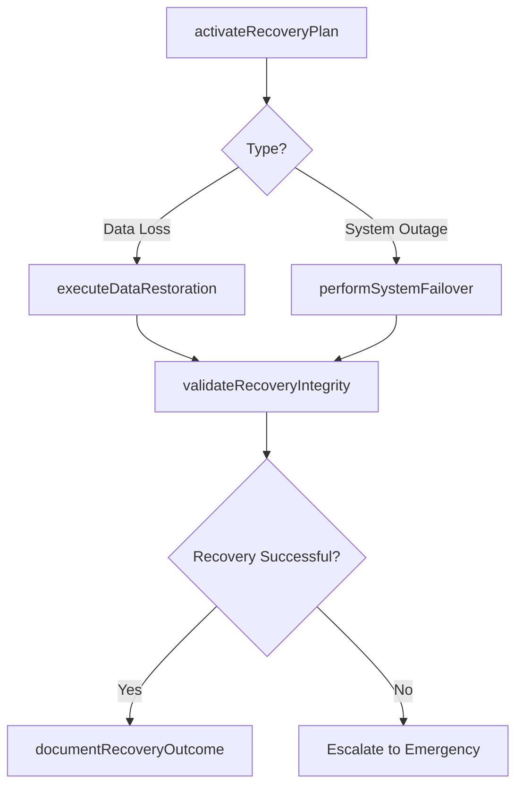

# Manage IT infrastructure/data recovery

> Business-as-Code definition for managing IT infrastructure and data recovery procedures to restore systems and data following disasters, outages, or data loss events using backups, failover, and continuity plans.

## Overview

Managing resources of IT infrastructure and their recovery capacity. Manage storage, computer hardware, software, and infrastructure resources that can be stored as inventory or provided by the organization as needed. Managing backup/recovery for IT services and solutions. Use a backup system or application.

## Process Hierarchy



## GraphDL

```yaml
manage:
  object: IT Infrastructure/data Recovery
  actor: RecoveryManager
  result: RecoveryExecutionRecord
```

## Actions

| Action | Description |
|--------|-------------|
| activateRecoveryPlan | Invoke the appropriate disaster recovery or data recovery plan based on the event type |
| executeDataRestoration | Restore data from backups to the designated recovery target systems |
| performSystemFailover | Switch operations to standby or secondary systems when primary systems are unavailable |
| validateRecoveryIntegrity | Verify that restored systems and data are complete, consistent, and operational |
| documentRecoveryOutcome | Record recovery details including timeline, data loss, and lessons learned |

## Events

| Event | Description |
|-------|-------------|
| recoveryPlanActivated | Disaster or data recovery plan invoked based on event type |
| dataRestorationExecuted | Data restored from backups to recovery target systems |
| systemFailoverPerformed | Operations switched to standby or secondary systems |
| recoveryIntegrityValidated | Restored systems and data verified as complete and operational |
| recoveryOutcomeDocumented | Recovery timeline, data loss, and lessons learned recorded |

## Searches

| Search | Description |
|--------|-------------|
| getRecoveryStatus | Retrieve real-time status of active recovery operations |
| getRecoveryHistory | Access historical recovery records filtered by type, date, or system |
| getBackupAvailability | Check available backup points for specific systems or data sets |

## Process Flow



## RACI Matrix

| Activity | Responsible | Accountable | Consulted | Informed |
|----------|-------------|-------------|-----------|----------|
| activateRecoveryPlan | RecoveryManager | ITDirector | DisasterRecoveryTeam | BusinessContinuityManager |
| executeDataRestoration | BackupEngineer | RecoveryManager | DatabaseAdmin | StorageAdmin |
| validateRecoveryIntegrity | RecoveryManager | QATeam | ApplicationTeams | BusinessUsers |

## Related Processes

| Process | Relationship |
|---------|-------------|
| 8.7.3.1.4 Schedule/optimize backup and archive activities | Upstream - backup schedules provide recovery data sources |
| 8.7.6.7 Monitor IT infrastructure security | Upstream - security incidents may trigger recovery operations |
| 8.7.8.6 Execute IT continuity and recovery action | Related - continuity actions include infrastructure recovery |

## Related Departments

| Department | Role |
|-----------|------|
| Disaster Recovery | Manages recovery plan execution and testing |
| IT Operations | Executes failover and restoration procedures |
| Business Continuity | Coordinates business impact assessment during recovery |

## Related Occupations

| Occupation | Involvement |
|-----------|-------------|
| Recovery Manager | Coordinates recovery plan activation and execution |
| Backup Engineer | Executes data restoration from backup systems |
| Disaster Recovery Specialist | Manages failover procedures and recovery testing |

## KPIs

| KPI | Description | Unit |
|-----|-------------|------|
| Recovery Time Objective Achievement | Percentage of recoveries completed within RTO targets | % |
| Recovery Point Objective Achievement | Percentage of recoveries meeting RPO data loss targets | % |
| Recovery Test Success Rate | Percentage of disaster recovery tests completing successfully | % |
| Data Integrity Validation Rate | Percentage of recovered data passing integrity checks | % |

## Usage

```typescript
import { manageItInfrastructureDataRecovery } from '@headlessly/manage-it-infrastructure-data-recovery'

const recovery = manageItInfrastructureDataRecovery()

// Get recovery status
const status = await recovery.getRecoveryStatus({
  system: 'primary-database',
  type: 'data-restoration'
})

// Check backup availability
const backups = await recovery.getBackupAvailability({
  system: 'production-app-server',
  dateRange: { start: '2024-12-01', end: '2024-12-15' }
})
```
