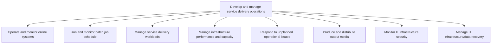
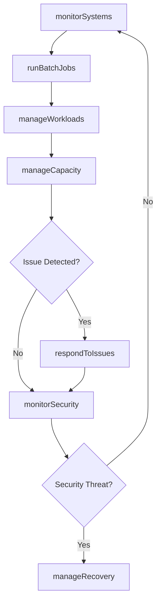

# Develop and manage service delivery operations

> Business-as-Code definition for managing day-to-day IT service delivery operations, including online system monitoring, batch job scheduling, workload management, capacity planning, incident response, security monitoring, and data recovery.

## Overview

Developing and managing different delivery services using service delivery systems for operational activities within the IT function in order to achieve organizations goal.

## Process Hierarchy



## GraphDL

```yaml
develop:
  object: Service Delivery Operations
  actor: OperationsManager
  result: OperationalStatusReport
```

## Actions

| Action | Description |
|--------|-------------|
| monitorSystems | Operate and monitor online systems for availability and performance |
| runBatchJobs | Execute and monitor scheduled batch processing jobs |
| manageWorkloads | Analyze and balance service delivery workloads |
| manageCapacity | Monitor infrastructure performance and adjust capacity |
| respondToIssues | Address unplanned operational issues and outages |
| monitorSecurity | Detect and respond to IT infrastructure security threats |
| manageRecovery | Execute IT infrastructure and data recovery procedures |

## Events

| Event | Description |
|-------|-------------|
| systemsMonitored | Online system monitoring cycle completed |
| batchJobsRun | Batch job schedule executed and results recorded |
| workloadsManaged | Service delivery workloads balanced and optimized |
| capacityManaged | Infrastructure capacity adjusted based on demand |
| issuesResponded | Unplanned operational issue addressed and resolved |
| securityMonitored | Infrastructure security scan completed |
| recoveryManaged | Data recovery or disaster recovery procedure executed |

## Searches

| Search | Description |
|--------|-------------|
| getSystemHealth | Retrieve real-time health status of monitored systems |
| getBatchJobResults | List batch job execution results by status or date |
| getCapacityMetrics | Retrieve infrastructure capacity and utilization metrics |
| findSecurityAlerts | List security alerts filtered by severity or type |
| getRecoveryStatus | Get the status of ongoing recovery operations |

## Process Flow



## RACI Matrix

| Activity | Responsible | Accountable | Consulted | Informed |
|----------|-------------|-------------|-----------|----------|
| monitorSystems | OperationsAnalyst | OperationsManager | InfrastructureTeam | ServiceDesk |
| respondToIssues | IncidentResponder | OperationsManager | TechnicalLeads | ChangeManager |
| monitorSecurity | SecurityAnalyst | SecurityManager | OperationsManager | CIO |
| manageRecovery | DisasterRecoveryLead | OperationsManager | InfrastructureTeam | ExecutiveTeam |

## Sub-Processes

| ID | Name | Description |
|----|------|-------------|
| 8.7.6.1 | Operate and monitor online systems | Operating and defining methodology of assessment for measuring and monitoring performance of online  |
| 8.7.6.2 | Run and monitor batch job schedule | Operate and monitor the application of scheduling batch jobs to be run in the background at a certai |
| 8.7.6.3 | Manage service delivery workloads | Analyze and manage workload needs in relation to service delivery. Plan resources and mechanism arou |
| 8.7.6.4 | Manage infrastructure performance and capacity | Managing the performance and capacity of infrastructure by using key performance indicators to routi |
| 8.7.6.5 | Respond to unplanned operational issues | Addressing to an issue in operational activities within the IT function, that occur outside of norma |
| 8.7.6.6 | Produce and distribute output media | Identify and introduce resources to display output in a viewable form to key decision makers and eva |
| 8.7.6.7 | Monitor IT infrastructure security | Identifying, examining, and recognizing any flaw or breach in security of IT infrastructure. Ensure  |
| 8.7.6.8 | Manage IT infrastructure/data recovery | Managing resources of IT infrastructure and their recovery capacity. Manage storage, computer hardwa |

## Related Processes

| Process | Relationship |
|---------|-------------|
| 8.7.3 Plan and manage service delivery control | Upstream - operational plans guide daily operations |
| 8.7.7 Manage infrastructure resource administration | Parallel - operations depend on administered infrastructure |
| 8.7.8 Operate IT user support | Parallel - operational issues may generate user support requests |

## Related Departments

| Department | Role |
|-----------|------|
| IT Operations | Runs day-to-day service delivery and system monitoring |
| Information Security | Monitors infrastructure security threats |
| Disaster Recovery | Manages backup and recovery operations |
| Network Operations | Monitors and manages network infrastructure |

## Related Occupations

| Occupation | Involvement |
|-----------|-------------|
| IT Operations Manager | Oversees all service delivery operations |
| Systems Operator | Monitors online systems and runs batch jobs |
| Security Operations Analyst | Monitors infrastructure for security threats |
| Disaster Recovery Specialist | Executes data and infrastructure recovery |

## KPIs

| KPI | Description | Unit |
|-----|-------------|------|
| System Uptime | Percentage of time online systems are operational | % |
| Batch Job Success Rate | Percentage of batch jobs completing without errors | % |
| Mean Time to Detect | Average time to detect an operational issue | Minutes |
| Mean Time to Recover | Average time from outage detection to service restoration | Minutes |
| Security Incident Count | Number of security incidents detected per month | Count |

## Usage

```typescript
import { developAndManageServiceDeliveryOperations } from '@headlessly/develop-and-manage-service-delivery-operations'

const ops = developAndManageServiceDeliveryOperations()

// Monitor system health
const health = await ops.getSystemHealth({
  scope: 'production',
  systems: ['web-servers', 'databases', 'message-queues']
})

// Respond to an operational issue
await ops.respondToIssues({
  alertId: 'ALT-2025-5532',
  severity: 'critical',
  responseTeam: 'on-call-engineers'
})

// Get capacity metrics
const capacity = await ops.getCapacityMetrics({
  resourceType: 'compute',
  period: 'last-24-hours',
  granularity: '1-hour'
})
```
