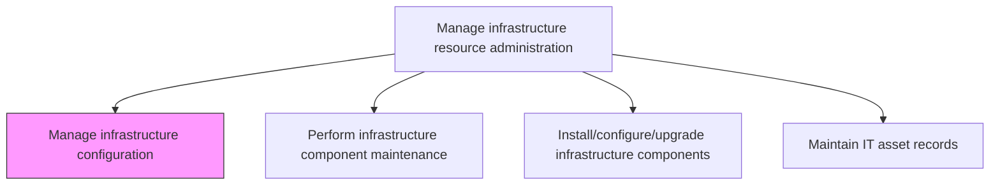
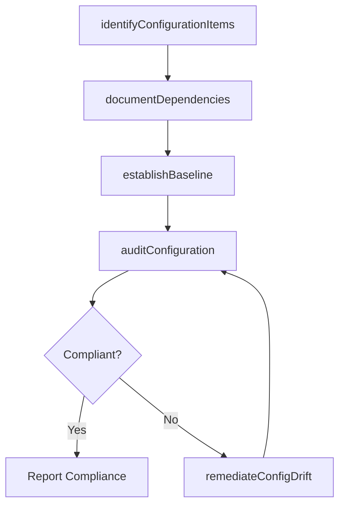

# Manage infrastructure configuration

> Business-as-Code definition for IT infrastructure configuration management. Models the identification, tracking, documentation, and governance of configuration items and their interdependencies across the IT estate.

## Overview

Identifying and tracking individual configuration items, documenting their functional capabilities and interdependencies within the IT infrastructure. This process maintains an accurate and authoritative Configuration Management Database (CMDB) that records all hardware, software, network, and virtual infrastructure components. It determines gaps between current and desired configurations, enforces configuration baselines, and supports change management by providing impact analysis of proposed modifications. Effective configuration management reduces outage risk and ensures infrastructure integrity.

## Process Hierarchy



## GraphDL

```yaml
manage:
  object: Infrastructure Configuration
  actor: ConfigurationManager
  result: ConfigurationBaseline
```

## Actions

| Action | Description |
|--------|-------------|
| identifyConfigurationItems | Discover and register infrastructure components as configuration items in the CMDB |
| documentDependencies | Map relationships and interdependencies between configuration items |
| establishBaseline | Define and approve standard configuration baselines for infrastructure components |
| auditConfiguration | Verify that actual configurations match approved baselines |
| remediateConfigDrift | Correct configuration items that have drifted from their approved baseline |

## Events

| Event | Description |
|-------|-------------|
| configurationItemsIdentified | New infrastructure components discovered and registered in the CMDB |
| dependenciesDocumented | Configuration item relationships and interdependencies mapped |
| baselineEstablished | Configuration baseline approved and published for a component class |
| configurationAudited | Configuration audit completed with compliance findings |
| configDriftRemediated | Drifted configuration items restored to baseline compliance |

## Searches

| Search | Description |
|--------|-------------|
| getConfigurationItem | Retrieve CMDB record for a specific configuration item |
| findDependencies | Map upstream and downstream dependencies for a configuration item |
| getBaselineCompliance | Query configuration compliance status against approved baselines |
| findConfigDrift | Identify configuration items that have drifted from their baseline |

## Process Flow



## RACI Matrix

| Activity | Responsible | Accountable | Consulted | Informed |
|----------|-------------|-------------|-----------|----------|
| identifyConfigurationItems | ConfigurationAnalyst | ConfigurationManager | InfrastructureEngineers | ITOperationsManager |
| documentDependencies | ConfigurationAnalyst | ConfigurationManager | EnterpriseArchitect | ChangeManager |
| establishBaseline | ConfigurationManager | ITInfrastructureDirector | SecurityTeam | ITOperations |
| auditConfiguration | ConfigurationAuditor | ConfigurationManager | ComplianceTeam | ITManagement |

## Related Processes

| Process | Relationship |
|---------|-------------|
| 8.7.7.2 Perform infrastructure component maintenance | Downstream - configuration data informs maintenance planning |
| 8.7.7.3 Install/configure/upgrade infrastructure components | Parallel - installations update the configuration baseline |
| 8.6.3 Manage change deployment control | Upstream - change management triggers configuration updates |

## Related Departments

| Department | Role |
|-----------|------|
| IT Operations | Primary owner of configuration management processes and CMDB |
| Infrastructure Engineering | Provides technical details on infrastructure components |
| IT Security | Reviews configurations for security compliance |
| Change Management | Coordinates configuration changes through the change process |

## Related Occupations

| Occupation | Involvement |
|-----------|-------------|
| Configuration Manager | Oversees the CMDB and configuration governance processes |
| Infrastructure Engineer | Provides technical input on component configurations |
| Configuration Analyst | Performs discovery, audits, and drift remediation |

## KPIs

| KPI | Description | Unit |
|-----|-------------|------|
| CMDB Accuracy | Percentage of configuration items with verified and current records | % |
| Baseline Compliance Rate | Percentage of infrastructure components matching approved baselines | % |
| Configuration Drift Rate | Number of configuration items drifting from baseline per period | Count |
| Mean Time to Remediate Drift | Average time to restore drifted items to baseline | Hours |

## Usage

```typescript
import { manageInfrastructureConfiguration } from '@headlessly/manage-infrastructure-configuration'

const config = manageInfrastructureConfiguration()

// Identify and register configuration items
const items = await config.identifyConfigurationItems({
  discoveryScope: 'data-center-east',
  componentTypes: ['servers', 'network-devices', 'storage'],
  autoRegister: true
})

// Audit configuration against baseline
const audit = await config.auditConfiguration({
  baseline: 'BASELINE-2026-Q1',
  scope: 'production-servers',
  reportFormat: 'detailed'
})

// Remediate configuration drift
await config.remediateConfigDrift({
  auditId: audit.id,
  autoRemediate: false,
  approvalRequired: true
})
```
