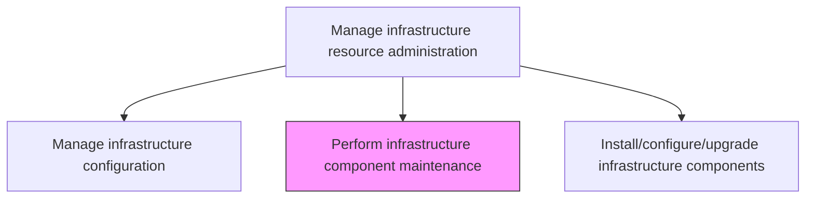
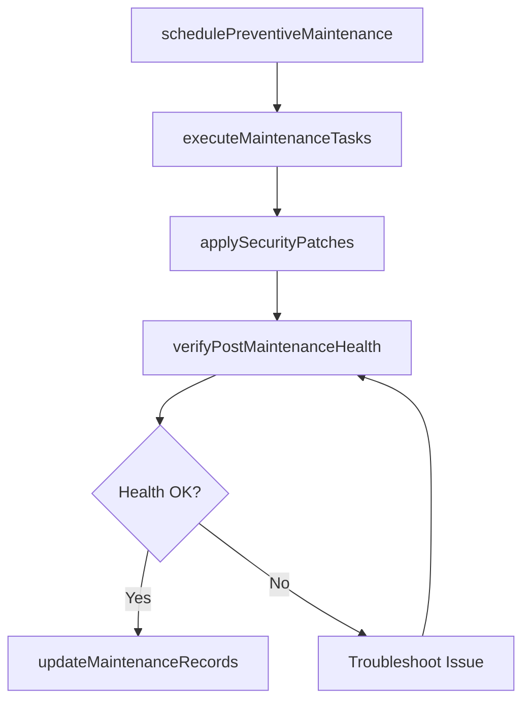

# Perform infrastructure component maintenance

> Business-as-Code definition for performing scheduled and preventive maintenance on IT infrastructure components to ensure reliability, extend asset lifecycle, and minimize unplanned downtime.

## Overview

Evaluating and maintaining all aspects of infrastructure component maintenance. Ensure that all components of an IT infrastructure are functioning properly as per the expectation. Maintenance includes all preventative, routine, and corrective measures.

## Process Hierarchy



## GraphDL

```yaml
perform:
  object: Infrastructure Component Maintenance
  actor: InfrastructureMaintenanceTech
  result: MaintenanceCompletionRecord
```

## Actions

| Action | Description |
|--------|-------------|
| schedulePreventiveMaintenance | Plan maintenance windows for hardware inspections, firmware updates, and cleaning |
| executeMaintenanceTasks | Perform scheduled maintenance activities on servers, network devices, and storage |
| applySecurityPatches | Install security patches and firmware updates to address known vulnerabilities |
| verifyPostMaintenanceHealth | Confirm component health and performance after maintenance activities |
| updateMaintenanceRecords | Document completed maintenance tasks in the asset management system |

## Events

| Event | Description |
|-------|-------------|
| preventiveMaintenanceScheduled | Maintenance windows planned for infrastructure components |
| maintenanceTasksExecuted | Scheduled maintenance performed on infrastructure |
| securityPatchesApplied | Security patches and firmware updates installed |
| postMaintenanceHealthVerified | Component health confirmed after maintenance |
| maintenanceRecordsUpdated | Maintenance tasks documented in asset system |

## Searches

| Search | Description |
|--------|-------------|
| getMaintenanceSchedule | Retrieve upcoming maintenance tasks filtered by component, date, or type |
| getMaintenanceHistory | Access maintenance history for specific infrastructure components |
| getPatchComplianceStatus | Get security patch compliance status across infrastructure |

## Process Flow



## RACI Matrix

| Activity | Responsible | Accountable | Consulted | Informed |
|----------|-------------|-------------|-----------|----------|
| schedulePreventiveMaintenance | InfrastructureMaintenanceTech | InfrastructureManager | ChangeManager | ServiceLevelManager |
| executeMaintenanceTasks | InfrastructureMaintenanceTech | InfrastructureManager | NetworkEngineer | StorageAdmin |
| applySecurityPatches | InfrastructureMaintenanceTech | SecurityTeam | InfrastructureManager | ComplianceTeam |

## Related Processes

| Process | Relationship |
|---------|-------------|
| 8.7.7.3 Install/configure/upgrade infrastructure components | Related - upgrades complement maintenance activities |
| 8.7.7.4 Maintain IT asset records | Downstream - maintenance records update asset documentation |
| 8.7.6.4 Manage infrastructure performance and capacity | Related - maintenance preserves infrastructure performance |

## Related Departments

| Department | Role |
|-----------|------|
| Infrastructure Engineering | Performs maintenance tasks on hardware and firmware |
| IT Security | Provides security patch requirements and validation |
| Asset Management | Tracks maintenance history and component lifecycle |

## Related Occupations

| Occupation | Involvement |
|-----------|-------------|
| Infrastructure Maintenance Technician | Executes hardware and firmware maintenance tasks |
| Network Engineer | Performs network equipment maintenance and patching |
| Storage Administrator | Maintains storage systems and applies updates |

## KPIs

| KPI | Description | Unit |
|-----|-------------|------|
| Preventive Maintenance Compliance | Percentage of scheduled maintenance completed on time | % |
| Patch Compliance Rate | Percentage of components with current security patches | % |
| Unplanned Downtime Reduction | Reduction in unplanned downtime attributed to maintenance | % |
| Maintenance Window Adherence | Percentage of maintenance completed within scheduled windows | % |

## Usage

```typescript
import { performInfrastructureComponentMaintenance } from '@headlessly/perform-infrastructure-component-maintenance'

const maintenance = performInfrastructureComponentMaintenance()

// Get maintenance schedule
const schedule = await maintenance.getMaintenanceSchedule({
  component: 'network-switches',
  dateRange: { start: '2024-12-01', end: '2024-12-31' }
})

// Get patch compliance
const compliance = await maintenance.getPatchComplianceStatus({
  environment: 'production',
  patchLevel: 'critical'
})
```
