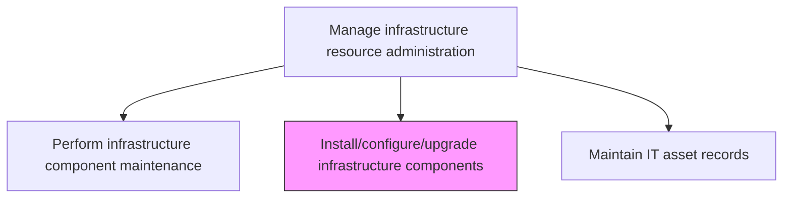
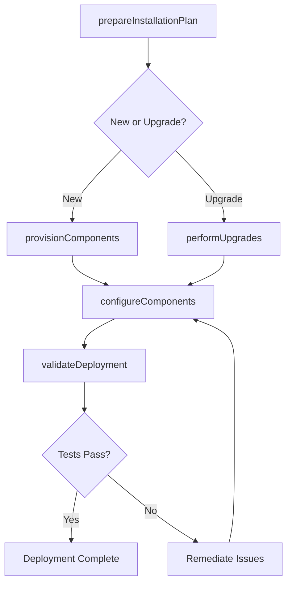

# Install/configure/upgrade infrastructure components

> Business-as-Code definition for installing, configuring, and upgrading IT infrastructure components including servers, network devices, storage systems, and cloud resources to meet evolving business needs.

## Overview

Installing/configuring/upgrading all the components required for operational activities within IT infrastructure. Ensure that all components of an IT infrastructure are functioning properly and updated to latest version/technology.

## Process Hierarchy



## GraphDL

```yaml
install/configure/upgrade:
  object: Infrastructure Components
  actor: InfrastructureDeploymentEngineer
  result: ComponentDeploymentRecord
```

## Actions

| Action | Description |
|--------|-------------|
| prepareInstallationPlan | Document installation requirements, dependencies, and testing criteria |
| provisionComponents | Install new hardware or provision cloud resources according to specifications |
| configureComponents | Apply configurations for networking, security, storage, and application settings |
| performUpgrades | Execute hardware or software upgrades on existing infrastructure components |
| validateDeployment | Test installed or upgraded components against functional and performance requirements |

## Events

| Event | Description |
|-------|-------------|
| installationPlanPrepared | Installation requirements and dependencies documented |
| componentsProvisioned | New hardware installed or cloud resources provisioned |
| componentsConfigured | Networking, security, and application settings applied |
| upgradesPerformed | Hardware or software upgrades executed on existing components |
| deploymentValidated | Installed components tested against requirements |

## Searches

| Search | Description |
|--------|-------------|
| getDeploymentQueue | Retrieve pending component installations and upgrades |
| getDeploymentHistory | Access installation and upgrade history for components |
| getConfigurationBaselines | Get approved configuration baselines for component types |

## Process Flow



## RACI Matrix

| Activity | Responsible | Accountable | Consulted | Informed |
|----------|-------------|-------------|-----------|----------|
| prepareInstallationPlan | InfrastructureDeploymentEngineer | InfrastructureManager | EnterpriseArchitect | ChangeManager |
| provisionComponents | InfrastructureDeploymentEngineer | InfrastructureManager | VendorSupport | ProcurementTeam |
| validateDeployment | InfrastructureDeploymentEngineer | QATeam | ApplicationTeams | SecurityTeam |

## Related Processes

| Process | Relationship |
|---------|-------------|
| 8.7.4.4 Plan IT infrastructure change | Upstream - change plans drive component installations |
| 8.7.7.4 Maintain IT asset records | Downstream - new installations update asset records |
| 8.7.7.1 Manage infrastructure configuration | Related - configurations applied per baseline standards |

## Related Departments

| Department | Role |
|-----------|------|
| Infrastructure Engineering | Installs, configures, and upgrades infrastructure components |
| Network Engineering | Handles network device installation and configuration |
| Cloud Operations | Provisions and configures cloud-based infrastructure |

## Related Occupations

| Occupation | Involvement |
|-----------|-------------|
| Infrastructure Deployment Engineer | Installs and configures infrastructure components |
| Network Engineer | Deploys and configures network infrastructure |
| Cloud Engineer | Provisions and manages cloud resources |

## KPIs

| KPI | Description | Unit |
|-----|-------------|------|
| Deployment Success Rate | Percentage of installations completed without rollback | % |
| Configuration Compliance | Percentage of components matching approved baselines | % |
| Provisioning Lead Time | Average time from request to operational component | Days |
| Upgrade Completion Rate | Percentage of planned upgrades completed on schedule | % |

## Usage

```typescript
import { installConfigureUpgradeInfrastructureComponents } from '@headlessly/install-configure-upgrade-infrastructure-components'

const deployment = installConfigureUpgradeInfrastructureComponents()

// Get deployment queue
const queue = await deployment.getDeploymentQueue({
  type: 'new-installation',
  priority: 'high'
})

// Get configuration baselines
const baselines = await deployment.getConfigurationBaselines({
  componentType: 'linux-server',
  version: 'current'
})
```
