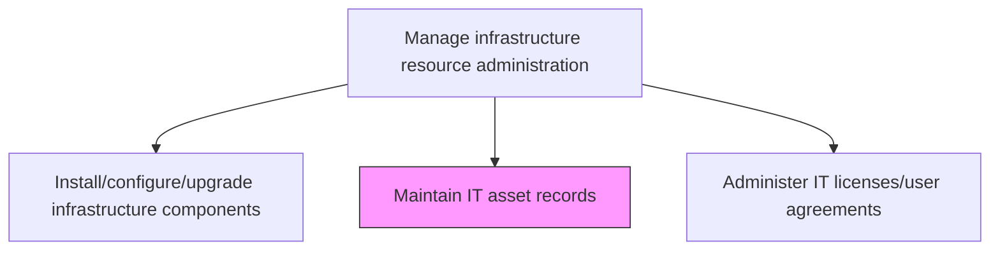
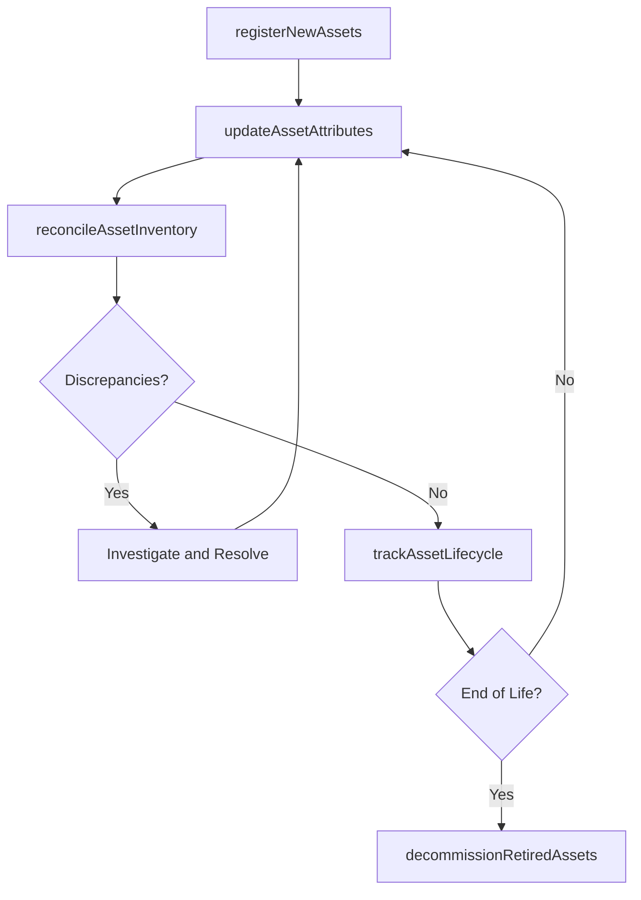

# Maintain IT asset records

> Business-as-Code definition for maintaining accurate and current IT asset records throughout the asset lifecycle, tracking hardware, software, and cloud resources from procurement through decommission.

## Overview

Maintaining the complete list of IT items or resources available with the organization with the details on date of purchase, licenses, deployment and SLAs.

## Process Hierarchy



## GraphDL

```yaml
maintain:
  object: IT Asset Records
  actor: ITAssetRecordManager
  result: AssetRecordUpdate
```

## Actions

| Action | Description |
|--------|-------------|
| registerNewAssets | Add newly procured or provisioned assets to the asset management system |
| updateAssetAttributes | Maintain current information including location, owner, configuration, and status |
| reconcileAssetInventory | Compare physical and logical asset inventories to identify discrepancies |
| trackAssetLifecycle | Monitor assets through procurement, deployment, operation, and retirement phases |
| decommissionRetiredAssets | Process end-of-life assets through proper data sanitization and disposal |

## Events

| Event | Description |
|-------|-------------|
| newAssetsRegistered | Newly procured assets added to management system |
| assetAttributesUpdated | Asset location, owner, and configuration information maintained |
| assetInventoryReconciled | Physical and logical inventories compared and discrepancies resolved |
| assetLifecycleTracked | Asset lifecycle phase transitions monitored |
| retiredAssetsDecommissioned | End-of-life assets sanitized and disposed properly |

## Searches

| Search | Description |
|--------|-------------|
| getAssetInventory | Retrieve asset inventory filtered by type, location, owner, or lifecycle stage |
| getAssetDetails | Access detailed record for a specific asset including full history |
| getAssetDiscrepancies | List inventory reconciliation discrepancies requiring resolution |

## Process Flow



## RACI Matrix

| Activity | Responsible | Accountable | Consulted | Informed |
|----------|-------------|-------------|-----------|----------|
| registerNewAssets | ITAssetRecordManager | ITAssetDirector | ProcurementTeam | FinanceTeam |
| reconcileAssetInventory | ITAssetRecordManager | ITAssetDirector | InfrastructureTeam | AuditTeam |
| decommissionRetiredAssets | ITAssetRecordManager | ITAssetDirector | SecurityTeam | ComplianceTeam |

## Related Processes

| Process | Relationship |
|---------|-------------|
| 8.7.7.3 Install/configure/upgrade infrastructure components | Upstream - installations create new asset records |
| 8.7.7.5 Administer IT licenses/user agreements | Related - license records linked to asset records |
| 8.7.4.3 Determine ongoing IT infrastructure capabilities | Related - asset records feed capability assessments |

## Related Departments

| Department | Role |
|-----------|------|
| IT Asset Management | Maintains asset records and conducts inventory reconciliation |
| Procurement | Provides acquisition data for new asset registration |
| IT Security | Ensures proper data sanitization during decommission |

## Related Occupations

| Occupation | Involvement |
|-----------|-------------|
| IT Asset Record Manager | Maintains and reconciles asset inventory records |
| Asset Coordinator | Tracks asset lifecycle transitions and updates |
| Disposal Specialist | Manages secure decommission and disposal of retired assets |

## KPIs

| KPI | Description | Unit |
|-----|-------------|------|
| Asset Record Accuracy | Percentage of assets with accurate and current records | % |
| Inventory Reconciliation Rate | Percentage of assets reconciled against physical inventory | % |
| Asset Registration Timeliness | Average time from procurement to asset registration | Days |
| Decommission Compliance | Percentage of retired assets properly sanitized and disposed | % |

## Usage

```typescript
import { maintainItAssetRecords } from '@headlessly/maintain-it-asset-records'

const assetRecords = maintainItAssetRecords()

// Get asset inventory
const assets = await assetRecords.getAssetInventory({
  type: 'server',
  location: 'dc-east',
  status: 'active'
})

// Get asset discrepancies
const discrepancies = await assetRecords.getAssetDiscrepancies({
  reconciliationDate: '2024-12-01',
  status: 'unresolved'
})
```
