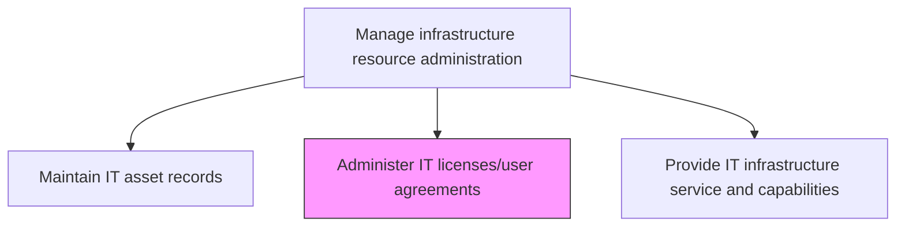
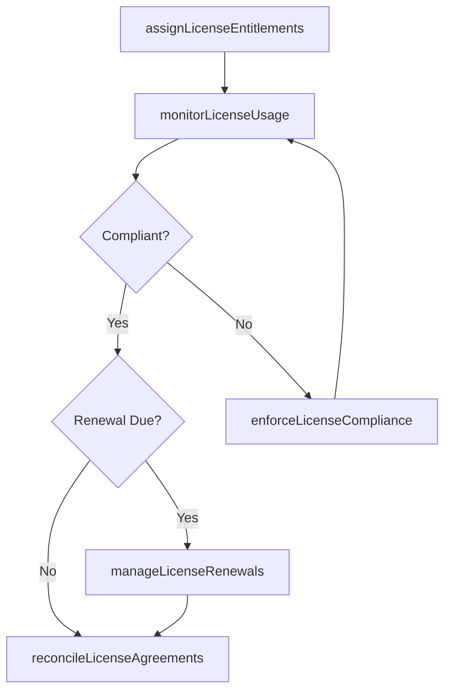

# Administer IT licenses/user agreements

> Business-as-Code definition for administering IT software licenses and user agreements, ensuring compliance with license terms, managing entitlements, and tracking usage against purchased volumes.

## Overview

Administering and overseeing the terms and policies associated with licensing the IT intellectual property. Create and manage the policies and terms governing the possible granting of a license to any external agent. Demarcate a clear framework that governs the licensing of any patents or copyrights held by the organization.

## Process Hierarchy



## GraphDL

```yaml
administer:
  object: IT Licenses/user Agreements
  actor: LicenseAdministrator
  result: LicenseComplianceRecord
```

## Actions

| Action | Description |
|--------|-------------|
| assignLicenseEntitlements | Allocate software licenses to users, devices, or services based on business needs |
| monitorLicenseUsage | Track active license consumption against purchased entitlements in real time |
| manageLicenseRenewals | Process license renewals, expirations, and true-up activities on schedule |
| enforceLicenseCompliance | Detect and remediate non-compliant license usage including over-deployment |
| reconcileLicenseAgreements | Compare license deployments against contractual terms and correct discrepancies |

## Events

| Event | Description |
|-------|-------------|
| licenseEntitlementsAssigned | Software licenses allocated to users or services |
| licenseUsageMonitored | License consumption tracked against entitlements |
| licenseRenewalsManaged | Renewals and true-up activities processed |
| licenseComplianceEnforced | Non-compliant usage detected and remediated |
| licenseAgreementsReconciled | Deployments compared against contractual terms |

## Searches

| Search | Description |
|--------|-------------|
| getLicenseAllocations | Retrieve license assignments filtered by user, product, or department |
| getLicenseComplianceStatus | Access compliance status showing usage versus entitlements |
| getLicenseRenewalSchedule | Get upcoming license renewal dates and associated actions |

## Process Flow



## RACI Matrix

| Activity | Responsible | Accountable | Consulted | Informed |
|----------|-------------|-------------|-----------|----------|
| assignLicenseEntitlements | LicenseAdministrator | LicenseManager | ITAssetManager | ServiceDeskManager |
| monitorLicenseUsage | LicenseAdministrator | LicenseManager | ComplianceTeam | ITFinanceManager |
| manageLicenseRenewals | LicenseAdministrator | ProcurementManager | VendorManagement | LegalTeam |

## Related Processes

| Process | Relationship |
|---------|-------------|
| 8.7.4.5 Plan and budget IT license usage volumes | Upstream - license planning guides administration activities |
| 8.7.7.4 Maintain IT asset records | Related - license records linked to asset documentation |
| 8.7.7.1 Manage infrastructure configuration | Related - configurations include license-dependent settings |

## Related Departments

| Department | Role |
|-----------|------|
| IT Asset Management | Administers license entitlements and compliance tracking |
| Procurement | Manages license purchasing and vendor agreements |
| IT Finance | Tracks license costs and renewal budgets |

## Related Occupations

| Occupation | Involvement |
|-----------|-------------|
| License Administrator | Assigns entitlements and monitors compliance |
| Vendor Manager | Manages license agreements and renewals |
| Compliance Analyst | Audits license usage and enforces compliance |

## KPIs

| KPI | Description | Unit |
|-----|-------------|------|
| License Compliance Rate | Percentage of software deployments in compliance with agreements | % |
| License Utilization Rate | Percentage of purchased licenses actively assigned | % |
| Renewal Processing Time | Average time to process license renewals | Days |
| Cost Avoidance | Savings from identifying and reclaiming unused licenses | Currency |

## Usage

```typescript
import { administerItLicensesUserAgreements } from '@headlessly/administer-it-licenses-user-agreements'

const licenseAdmin = administerItLicensesUserAgreements()

// Get license compliance
const compliance = await licenseAdmin.getLicenseComplianceStatus({
  vendor: 'microsoft',
  product: 'office-365'
})

// Get renewal schedule
const renewals = await licenseAdmin.getLicenseRenewalSchedule({
  dateRange: { start: '2025-01-01', end: '2025-03-31' }
})
```
