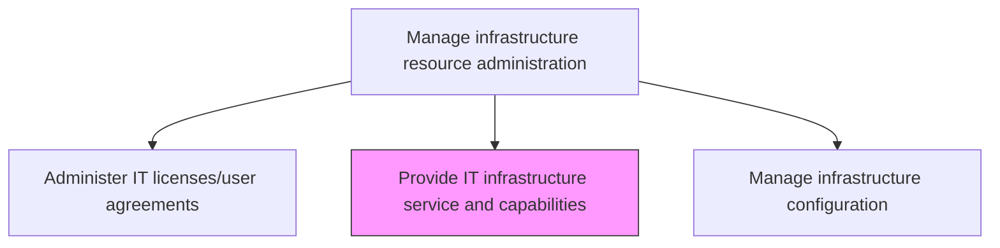
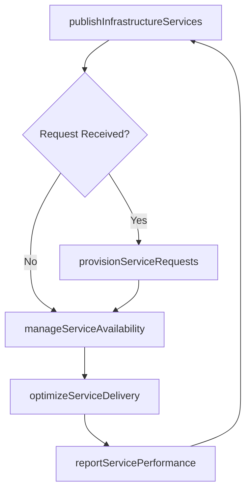

# Provide IT infrastructure service and capabilities

> Business-as-Code definition for providing IT infrastructure services and capabilities to the organization, ensuring technology resources are available, performant, and aligned with business requirements.

## Overview

Providing all the infrastructure services and capabilities required for operational activities within the IT function supporting overall business objectives.

## Process Hierarchy



## GraphDL

```yaml
provide:
  object: IT Infrastructure Service And Capabilities
  actor: InfrastructureServiceManager
  result: InfrastructureServiceReport
```

## Actions

| Action | Description |
|--------|-------------|
| publishInfrastructureServices | Make infrastructure service offerings visible through the IT service catalog |
| provisionServiceRequests | Fulfill requests for infrastructure resources including compute, storage, and network |
| manageServiceAvailability | Ensure infrastructure services meet availability and performance commitments |
| optimizeServiceDelivery | Continuously improve infrastructure service efficiency and user experience |
| reportServicePerformance | Produce reports on infrastructure service utilization and performance metrics |

## Events

| Event | Description |
|-------|-------------|
| infrastructureServicesPublished | Infrastructure offerings made visible in service catalog |
| serviceRequestsProvisioned | Infrastructure resource requests fulfilled |
| serviceAvailabilityManaged | Availability and performance commitments ensured |
| serviceDeliveryOptimized | Infrastructure service efficiency improved |
| servicePerformanceReported | Utilization and performance reports produced |

## Searches

| Search | Description |
|--------|-------------|
| getInfrastructureServices | Retrieve available infrastructure services from the catalog |
| getServiceRequests | Access pending and completed infrastructure service requests |
| getServicePerformance | Get performance and availability metrics for infrastructure services |

## Process Flow



## RACI Matrix

| Activity | Responsible | Accountable | Consulted | Informed |
|----------|-------------|-------------|-----------|----------|
| publishInfrastructureServices | InfrastructureServiceManager | ITServiceDirector | ServiceCatalogManager | AllStakeholders |
| provisionServiceRequests | InfrastructureEngineer | InfrastructureServiceManager | SecurityTeam | RequestingTeam |
| reportServicePerformance | InfrastructureServiceManager | ITServiceDirector | CapacityPlanner | CIO |

## Related Processes

| Process | Relationship |
|---------|-------------|
| 8.7.7.1 Manage infrastructure configuration | Related - configurations underpin service delivery |
| 8.7.1.2 Define IT service delivery portfolio | Upstream - portfolio defines infrastructure service offerings |
| 8.7.6.4 Manage infrastructure performance and capacity | Related - performance management ensures service quality |

## Related Departments

| Department | Role |
|-----------|------|
| Infrastructure Services | Delivers and manages infrastructure service offerings |
| Service Management | Publishes service catalog and manages service requests |
| Capacity Management | Ensures infrastructure capacity meets service demands |

## Related Occupations

| Occupation | Involvement |
|-----------|-------------|
| Infrastructure Service Manager | Oversees infrastructure service delivery and performance |
| Infrastructure Engineer | Provisions and maintains infrastructure resources |
| Service Catalog Manager | Publishes and maintains infrastructure service listings |

## KPIs

| KPI | Description | Unit |
|-----|-------------|------|
| Service Availability | Percentage uptime of infrastructure services | % |
| Request Fulfillment Time | Average time to provision infrastructure service requests | Hours |
| Service Satisfaction | User satisfaction score for infrastructure services | Score (1-5) |
| Service Catalog Coverage | Percentage of infrastructure capabilities listed in service catalog | % |

## Usage

```typescript
import { provideItInfrastructureServiceAndCapabilities } from '@headlessly/provide-it-infrastructure-service-and-capabilities'

const infraServices = provideItInfrastructureServiceAndCapabilities()

// Get infrastructure services
const services = await infraServices.getInfrastructureServices({
  category: 'compute',
  status: 'active'
})

// Get service performance
const performance = await infraServices.getServicePerformance({
  serviceId: 'virtual-machine-hosting',
  period: 'last-month'
})
```
