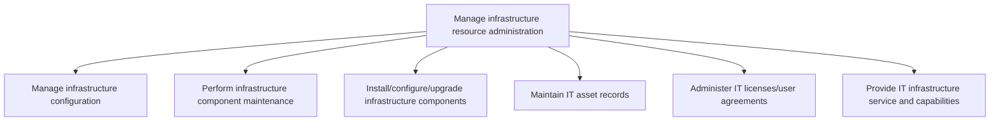
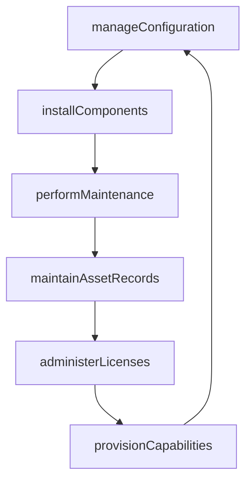

# Manage infrastructure resource administration

> Business-as-Code definition for administering IT infrastructure resources, including configuration management, component maintenance, installation and upgrades, asset records, license administration, and service capability provisioning.

## Overview

Managing the resources required for administration of IT infrastructure. Manage the IT inventory and assets. Take care of the organization's IT resource capacity.

## Process Hierarchy



## GraphDL

```yaml
manage:
  object: Infrastructure Resource Administration
  actor: InfrastructureAdministrator
  result: AssetInventoryRecord
```

## Actions

| Action | Description |
|--------|-------------|
| manageConfiguration | Track configuration items and their interdependencies |
| performMaintenance | Execute preventative and corrective infrastructure maintenance |
| installComponents | Install, configure, or upgrade infrastructure components |
| maintainAssetRecords | Update IT asset records with current inventory and status |
| administerLicenses | Manage software licenses and user agreements |
| provisionCapabilities | Deliver infrastructure services and capabilities to consumers |

## Events

| Event | Description |
|-------|-------------|
| configurationManaged | Configuration items documented and dependencies tracked |
| maintenancePerformed | Infrastructure component maintenance completed |
| componentsInstalled | Infrastructure components installed, configured, or upgraded |
| assetRecordsMaintained | IT asset inventory records updated |
| licensesAdministered | Software licenses and user agreements processed |
| capabilitiesProvisioned | Infrastructure services delivered to requesting teams |

## Searches

| Search | Description |
|--------|-------------|
| findAssets | List IT assets filtered by type, location, status, or owner |
| getConfigurationItems | Retrieve configuration item details and dependency maps |
| getLicenseInventory | List software licenses with usage and expiration details |
| getMaintenanceSchedule | Get the scheduled maintenance activities for infrastructure |

## Process Flow



## RACI Matrix

| Activity | Responsible | Accountable | Consulted | Informed |
|----------|-------------|-------------|-----------|----------|
| manageConfiguration | ConfigurationManager | InfrastructureAdministrator | OperationsTeam | ChangeManager |
| installComponents | SystemsAdministrator | InfrastructureAdministrator | VendorSupport | ServiceDesk |
| maintainAssetRecords | AssetManager | InfrastructureAdministrator | Finance | Procurement |
| administerLicenses | LicenseAdministrator | InfrastructureAdministrator | VendorManagement | Finance |

## Sub-Processes

| ID | Name | Description |
|----|------|-------------|
| 8.7.7.1 | Manage infrastructure configuration | Identifying and tracking individual configuration items, documenting functional capabilities and int |
| 8.7.7.2 | Perform infrastructure component maintenance | Evaluating and maintaining all aspects of infrastructure component maintenance. Ensure that all comp |
| 8.7.7.3 | Install/configure/upgrade infrastructure components | Installing/configuring/upgrading all the components required for operational activities within IT in |
| 8.7.7.4 | Maintain IT asset records | Maintaining the complete list of IT items or resources available with the organization with the deta |
| 8.7.7.5 | Administer IT licenses/user agreements | Administering and overseeing the terms and policies associated with licensing the IT intellectual pr |
| 8.7.7.6 | Provide IT infrastructure service and capabilities | Providing all the infrastructure services and capabilities required for operational activities withi |

## Related Processes

| Process | Relationship |
|---------|-------------|
| 8.7.4 Develop and manage infrastructure resource planning | Upstream - resource plan guides administration activities |
| 8.7.6 Develop and manage service delivery operations | Parallel - operations depend on administered infrastructure |
| 8.7.8 Operate IT user support | Parallel - user support may trigger infrastructure changes |

## Related Departments

| Department | Role |
|-----------|------|
| Infrastructure Engineering | Installs, configures, and maintains infrastructure |
| IT Asset Management | Tracks and manages IT asset inventory |
| Procurement | Sources infrastructure components and licenses |
| Configuration Management | Maintains the configuration management database |

## Related Occupations

| Occupation | Involvement |
|-----------|-------------|
| Systems Administrator | Installs, configures, and maintains infrastructure |
| IT Asset Manager | Manages asset records and lifecycle tracking |
| License Administrator | Administers software licenses and compliance |

## KPIs

| KPI | Description | Unit |
|-----|-------------|------|
| Asset Record Accuracy | Percentage of physical assets matching inventory records | % |
| License Compliance Rate | Percentage of software installations within licensed limits | % |
| Configuration Accuracy | Percentage of configuration items with up-to-date documentation | % |
| Maintenance Completion Rate | Percentage of scheduled maintenance tasks completed on time | % |

## Usage

```typescript
import { manageInfrastructureResourceAdministration } from '@headlessly/manage-infrastructure-resource-administration'

const admin = manageInfrastructureResourceAdministration()

// Install a new infrastructure component
await admin.installComponents({
  component: 'load-balancer',
  model: 'F5-BIG-IP-i5800',
  location: 'data-center-east',
  configuration: { vips: 10, sslOffload: true }
})

// Maintain asset records
await admin.maintainAssetRecords({
  assetId: 'HW-2025-0312',
  status: 'active',
  location: 'data-center-east',
  assignedTo: 'production-cluster'
})

// Get license inventory
const licenses = await admin.getLicenseInventory({
  product: 'sql-server',
  expiringBefore: '2025-12-31'
})
```
