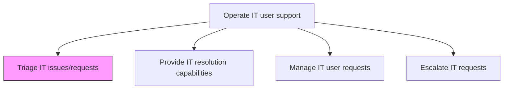
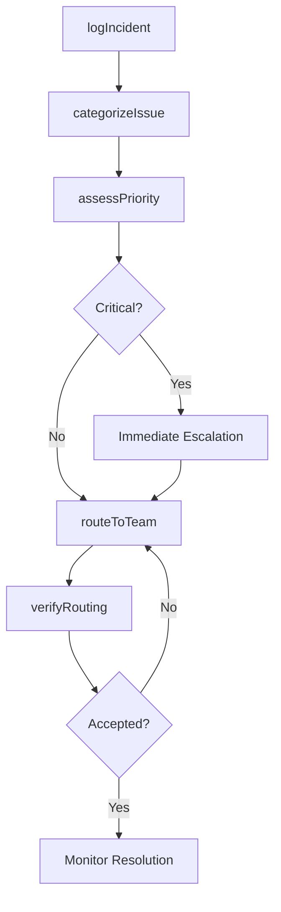

# Triage IT issues/requests

> Business-as-Code definition for IT issue and request triage. Models the intake, categorization, prioritization, and routing of IT incidents and service requests to the appropriate support tiers and resolution teams.

## Overview

Evaluating and assigning IT issues and requests to the correct support teams based on categorization, urgency, and impact assessment. This process ensures that every incoming IT incident or service request is logged, classified by type and severity, and routed to the appropriate resolution group. Effective triage minimizes response times, prevents bottlenecks at the service desk, and ensures critical business-impacting issues receive immediate attention from the right technical specialists.

## Process Hierarchy



## GraphDL

```yaml
triage:
  object: IT Issues/requests
  actor: ServiceDeskAnalyst
  result: TriagedTicket
```

## Actions

| Action | Description |
|--------|-------------|
| logIncident | Record the IT issue or request with initial details from the user |
| categorizeIssue | Classify the issue by type, affected service, and configuration item |
| assessPriority | Determine urgency and impact to assign priority level |
| routeToTeam | Assign the triaged ticket to the appropriate support tier or resolver group |
| verifyRouting | Confirm the ticket has been accepted by the assigned team |

## Events

| Event | Description |
|-------|-------------|
| incidentLogged | IT issue or request recorded in the ticketing system |
| issueCategorized | Issue classified by type, service, and configuration item |
| priorityAssessed | Urgency and impact evaluated and priority level assigned |
| ticketRouted | Triaged ticket assigned to the appropriate resolver group |
| routingVerified | Assigned team confirmed acceptance of the ticket |

## Searches

| Search | Description |
|--------|-------------|
| findOpenTickets | List unresolved tickets filtered by priority, category, or age |
| getTriageQueue | Retrieve tickets awaiting triage and categorization |
| getRoutingHistory | Query routing and reassignment history for a ticket |
| findMisroutedTickets | Identify tickets that were rerouted after initial assignment |

## Process Flow



## RACI Matrix

| Activity | Responsible | Accountable | Consulted | Informed |
|----------|-------------|-------------|-----------|----------|
| logIncident | ServiceDeskAnalyst | ServiceDeskManager | EndUser | ITOperations |
| categorizeIssue | ServiceDeskAnalyst | ServiceDeskManager | KnowledgeBase | IncidentManager |
| assessPriority | ServiceDeskAnalyst | IncidentManager | BusinessOwner | ITManagement |
| routeToTeam | ServiceDeskAnalyst | ServiceDeskManager | TierTwoSupport | EndUser |

## Related Processes

| Process | Relationship |
|---------|-------------|
| 8.7.8.2 Provide IT resolution capabilities | Downstream - triaged tickets are resolved by support teams |
| 8.7.8.4 Escalate IT requests | Downstream - high-priority triaged tickets may require escalation |
| 8.7.5.5 Triage IT service delivery incidents | Parallel - service delivery incidents follow similar triage patterns |

## Related Departments

| Department | Role |
|-----------|------|
| IT Service Desk | Primary owner of triage activities and first-contact resolution |
| IT Operations | Receives triaged infrastructure and operations tickets |
| Application Support | Receives triaged application-related issues |
| IT Security | Receives triaged security incidents and access requests |

## Related Occupations

| Occupation | Involvement |
|-----------|-------------|
| Service Desk Analyst | Performs initial triage, categorization, and routing |
| Incident Manager | Oversees priority assessment and critical incident handling |
| IT Support Specialist | Receives and resolves triaged tickets at Tier 2 |

## KPIs

| KPI | Description | Unit |
|-----|-------------|------|
| Average Triage Time | Mean time from ticket creation to assignment to resolver group | Minutes |
| First-Contact Resolution Rate | Percentage of issues resolved during initial triage | % |
| Misroute Rate | Percentage of tickets reassigned after initial routing | % |
| Triage Queue Backlog | Number of tickets awaiting triage at any point | Count |

## Usage

```typescript
import { triageItIssuesRequests } from '@headlessly/triage-it-issues-requests'

const triage = triageItIssuesRequests()

// Log a new incident
const ticket = await triage.logIncident({
  reporter: 'jane.doe@company.com',
  summary: 'Unable to access CRM application',
  affectedService: 'CRM-Salesforce',
  channel: 'phone'
})

// Categorize and assess priority
const categorized = await triage.categorizeIssue({
  ticketId: ticket.id,
  category: 'Application Access',
  configurationItem: 'CRM-PROD-01'
})

// Route to appropriate team
await triage.routeToTeam({
  ticketId: ticket.id,
  resolverGroup: 'Application-Support-CRM',
  priority: 'P2-High'
})
```
