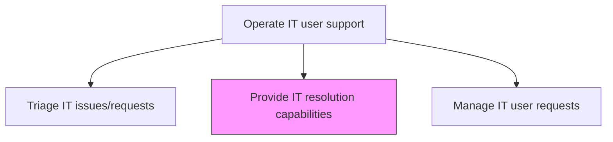
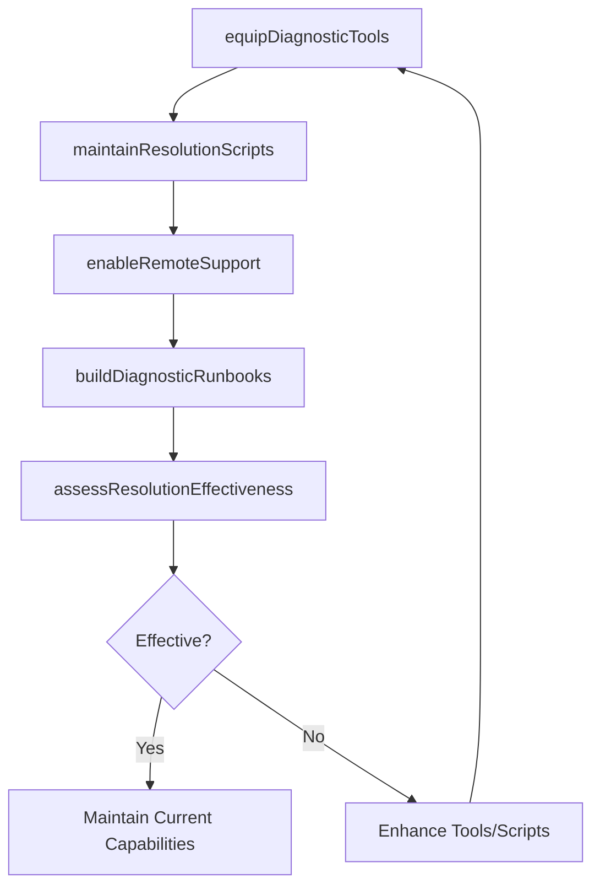

# Provide IT resolution capabilities

> Business-as-Code definition for providing IT resolution capabilities by equipping support teams with the tools, knowledge, and procedures needed to diagnose and resolve user-reported IT issues efficiently.

## Overview

Providing the necessary skills and competencies required to efficiently provide IT resolution through the support structure.

## Process Hierarchy



## GraphDL

```yaml
provide:
  object: IT Resolution Capabilities
  actor: ResolutionCapabilityManager
  result: ResolutionCapabilityAssessment
```

## Actions

| Action | Description |
|--------|-------------|
| equipDiagnosticTools | Provide support teams with diagnostic tools and remote access capabilities |
| maintainResolutionScripts | Develop and update automated resolution scripts for common issue types |
| enableRemoteSupport | Configure remote desktop and command-line tools for off-site issue diagnosis |
| buildDiagnosticRunbooks | Create step-by-step diagnostic guides for complex or recurring issues |
| assessResolutionEffectiveness | Evaluate resolution tool usage and success rates for improvement |

## Events

| Event | Description |
|-------|-------------|
| diagnosticToolsEquipped | Support teams provided with diagnostic and remote access tools |
| resolutionScriptsMaintained | Automated resolution scripts developed and updated |
| remoteSupportEnabled | Remote desktop and diagnostic capabilities configured |
| diagnosticRunbooksBuilt | Step-by-step diagnostic guides created for complex issues |
| resolutionEffectivenessAssessed | Tool usage and success rates evaluated |

## Searches

| Search | Description |
|--------|-------------|
| getResolutionTools | Retrieve available resolution tools and their deployment status |
| getResolutionScripts | Access automated resolution scripts by issue type or category |
| getResolutionMetrics | Get resolution effectiveness metrics by tool or technique |

## Process Flow



## RACI Matrix

| Activity | Responsible | Accountable | Consulted | Informed |
|----------|-------------|-------------|-----------|----------|
| equipDiagnosticTools | ResolutionCapabilityManager | ServiceDeskDirector | ITToolsAdmin | SecurityTeam |
| maintainResolutionScripts | AutomationEngineer | ResolutionCapabilityManager | ServiceDeskAgents | QATeam |
| assessResolutionEffectiveness | ResolutionCapabilityManager | ServiceDeskDirector | QualityTeam | ITServiceDirector |

## Related Processes

| Process | Relationship |
|---------|-------------|
| 8.7.8.5 Resolve IT issues/requests | Downstream - resolution capabilities used during issue resolution |
| 8.7.5.3 Maintain service support knowledge repository | Related - diagnostic runbooks stored in knowledge repository |
| 8.7.2.6 Provide service support tools and technology | Upstream - tool strategy determines resolution capabilities |

## Related Departments

| Department | Role |
|-----------|------|
| Service Desk | Uses resolution tools and scripts during support interactions |
| IT Tools Administration | Deploys and maintains diagnostic and remote support tools |
| Automation Engineering | Develops automated resolution scripts |

## Related Occupations

| Occupation | Involvement |
|-----------|-------------|
| Resolution Capability Manager | Oversees diagnostic tools and resolution effectiveness |
| Automation Engineer | Builds and maintains automated resolution scripts |
| Tools Administrator | Deploys and configures diagnostic tooling |

## KPIs

| KPI | Description | Unit |
|-----|-------------|------|
| Tool Adoption Rate | Percentage of support agents regularly using diagnostic tools | % |
| Script Resolution Rate | Percentage of issues resolved by automated scripts | % |
| Remote Resolution Rate | Percentage of issues resolved remotely without on-site visit | % |
| Resolution Capability Score | Composite score of resolution tool effectiveness | Score (1-10) |

## Usage

```typescript
import { provideItResolutionCapabilities } from '@headlessly/provide-it-resolution-capabilities'

const resolutionCaps = provideItResolutionCapabilities()

// Get resolution tools
const tools = await resolutionCaps.getResolutionTools({
  category: 'remote-support',
  status: 'deployed'
})

// Get resolution metrics
const metrics = await resolutionCaps.getResolutionMetrics({
  technique: 'automated-scripts',
  period: 'last-quarter'
})
```
