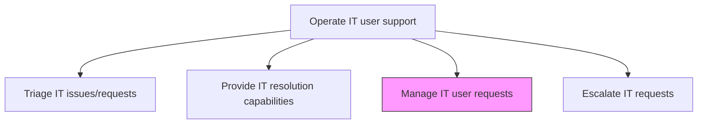
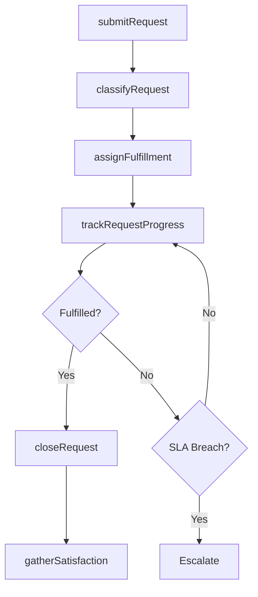

# Manage IT user requests

> Business-as-Code definition for IT user request management. Models the intake, tracking, fulfillment, and satisfaction measurement of IT service requests from end users across the organization.

## Overview

Creating an effective plan and structure to address and resolve requests from IT users. This process covers the full lifecycle of service requests, from initial submission through fulfillment and closure, including provisioning of hardware and software, access management, information requests, and standard changes. It establishes request catalogs, defines fulfillment workflows, monitors request queues for SLA compliance, and gathers user feedback to continuously improve the request handling experience.

## Process Hierarchy



## GraphDL

```yaml
manage:
  object: IT User Requests
  actor: ServiceRequestCoordinator
  result: FulfilledRequest
```

## Actions

| Action | Description |
|--------|-------------|
| submitRequest | Record a new IT service request from an end user with required details |
| classifyRequest | Categorize the request against the service catalog and assign fulfillment workflow |
| assignFulfillment | Route the request to the appropriate fulfillment team or automated workflow |
| trackRequestProgress | Monitor request status, SLA timelines, and notify users of updates |
| closeRequest | Verify fulfillment, obtain user confirmation, and close the request record |
| gatherSatisfaction | Collect user feedback on the request handling experience |

## Events

| Event | Description |
|-------|-------------|
| requestSubmitted | New IT service request recorded in the request management system |
| requestClassified | Request categorized and fulfillment workflow assigned |
| fulfillmentAssigned | Request routed to the appropriate fulfillment team |
| requestProgressTracked | Request status updated and SLA compliance monitored |
| requestClosed | Request fulfillment verified and record closed |
| satisfactionGathered | User feedback on request handling experience collected |

## Searches

| Search | Description |
|--------|-------------|
| findOpenRequests | List open service requests filtered by status, category, or requester |
| getRequestStatus | Retrieve current status and fulfillment progress for a request |
| getServiceCatalog | Browse available service request types and their fulfillment details |
| getSatisfactionScores | Query user satisfaction ratings for fulfilled requests |

## Process Flow



## RACI Matrix

| Activity | Responsible | Accountable | Consulted | Informed |
|----------|-------------|-------------|-----------|----------|
| submitRequest | EndUser | ServiceDeskManager | ServiceDeskAnalyst | ITOperations |
| classifyRequest | ServiceDeskAnalyst | ServiceRequestCoordinator | ServiceCatalogOwner | FulfillmentTeam |
| assignFulfillment | ServiceRequestCoordinator | ServiceDeskManager | FulfillmentTeam | EndUser |
| closeRequest | ServiceRequestCoordinator | ServiceDeskManager | EndUser | ITManagement |

## Related Processes

| Process | Relationship |
|---------|-------------|
| 8.7.8.1 Triage IT issues/requests | Upstream - triage categorizes and routes incoming requests |
| 8.7.8.4 Escalate IT requests | Downstream - unfulfilled requests may require escalation |
| 8.7.5.6 Manage IT service support resources | Parallel - resource availability affects fulfillment capacity |

## Related Departments

| Department | Role |
|-----------|------|
| IT Service Desk | Primary owner of request intake and coordination |
| IT Provisioning | Fulfills hardware, software, and access provisioning requests |
| IT Security | Handles access management and security-related requests |
| IT Operations | Fulfills infrastructure and network service requests |

## Related Occupations

| Occupation | Involvement |
|-----------|-------------|
| Service Request Coordinator | Manages request lifecycle and fulfillment tracking |
| Service Desk Analyst | Handles initial request intake and classification |
| IT Provisioning Specialist | Fulfills hardware and software provisioning requests |

## KPIs

| KPI | Description | Unit |
|-----|-------------|------|
| Request Fulfillment Time | Average time from request submission to closure | Hours |
| SLA Compliance Rate | Percentage of requests fulfilled within defined SLA | % |
| User Satisfaction Score | Average satisfaction rating from post-fulfillment surveys | Score (1-5) |
| Request Backlog | Number of open requests awaiting fulfillment | Count |

## Usage

```typescript
import { manageItUserRequests } from '@headlessly/manage-it-user-requests'

const requests = manageItUserRequests()

// Submit a new service request
const request = await requests.submitRequest({
  requester: 'john.smith@company.com',
  category: 'Software Provisioning',
  description: 'Request access to Tableau Desktop for data analysis',
  priority: 'standard'
})

// Track request progress
const status = await requests.trackRequestProgress({
  requestId: request.id,
  includeTimeline: true
})

// Close fulfilled request
await requests.closeRequest({
  requestId: request.id,
  resolution: 'Tableau Desktop installed and license activated',
  userConfirmed: true
})
```
