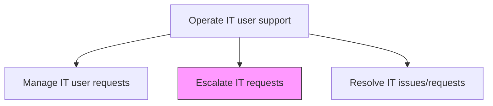
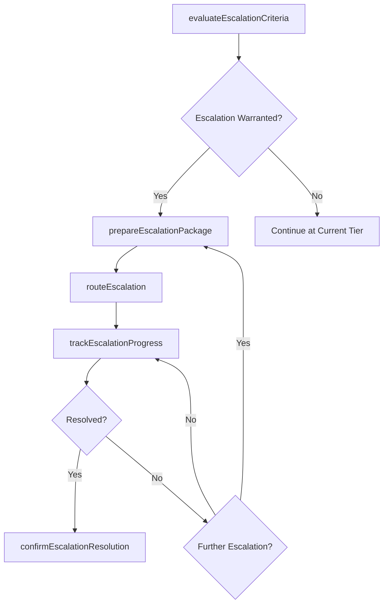

# Escalate IT requests

> Business-as-Code definition for escalating IT requests and incidents to higher support tiers, specialist teams, or management when issues cannot be resolved at the current level within defined timeframes.

## Overview

Follow processes and procedures to escalate IT requests to required levels for resolution or effective decision making when necessary.

## Process Hierarchy



## GraphDL

```yaml
escalate:
  object: IT Requests
  actor: EscalationCoordinator
  result: EscalationRecord
```

## Actions

| Action | Description |
|--------|-------------|
| evaluateEscalationCriteria | Assess whether the issue meets defined criteria for escalation to a higher tier |
| prepareEscalationPackage | Compile issue details, diagnostic data, and attempted resolutions for the receiving team |
| routeEscalation | Transfer the issue to the appropriate specialist team or management level |
| trackEscalationProgress | Monitor the escalated issue through to resolution at the higher tier |
| confirmEscalationResolution | Verify the escalated issue has been resolved and close the escalation record |

## Events

| Event | Description |
|-------|-------------|
| escalationCriteriaEvaluated | Issue assessed against escalation criteria |
| escalationPackagePrepared | Issue details and diagnostic data compiled for receiving team |
| escalationRouted | Issue transferred to specialist team or management |
| escalationProgressTracked | Escalated issue monitored through to resolution |
| escalationResolutionConfirmed | Escalated issue verified as resolved |

## Searches

| Search | Description |
|--------|-------------|
| getActiveEscalations | Retrieve currently escalated issues filtered by tier, team, or age |
| getEscalationHistory | Access escalation records for specific tickets or time periods |
| getEscalationSLAStatus | Get SLA compliance status for escalated issues by tier |

## Process Flow



## RACI Matrix

| Activity | Responsible | Accountable | Consulted | Informed |
|----------|-------------|-------------|-----------|----------|
| evaluateEscalationCriteria | EscalationCoordinator | ServiceDeskTeamLead | ServiceDeskAgent | IncidentManager |
| routeEscalation | EscalationCoordinator | ServiceDeskManager | TierLeads | SpecialistTeamLeads |
| trackEscalationProgress | EscalationCoordinator | IncidentManager | ServiceDeskManager | RequestingUser |

## Related Processes

| Process | Relationship |
|---------|-------------|
| 8.7.5.6 Define IT escalation mechanisms | Upstream - escalation mechanisms define routing and criteria |
| 8.7.8.5 Resolve IT issues/requests | Downstream - resolution occurs at the escalation target tier |
| 8.7.8.1 Triage IT issues/requests | Upstream - triage may identify need for immediate escalation |

## Related Departments

| Department | Role |
|-----------|------|
| Service Desk | Initiates escalations from first-tier support |
| Incident Management | Oversees major incident escalation and tracking |
| Specialist Support Teams | Receive and resolve escalated issues |

## Related Occupations

| Occupation | Involvement |
|-----------|-------------|
| Escalation Coordinator | Manages escalation routing and progress tracking |
| Service Desk Team Lead | Evaluates escalation criteria and approves escalations |
| Incident Manager | Coordinates major incident escalations |

## KPIs

| KPI | Description | Unit |
|-----|-------------|------|
| Escalation Rate | Percentage of total tickets requiring escalation | % |
| Escalation Resolution Time | Average time from escalation to resolution | Hours |
| Escalation Accuracy | Percentage of escalations routed correctly on first attempt | % |
| Escalation SLA Compliance | Percentage of escalated issues resolved within SLA | % |

## Usage

```typescript
import { escalateItRequests } from '@headlessly/escalate-it-requests'

const escalation = escalateItRequests()

// Get active escalations
const escalated = await escalation.getActiveEscalations({
  tier: 'tier-3',
  ageGreaterThan: '24-hours'
})

// Get escalation SLA status
const sla = await escalation.getEscalationSLAStatus({
  team: 'database-specialists',
  period: 'current-month'
})
```
