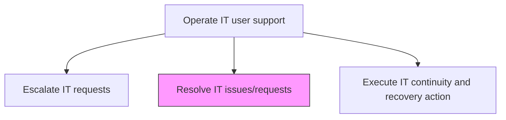
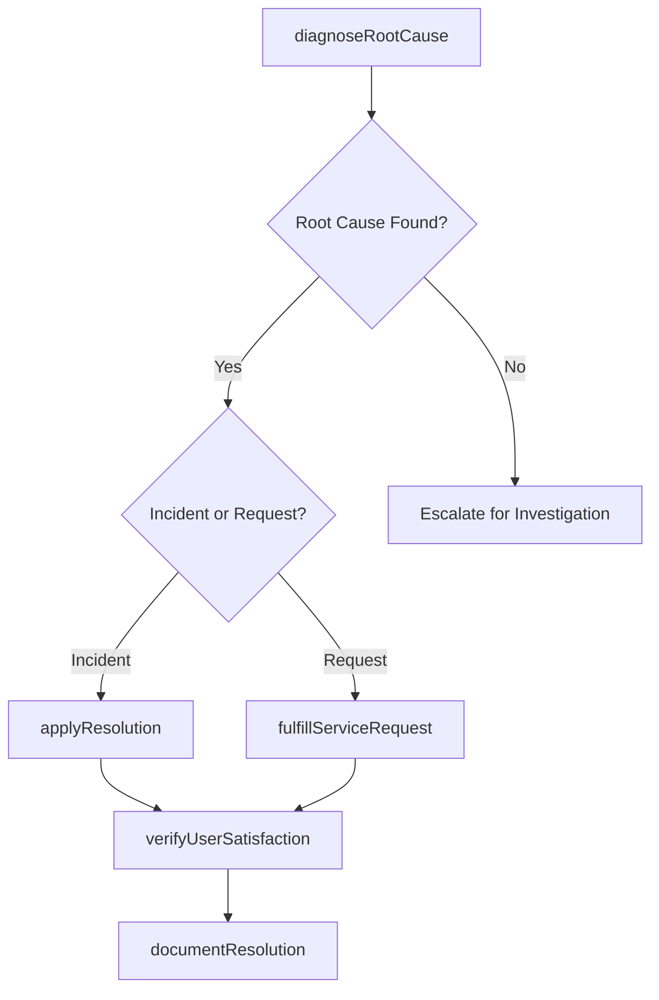

# Resolve IT issues/requests

> Business-as-Code definition for diagnosing and resolving IT issues and fulfilling service requests reported by users, applying technical expertise, knowledge base articles, and resolution procedures to restore normal service.

## Overview

Creating a structure to resolve issues/requests of IT services using different mechanisms.

## Process Hierarchy



## GraphDL

```yaml
resolve:
  object: IT Issues/requests
  actor: SupportResolutionAgent
  result: ResolutionRecord
```

## Actions

| Action | Description |
|--------|-------------|
| diagnoseRootCause | Investigate the reported issue to identify the underlying cause |
| applyResolution | Implement the fix, workaround, or configuration change to resolve the issue |
| fulfillServiceRequest | Complete service requests such as access provisioning, installations, or changes |
| verifyUserSatisfaction | Confirm with the user that the issue is resolved to their satisfaction |
| documentResolution | Record resolution details including steps taken, root cause, and time to resolve |

## Events

| Event | Description |
|-------|-------------|
| rootCauseDiagnosed | Underlying cause of reported issue identified |
| resolutionApplied | Fix or workaround implemented to resolve the issue |
| serviceRequestFulfilled | Service request completed as specified |
| userSatisfactionVerified | User confirmed issue resolved to satisfaction |
| resolutionDocumented | Resolution details and root cause recorded |

## Searches

| Search | Description |
|--------|-------------|
| getOpenTickets | Retrieve open tickets assigned for resolution filtered by priority or category |
| getResolutionHistory | Access resolution history for similar issues to aid diagnosis |
| getResolutionMetrics | Get resolution time, success rate, and satisfaction metrics |

## Process Flow



## RACI Matrix

| Activity | Responsible | Accountable | Consulted | Informed |
|----------|-------------|-------------|-----------|----------|
| diagnoseRootCause | SupportResolutionAgent | ServiceDeskTeamLead | SubjectMatterExperts | ApplicationTeams |
| applyResolution | SupportResolutionAgent | ServiceDeskTeamLead | InfrastructureTeam | SecurityTeam |
| documentResolution | SupportResolutionAgent | KnowledgeManager | ServiceDeskTeamLead | QualityTeam |

## Related Processes

| Process | Relationship |
|---------|-------------|
| 8.7.8.4 Escalate IT requests | Upstream - escalated issues arrive for specialist resolution |
| 8.7.8.1 Triage IT issues/requests | Upstream - triaged tickets assigned for resolution |
| 8.7.5.3 Maintain service support knowledge repository | Downstream - resolution details feed knowledge base |

## Related Departments

| Department | Role |
|-----------|------|
| Service Desk | Resolves first-tier issues and fulfills standard requests |
| Application Support | Resolves application-specific issues at higher tiers |
| Infrastructure Support | Resolves infrastructure-related incidents |

## Related Occupations

| Occupation | Involvement |
|-----------|-------------|
| Support Resolution Agent | Diagnoses and resolves user-reported issues |
| Application Support Analyst | Resolves complex application issues |
| Infrastructure Support Engineer | Resolves hardware and system issues |

## KPIs

| KPI | Description | Unit |
|-----|-------------|------|
| First Contact Resolution Rate | Percentage of issues resolved during the initial contact | % |
| Mean Time to Resolve | Average time from ticket assignment to resolution | Hours |
| Resolution Satisfaction Score | User satisfaction rating after issue resolution | Score (1-5) |
| Reopen Rate | Percentage of resolved tickets reopened within 7 days | % |

## Usage

```typescript
import { resolveItIssuesRequests } from '@headlessly/resolve-it-issues-requests'

const resolver = resolveItIssuesRequests()

// Get open tickets
const tickets = await resolver.getOpenTickets({
  priority: 'high',
  assignedTo: 'tier-2-team'
})

// Get resolution history for similar issues
const history = await resolver.getResolutionHistory({
  category: 'email-delivery-failure',
  limit: 10
})
```
