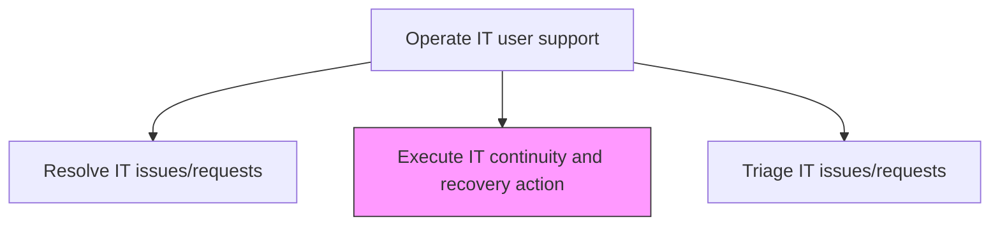
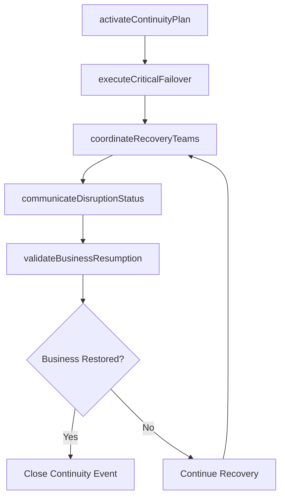

# Execute IT continuity and recovery action

> Business-as-Code definition for executing IT continuity and recovery actions that ensure critical business processes remain operational during and after disruptive events through planned failover, recovery, and communication procedures.

## Overview

Successfully implement preventive measures to manage IT risk of exposure to internal and external threats. Integrating the disciplines of Emergency Response, Crisis Management, Disaster Recovery (technology continuity) and Business Continuity for IT.

## Process Hierarchy



## GraphDL

```yaml
execute:
  object: IT Continuity And Recovery Action
  actor: ContinuityActionCoordinator
  result: ContinuityRecoveryRecord
```

## Actions

| Action | Description |
|--------|-------------|
| activateContinuityPlan | Invoke the business continuity plan appropriate to the disruption type and severity |
| executeCriticalFailover | Switch critical business processes to redundant systems and alternate sites |
| coordinateRecoveryTeams | Mobilize and direct recovery teams across infrastructure, application, and business domains |
| communicateDisruptionStatus | Provide regular status updates to stakeholders during the continuity event |
| validateBusinessResumption | Confirm critical business processes have been restored to acceptable operation levels |

## Events

| Event | Description |
|-------|-------------|
| continuityPlanActivated | Business continuity plan invoked for the disruption event |
| criticalFailoverExecuted | Critical processes switched to redundant systems |
| recoveryTeamsCoordinated | Recovery teams mobilized across domains |
| disruptionStatusCommunicated | Status updates provided to stakeholders |
| businessResumptionValidated | Critical processes confirmed restored to acceptable levels |

## Searches

| Search | Description |
|--------|-------------|
| getContinuityStatus | Retrieve real-time status of active continuity and recovery operations |
| getContinuityPlans | Access business continuity plans filtered by scenario or criticality |
| getRecoveryTimeline | Get timeline of recovery milestones and current progress |

## Process Flow



## RACI Matrix

| Activity | Responsible | Accountable | Consulted | Informed |
|----------|-------------|-------------|-----------|----------|
| activateContinuityPlan | ContinuityActionCoordinator | BusinessContinuityManager | ITDirector | CrisisManagementTeam |
| executeCriticalFailover | DisasterRecoveryEngineer | ContinuityActionCoordinator | InfrastructureTeam | ApplicationTeams |
| validateBusinessResumption | ContinuityActionCoordinator | BusinessContinuityManager | BusinessUnitLeads | QATeam |

## Related Processes

| Process | Relationship |
|---------|-------------|
| 8.7.6.8 Manage IT infrastructure/data recovery | Related - infrastructure recovery supports continuity actions |
| 8.7.6.5 Respond to unplanned operational issues | Upstream - operational issues may trigger continuity activation |
| 8.7.6.7 Monitor IT infrastructure security | Upstream - security incidents may cause business disruption |

## Related Departments

| Department | Role |
|-----------|------|
| Business Continuity | Coordinates continuity plan activation and business resumption |
| Disaster Recovery | Executes technical failover and recovery procedures |
| Crisis Communications | Manages stakeholder communications during disruption events |

## Related Occupations

| Occupation | Involvement |
|-----------|-------------|
| Continuity Action Coordinator | Leads continuity event response and recovery coordination |
| Disaster Recovery Engineer | Executes failover and technical recovery procedures |
| Crisis Communications Manager | Provides stakeholder updates during disruption |

## KPIs

| KPI | Description | Unit |
|-----|-------------|------|
| Recovery Time Achievement | Percentage of recoveries completed within RTO targets | % |
| Business Process Restoration Rate | Percentage of critical processes restored within target timeframes | % |
| Communication Timeliness | Percentage of status updates delivered within required intervals | % |
| Continuity Plan Test Success | Percentage of continuity plan tests completing successfully | % |

## Usage

```typescript
import { executeItContinuityAndRecoveryAction } from '@headlessly/execute-it-continuity-and-recovery-action'

const continuity = executeItContinuityAndRecoveryAction()

// Get continuity status
const status = await continuity.getContinuityStatus({
  eventId: 'dc-outage-2024-12',
  scope: 'critical-processes'
})

// Get continuity plans
const plans = await continuity.getContinuityPlans({
  scenario: 'data-center-failure',
  criticality: 'tier-1'
})
```
