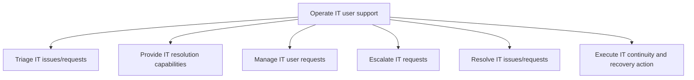
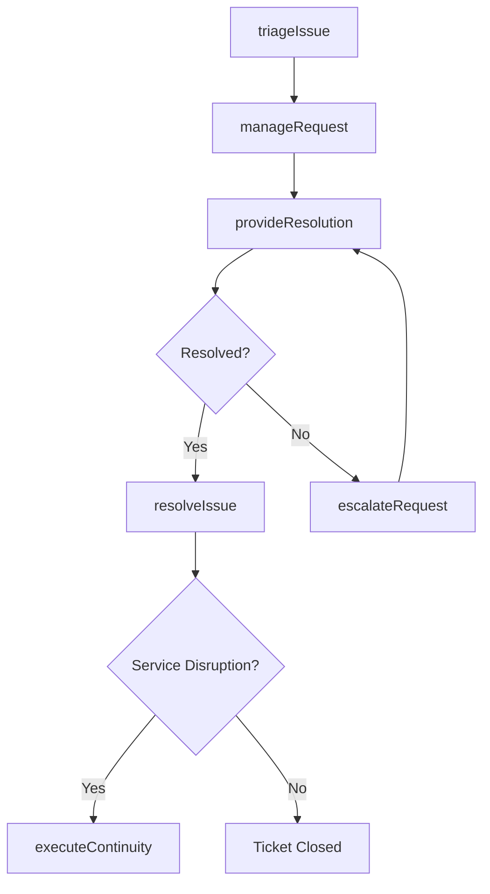

# Operate IT user support

> Business-as-Code definition for operating the IT user support function, including ticket triage, resolution capability provisioning, request management, escalation, issue resolution, and continuity and recovery actions.

## Overview

Managing systematic user support functionality and capability through defined procedures. Determine, record, and monitor user requests. Execute issue/request resolution. Utilize escalation path when needed. Resolve issue/request.

## Process Hierarchy



## GraphDL

```yaml
operate:
  object: IT User Support
  actor: ServiceDeskManager
  result: SupportTicketResolution
```

## Actions

| Action | Description |
|--------|-------------|
| triageIssue | Classify, prioritize, and route incoming IT issues and requests |
| provideResolution | Apply resolution capabilities to diagnose and fix issues |
| manageRequest | Track and manage the lifecycle of user support requests |
| escalateRequest | Elevate unresolved requests to higher support tiers |
| resolveIssue | Complete the resolution of IT issues and close tickets |
| executeContinuity | Implement IT continuity and recovery actions during disruptions |

## Events

| Event | Description |
|-------|-------------|
| issueTriaged | IT issue classified, prioritized, and assigned to a resolver |
| resolutionProvided | Resolution applied and issue diagnosis completed |
| requestManaged | User support request tracked through its lifecycle |
| requestEscalated | Unresolved request escalated to higher support tier |
| issueResolved | IT issue resolved and ticket closed |
| continuityExecuted | IT continuity or recovery action completed |

## Searches

| Search | Description |
|--------|-------------|
| findTickets | List support tickets filtered by status, priority, or assignee |
| getTicketDetails | Retrieve full details and history for a specific ticket |
| getResolutionMetrics | Get resolution time and satisfaction metrics by category |
| findEscalations | List escalated tickets with escalation path details |

## Process Flow



## RACI Matrix

| Activity | Responsible | Accountable | Consulted | Informed |
|----------|-------------|-------------|-----------|----------|
| triageIssue | ServiceDeskAnalyst | ServiceDeskManager | TechnicalLead | EndUsers |
| provideResolution | SupportEngineer | ServiceDeskManager | KnowledgeBase | EndUsers |
| escalateRequest | ServiceDeskAnalyst | ServiceDeskManager | Tier2Support | IncidentManager |
| resolveIssue | SupportEngineer | ServiceDeskManager | QATeam | EndUsers |
| executeContinuity | DisasterRecoveryLead | OperationsManager | InfrastructureTeam | ExecutiveTeam |

## Sub-Processes

| ID | Name | Description |
|----|------|-------------|
| 8.7.8.1 | Triage IT issues/requests | Evaluate and assign IT issues/requests accordingly to allow for the correct routing of IT issues to  |
| 8.7.8.2 | Provide IT resolution capabilities | Providing the necessary skills and competencies required to efficiently provide IT resolution throug |
| 8.7.8.3 | Manage IT user requests | Creating an effective plan and structure to address and resolve requests of IT users. Determine, rec |
| 8.7.8.4 | Escalate IT requests | Follow processes and procedures to escalate IT requests to required levels for resolution or effecti |
| 8.7.8.5 | Resolve IT issues/requests | Creating a structure to resolve issues/requests of IT services using different mechanisms. |
| 8.7.8.6 | Execute IT continuity and recovery action | Successfully implement preventive measures to manage IT risk of exposure to internal and external th |

## Related Processes

| Process | Relationship |
|---------|-------------|
| 8.7.5 Define service support planning | Upstream - support plan defines how user support operates |
| 8.7.2 Define and develop service support strategy | Upstream - support strategy guides user support operations |
| 8.7.6 Develop and manage service delivery operations | Parallel - operational issues may generate user support tickets |

## Related Departments

| Department | Role |
|-----------|------|
| Service Desk | Provides first-contact user support and triage |
| Technical Support | Delivers tier-2 resolution capabilities |
| IT Operations | Handles infrastructure-related escalations |
| Disaster Recovery | Executes continuity and recovery procedures |

## Related Occupations

| Occupation | Involvement |
|-----------|-------------|
| Help Desk Technician | Triages and resolves user issues at first contact |
| Desktop Support Engineer | Provides hands-on technical support |
| Service Desk Manager | Oversees user support operations and SLA compliance |

## KPIs

| KPI | Description | Unit |
|-----|-------------|------|
| First Contact Resolution Rate | Percentage of issues resolved at first contact | % |
| Mean Time to Resolve | Average time from ticket creation to resolution | Hours |
| Customer Satisfaction Score | End-user satisfaction with support interactions | Score (1-5) |
| Escalation Rate | Percentage of tickets requiring escalation | % |
| Ticket Backlog | Number of open tickets at end of reporting period | Count |

## Usage

```typescript
import { operateItUserSupport } from '@headlessly/operate-it-user-support'

const support = operateItUserSupport()

// Triage an incoming issue
const ticket = await support.triageIssue({
  reportedBy: 'user@company.com',
  category: 'Software',
  severity: 'P3',
  description: 'Unable to access shared drive after password reset'
})

// Resolve the issue
await support.resolveIssue({
  ticketId: ticket.id,
  resolution: 'Remapped network drive with updated credentials',
  rootCause: 'Password change did not propagate to network authentication'
})

// Get resolution metrics
const metrics = await support.getResolutionMetrics({
  period: '2025-Q2',
  category: 'Software'
})
```
