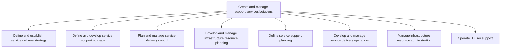
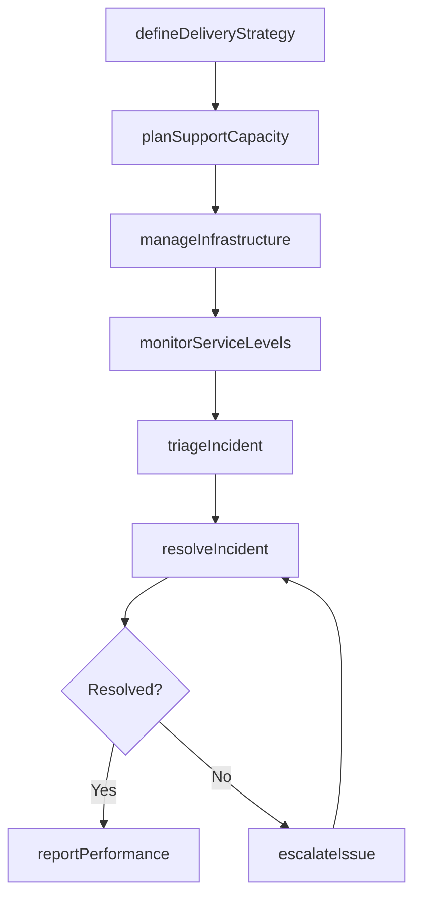

# Create and manage support services/solutions

> Business-as-Code definition for establishing and operating IT support services, including service delivery strategy, infrastructure management, user support operations, and incident resolution.

## Overview

Establishing and managing services for providing support to users of IT services and solutions. Define the plethora of services by which the organization assists users of computers, software products, or other information technology products.

## Process Hierarchy



## GraphDL

```yaml
create:
  object: Support Services/solutions
  actor: ITServiceDeliveryManager
  result: SupportServicePortfolio
```

## Actions

| Action | Description |
|--------|-------------|
| defineDeliveryStrategy | Establish the IT service delivery model and sourcing approach |
| planSupportCapacity | Forecast demand and allocate support resources accordingly |
| monitorServiceLevels | Track service level agreement compliance across support tiers |
| triageIncident | Classify and prioritize incoming service requests and incidents |
| resolveIncident | Diagnose and fix reported IT issues within SLA targets |
| escalateIssue | Elevate unresolved issues to higher support tiers or vendors |
| manageInfrastructure | Administer and maintain IT infrastructure components |
| reportPerformance | Generate service delivery and support performance reports |

## Events

| Event | Description |
|-------|-------------|
| deliveryStrategyDefined | Service delivery strategy established and documented |
| supportCapacityPlanned | Support resource levels determined and allocated |
| serviceLevelsMonitored | SLA compliance metrics collected and reviewed |
| incidentTriaged | Incoming incident classified, prioritized, and assigned |
| incidentResolved | IT issue diagnosed and fixed within SLA |
| issueEscalated | Unresolved issue elevated to next support tier |
| infrastructureManaged | Infrastructure maintenance or configuration completed |
| performanceReported | Service delivery performance report published |

## Searches

| Search | Description |
|--------|-------------|
| findIncidents | List incidents filtered by severity, status, or assigned team |
| getSLACompliance | Retrieve SLA compliance metrics for a service or time period |
| getInfrastructureAssets | List IT infrastructure assets by type, location, or status |
| findOpenTickets | List open support tickets with aging and priority details |
| getCapacityForecast | Retrieve demand forecast and resource capacity data |

## Process Flow



## RACI Matrix

| Activity | Responsible | Accountable | Consulted | Informed |
|----------|-------------|-------------|-----------|----------|
| defineDeliveryStrategy | ITServiceDeliveryManager | CIO | BusinessUnitLeads | ExecutiveTeam |
| planSupportCapacity | CapacityPlanner | VP IT Operations | ServiceDeskManager | Finance |
| triageIncident | ServiceDeskAnalyst | ServiceDeskManager | TechnicalLead | EndUsers |
| resolveIncident | SupportEngineer | TechnicalLead | VendorSupport | ServiceDeskManager |
| manageInfrastructure | SystemsAdministrator | InfrastructureManager | SecurityTeam | ITServiceDeliveryManager |

## Sub-Processes

| ID | Name | Description |
|----|------|-------------|
| 8.7.1 | Define and establish service delivery strategy | Defining and establishing strategy for delivering IT services and solutions to the users. Design an  |
| 8.7.2 | Define and develop service support strategy | Defining and creating a strategy for provision of support to users of IT services and solutions. |
| 8.7.3 | Plan and manage service delivery control | Determine and manage service delivery flow across different business functions. Understand the level |
| 8.7.4 | Develop and manage infrastructure resource planning | Developing and managing the resources required for administration of infrastructure. Manage the IT i |
| 8.7.5 | Define service support planning | Develop strategies and methodologies to provide service support. Examine service levels, support com |
| 8.7.6 | Develop and manage service delivery operations | Developing and managing different delivery services using service delivery systems for operational a |
| 8.7.7 | Manage infrastructure resource administration | Managing the resources required for administration of IT infrastructure. Manage the IT inventory and |
| 8.7.8 | Operate IT user support | Managing systematic user support functionality and capability through defined procedures. Determine, |

## Related Processes

| Process | Relationship |
|---------|-------------|
| 8.5 Develop and manage services/solutions | Upstream - provides services requiring support |
| 8.6 Deploy services/solutions | Upstream - hands off deployed services for ongoing support |
| 8.3 Manage IT resiliency | Parallel - coordinates disaster recovery and continuity |
| 8.2 Develop and manage IT customer relationships | Parallel - aligns support with customer expectations |

## Related Departments

| Department | Role |
|-----------|------|
| Service Desk | Provides first-line incident triage and resolution |
| IT Operations | Manages infrastructure and service delivery operations |
| Infrastructure Engineering | Maintains and configures hardware and network components |
| Vendor Management | Coordinates with external support providers |
| IT Service Management | Governs SLA compliance and process improvement |

## Related Occupations

| Occupation | Involvement |
|-----------|-------------|
| IT Service Delivery Manager | Oversees end-to-end support service operations |
| Help Desk Technician | Provides first-level user support and incident resolution |
| Systems Administrator | Maintains infrastructure and performs system administration |
| Network Engineer | Manages network infrastructure and connectivity |

## KPIs

| KPI | Description | Unit |
|-----|-------------|------|
| First Contact Resolution Rate | Percentage of incidents resolved at first contact | % |
| Mean Time to Resolve | Average time from incident creation to resolution | Hours |
| SLA Compliance Rate | Percentage of incidents resolved within SLA targets | % |
| System Uptime | Percentage of time IT infrastructure is operational | % |
| Customer Satisfaction Score | End-user satisfaction rating for IT support interactions | Score (1-5) |

## Usage

```typescript
import { createAndManageSupportServicesSolutions } from '@headlessly/create-and-manage-support-services-solutions'

const support = createAndManageSupportServicesSolutions()

// Triage a new incident
const incident = await support.triageIncident({
  reportedBy: 'user@company.com',
  category: 'Application',
  severity: 'P2',
  description: 'Customer portal returns 500 error on login'
})

// Resolve the incident
const resolution = await support.resolveIncident({
  incidentId: incident.id,
  rootCause: 'Expired SSL certificate on authentication service',
  resolution: 'Certificate renewed and service restarted'
})

// Check SLA compliance
const sla = await support.getSLACompliance({
  period: '2025-Q2',
  serviceGroup: 'Customer-Facing Applications'
})
```
