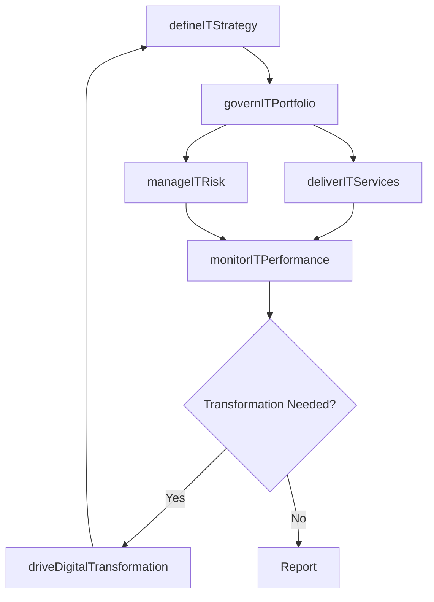

# Manage Information Technology (IT)

> Business-as-Code definition for the enterprise IT management function. Models the complete lifecycle of IT governance, service delivery, risk management, and technology innovation as programmable processes.

## Overview

Managing process groups relevant to the business of information technology within an organization. The process groups include "Develop and manage IT customer relationships", "Develop and manage IT business strategy", " Develop and manage IT resilience and risk", " Manage information", " Develop and manage services/solutions", "Deploy services/solutions", and " Create and manage support services/solutions".

## Process Hierarchy

```mermaid
graph TD
    A[Manage Information Technology (IT)]
    A --> B[Develop and manage IT customer relationships]
    A --> C[Develop and manage IT business strategy]
    A --> D[Develop and manage IT resilience and risk]
    A --> E[Manage information]
    A --> F[Develop and manage services/solutions]
    A --> G[Deploy services/solutions]
    A --> H[Create and manage support services/solutions]
```

## GraphDL

```yaml
manage:
  object: Information Technology (IT)
  actor: ChiefInformationOfficer
  result: ITGovernanceFramework
```

## Actions

| Action | Description |
|--------|-------------|
| defineITStrategy | Establish the overarching IT strategy aligned to business objectives |
| governITPortfolio | Oversee the portfolio of IT investments, projects, and services |
| manageITRisk | Identify, assess, and mitigate technology-related risks across the enterprise |
| deliverITServices | Coordinate the delivery of IT services to internal and external customers |
| monitorITPerformance | Track IT operational and financial performance against targets |
| driveDigitalTransformation | Lead technology-enabled business transformation initiatives |

## Events

| Event | Description |
|-------|-------------|
| itStrategyDefined | Enterprise IT strategy established and approved |
| itPortfolioGoverned | IT investment portfolio reviewed and rebalanced |
| itRiskManaged | Technology risk assessment completed with mitigation plans |
| itServicesDelivered | IT services provisioned and operational |
| itPerformanceMonitored | IT performance metrics collected and reported |
| digitalTransformationDriven | Digital transformation initiative launched or milestone reached |

## Searches

| Search | Description |
|--------|-------------|
| findITServices | List IT services filtered by type, status, or business unit |
| getITPortfolio | Retrieve IT investment portfolio with project details |
| getITRiskProfile | Get current IT risk posture and open mitigation items |
| getITPerformanceDashboard | Retrieve aggregated IT performance metrics and KPIs |

## Process Flow



## RACI Matrix

| Activity | Responsible | Accountable | Consulted | Informed |
|----------|-------------|-------------|-----------|----------|
| defineITStrategy | CIO | CEO | BusinessUnitLeaders | Board |
| governITPortfolio | ITPortfolioManager | CIO | Finance | BusinessUnitLeaders |
| manageITRisk | ITRiskManager | CISO | Legal | CIO |
| deliverITServices | ITServiceManager | CIO | BusinessUnitLeaders | EndUsers |
| monitorITPerformance | ITOperationsManager | CIO | Finance | ExecutiveTeam |

## Sub-Processes

| ID | Name | Description |
|----|------|-------------|
| 8.1 | Develop and manage IT customer relationships | Creating and administering relationships with IT customers. Understanding customer needs including h |
| 8.2 | Develop and manage IT business strategy | Handling the business of IT. Create a organization-wide strategy for the IT function. Define the org |
| 8.3 | Develop and manage IT resilience and risk | Develop and include the processes required to rapidly adapt and respond to any internal or external  |
| 8.4 | Manage information | Creating strategies to manage the organization's information and content. Outline the architecture f |
| 8.5 | Develop and manage services/solutions | Designing and maintaining the IT services/solutions catalogue. Evaluate the performance of IT servic |
| 8.6 | Deploy services/solutions | Executing IT services/solutions by creating a strategy for deployment. Plan and execute the changes. |
| 8.7 | Create and manage support services/solutions | Establishing and managing services for providing support to users of IT services and solutions. Defi |

## Related Processes

| Process | Relationship |
|---------|-------------|
| 1.0 Develop Vision and Strategy | Upstream - IT strategy aligns to corporate strategy |
| 7.0 Manage Human Capital | Parallel - IT supports workforce management systems |
| 11.0 Manage Business Risk | Parallel - IT risk integrates with enterprise risk management |

## Related Departments

| Department | Role |
|-----------|------|
| Information Technology | Primary owner of all IT management processes |
| Finance | Governs IT budgets and investment approvals |
| Legal and Compliance | Ensures IT regulatory and contractual compliance |
| Human Resources | Manages IT workforce planning and development |
| Operations | Key consumer of IT services and infrastructure |

## Related Occupations

| Occupation | Involvement |
|-----------|-------------|
| Chief Information Officer | Executive accountable for IT strategy and governance |
| IT Director | Manages IT operations and service delivery |
| Enterprise Architect | Designs technology architecture and standards |
| IT Security Manager | Oversees cybersecurity and risk management |

## KPIs

| KPI | Description | Unit |
|-----|-------------|------|
| IT Spend as Percentage of Revenue | Total IT expenditure relative to company revenue | % |
| System Uptime | Availability of critical IT systems | % |
| IT Project On-Time Delivery | Percentage of IT projects delivered on schedule | % |
| Security Incident Rate | Number of security incidents per reporting period | Count/Quarter |
| IT Customer Satisfaction | Internal user satisfaction with IT services | Score (1-5) |

## Usage

```typescript
import { manageInformationTechnology } from '@headlessly/manage-information-technology-it'

const it = manageInformationTechnology()

// Define IT strategy aligned to business goals
const strategy = await it.defineITStrategy({
  planningHorizon: '3-year',
  alignedTo: 'corporate-strategy-2025',
  focusAreas: ['cloud-migration', 'cybersecurity', 'data-analytics']
})

// Monitor IT performance across the portfolio
const dashboard = await it.monitorITPerformance({
  period: 'Q4-2025',
  metrics: ['uptime', 'project-delivery', 'budget-variance']
})
```
