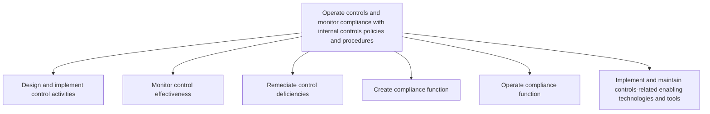

# Operate controls and monitor compliance with internal controls policies and procedures

> TODO: Business-as-Code definition for operate controls and monitor compliance with internal controls policies and procedures (automotive)

## Overview

Incorporating planning, management, operations, and monitoring of internal control mechanism policies and procedures in order to manage internal controls. Design and implement control activities. Monitor control effectiveness. Remediate control deficiencies. Create compliance functions. Operate compliance functions. Implement and maintain technologies and tools to enable the internal controls-related activities.

## Process Hierarchy



## GraphDL

```yaml
operate:
  object: Controls And Monitor Compliance With Internal Controls Policies And Procedures
  actor: TODO
  result: TODO
```

## Actions

| Action | Description |
|--------|-------------|
| TODO | TODO |

## Events

| Event | Description |
|-------|-------------|
| TODO | TODO |

## Searches

| Search | Description |
|--------|-------------|
| TODO | TODO |

## Process Flow


## RACI Matrix

| Activity | Responsible | Accountable | Consulted | Informed |
|----------|-------------|-------------|-----------|----------|
| TODO | TODO | TODO | TODO | TODO |

## Sub-Processes

| ID | Name | Description |
|----|------|-------------|
| 9.8.2.1 | Design and implement control activities | Defining and executing policies, procedures, techniques, and mechanisms and actions taken to minimiz |
| 9.8.2.2 | Monitor control effectiveness | Overseeing the activities for internal controls. Observe the effectiveness of policies, procedures,  |
| 9.8.2.3 | Remediate control deficiencies | Taking corrective measures for policies, procedures, techniques, and mechanisms actions taken to min |
| 9.8.2.4 | Create compliance function | Developing a compliance function for internal controls. Monitor trading activity. Avoid conflicts of |
| 9.8.2.5 | Operate compliance function | Administering operational activities of a compliance function. |
| 9.8.2.6 | Implement and maintain controls-related enabling technologies and tools | Implementing and maintaining the compliance technological systems or equipment that are control-enab |

## Related Processes

| Process | Relationship |
|---------|-------------|
| TODO | TODO |

## Related Departments

| Department | Role |
|-----------|------|
| TODO | TODO |

## Related Occupations

| Occupation | Involvement |
|-----------|-------------|
| TODO | TODO |

## KPIs

| KPI | Description | Unit |
|-----|-------------|------|
| TODO | TODO | TODO |

## Usage

```typescript
import { TODO } from '@headlessly/operate-controls-and-monitor-compliance-with-internal-controls-policies-and-procedures'

const client = TODO()

// TODO: Example action calls
```
