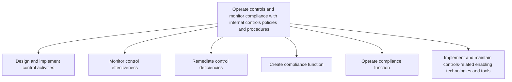

# Operate controls and monitor compliance with internal controls policies and procedures

> TODO: Business-as-Code definition for operate controls and monitor compliance with internal controls policies and procedures (consumer-electronics)

## Overview

TODO: Add process overview

## Process Hierarchy



## GraphDL

```yaml
operate:
  object: Controls And Monitor Compliance With Internal Controls Policies And Procedures
  actor: TODO
  result: TODO
```

## Actions

| Action | Description |
|--------|-------------|
| TODO | TODO |

## Events

| Event | Description |
|-------|-------------|
| TODO | TODO |

## Searches

| Search | Description |
|--------|-------------|
| TODO | TODO |

## Process Flow


## RACI Matrix

| Activity | Responsible | Accountable | Consulted | Informed |
|----------|-------------|-------------|-----------|----------|
| TODO | TODO | TODO | TODO | TODO |

## Sub-Processes

| ID | Name | Description |
|----|------|-------------|
| 9.8.2.1 | Design and implement control activities | TODO |
| 9.8.2.2 | Monitor control effectiveness | TODO |
| 9.8.2.3 | Remediate control deficiencies | TODO |
| 9.8.2.4 | Create compliance function | TODO |
| 9.8.2.5 | Operate compliance function | TODO |
| 9.8.2.6 | Implement and maintain controls-related enabling technologies and tools | TODO |

## Related Processes

| Process | Relationship |
|---------|-------------|
| TODO | TODO |

## Related Departments

| Department | Role |
|-----------|------|
| TODO | TODO |

## Related Occupations

| Occupation | Involvement |
|-----------|-------------|
| TODO | TODO |

## KPIs

| KPI | Description | Unit |
|-----|-------------|------|
| TODO | TODO | TODO |

## Usage

```typescript
import { TODO } from '@headlessly/operate-controls-and-monitor-compliance-with-internal-controls-policies-and-procedures'

const client = TODO()

// TODO: Example action calls
```
