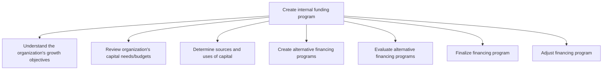

# Create internal funding program

> TODO: Business-as-Code definition for create internal funding program (consumer-products)

## Overview

TODO: Add process overview

## Process Hierarchy



## GraphDL

```yaml
create:
  object: Internal Funding Program
  actor: TODO
  result: TODO
```

## Actions

| Action | Description |
|--------|-------------|
| TODO | TODO |

## Events

| Event | Description |
|-------|-------------|
| TODO | TODO |

## Searches

| Search | Description |
|--------|-------------|
| TODO | TODO |

## Process Flow


## RACI Matrix

| Activity | Responsible | Accountable | Consulted | Informed |
|----------|-------------|-------------|-----------|----------|
| TODO | TODO | TODO | TODO | TODO |

## Sub-Processes

| ID | Name | Description |
|----|------|-------------|
| 9.7.2.1 | Understand the organization's growth objectives | TODO |
| 9.7.2.2 | Review organization's capital needs/budgets | TODO |
| 9.7.2.3 | Determine sources and uses of capital | TODO |
| 9.7.2.4 | Create alternative financing programs | TODO |
| 9.7.2.5 | Evaluate alternative financing programs | TODO |
| 9.7.2.6 | Finalize financing program | TODO |
| 9.7.2.7 | Adjust financing program | TODO |

## Related Processes

| Process | Relationship |
|---------|-------------|
| TODO | TODO |

## Related Departments

| Department | Role |
|-----------|------|
| TODO | TODO |

## Related Occupations

| Occupation | Involvement |
|-----------|-------------|
| TODO | TODO |

## KPIs

| KPI | Description | Unit |
|-----|-------------|------|
| TODO | TODO | TODO |

## Usage

```typescript
import { TODO } from '@headlessly/create-internal-funding-program'

const client = TODO()

// TODO: Example action calls
```
