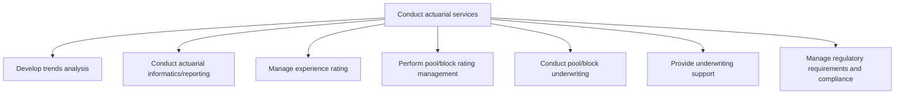

# Conduct actuarial services

> TODO: Business-as-Code definition for conduct actuarial services (unknown)

## Overview

TODO: Add process overview

## Process Hierarchy



## GraphDL

```yaml
conduct:
  object: Actuarial Services
  actor: TODO
  result: TODO
```

## Actions

| Action | Description |
|--------|-------------|
| TODO | TODO |

## Events

| Event | Description |
|-------|-------------|
| TODO | TODO |

## Searches

| Search | Description |
|--------|-------------|
| TODO | TODO |

## Process Flow


## RACI Matrix

| Activity | Responsible | Accountable | Consulted | Informed |
|----------|-------------|-------------|-----------|----------|
| TODO | TODO | TODO | TODO | TODO |

## Sub-Processes

| ID | Name | Description |
|----|------|-------------|
| 9.13.1 | Develop trends analysis | TODO |
| 9.13.2 | Conduct actuarial informatics/reporting | TODO |
| 9.13.3 | Manage experience rating | TODO |
| 9.13.4 | Perform pool/block rating management | TODO |
| 9.13.5 | Conduct pool/block underwriting | TODO |
| 9.13.6 | Provide underwriting support | TODO |
| 9.13.7 | Manage regulatory requirements and compliance | TODO |

## Related Processes

| Process | Relationship |
|---------|-------------|
| TODO | TODO |

## Related Departments

| Department | Role |
|-----------|------|
| TODO | TODO |

## Related Occupations

| Occupation | Involvement |
|-----------|-------------|
| TODO | TODO |

## KPIs

| KPI | Description | Unit |
|-----|-------------|------|
| TODO | TODO | TODO |

## Usage

```typescript
import { TODO } from '@headlessly/conduct-actuarial-services'

const client = TODO()

// TODO: Example action calls
```
