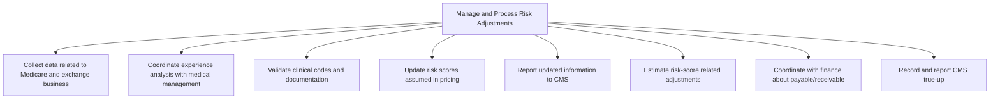

# Manage and Process Risk Adjustments

> TODO: Business-as-Code definition for manage and process risk adjustments (unknown)

## Overview

TODO: Add process overview

## Process Hierarchy



## GraphDL

```yaml
manage:
  object: And Process Risk Adjustments
  actor: TODO
  result: TODO
```

## Actions

| Action | Description |
|--------|-------------|
| TODO | TODO |

## Events

| Event | Description |
|-------|-------------|
| TODO | TODO |

## Searches

| Search | Description |
|--------|-------------|
| TODO | TODO |

## Process Flow


## RACI Matrix

| Activity | Responsible | Accountable | Consulted | Informed |
|----------|-------------|-------------|-----------|----------|
| TODO | TODO | TODO | TODO | TODO |

## Sub-Processes

| ID | Name | Description |
|----|------|-------------|
| 9.2.6.1 | Collect data related to Medicare and exchange business | TODO |
| 9.2.6.2 | Coordinate experience analysis with medical management | TODO |
| 9.2.6.3 | Validate clinical codes and documentation | TODO |
| 9.2.6.4 | Update risk scores assumed in pricing | TODO |
| 9.2.6.5 | Report updated information to CMS | TODO |
| 9.2.6.6 | Estimate risk-score related adjustments | TODO |
| 9.2.6.7 | Coordinate with finance about payable/receivable | TODO |
| 9.2.6.8 | Record and report CMS true-up | TODO |

## Related Processes

| Process | Relationship |
|---------|-------------|
| TODO | TODO |

## Related Departments

| Department | Role |
|-----------|------|
| TODO | TODO |

## Related Occupations

| Occupation | Involvement |
|-----------|-------------|
| TODO | TODO |

## KPIs

| KPI | Description | Unit |
|-----|-------------|------|
| TODO | TODO | TODO |

## Usage

```typescript
import { TODO } from '@headlessly/manage-and-process-risk-adjustments'

const client = TODO()

// TODO: Example action calls
```
