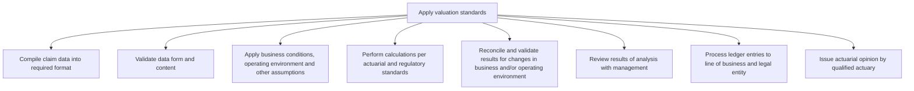

# Apply valuation standards

> TODO: Business-as-Code definition for apply valuation standards (unknown)

## Overview

TODO: Add process overview

## Process Hierarchy



## GraphDL

```yaml
apply:
  object: Valuation Standards
  actor: TODO
  result: TODO
```

## Actions

| Action | Description |
|--------|-------------|
| TODO | TODO |

## Events

| Event | Description |
|-------|-------------|
| TODO | TODO |

## Searches

| Search | Description |
|--------|-------------|
| TODO | TODO |

## Process Flow


## RACI Matrix

| Activity | Responsible | Accountable | Consulted | Informed |
|----------|-------------|-------------|-----------|----------|
| TODO | TODO | TODO | TODO | TODO |

## Sub-Processes

| ID | Name | Description |
|----|------|-------------|
| 9.7.2.1 | Compile claim data into required format | TODO |
| 9.7.2.2 | Validate data form and content | TODO |
| 9.7.2.3 | Apply business conditions, operating environment and other assumptions | TODO |
| 9.7.2.4 | Perform calculations per actuarial and regulatory standards | TODO |
| 9.7.2.5 | Reconcile and validate results for changes in business and/or operating environment | TODO |
| 9.7.2.6 | Review results of analysis with management | TODO |
| 9.7.2.7 | Process ledger entries to line of business and legal entity | TODO |
| 9.7.2.8 | Issue actuarial opinion by qualified actuary | TODO |

## Related Processes

| Process | Relationship |
|---------|-------------|
| TODO | TODO |

## Related Departments

| Department | Role |
|-----------|------|
| TODO | TODO |

## Related Occupations

| Occupation | Involvement |
|-----------|-------------|
| TODO | TODO |

## KPIs

| KPI | Description | Unit |
|-----|-------------|------|
| TODO | TODO | TODO |

## Usage

```typescript
import { TODO } from '@headlessly/apply-valuation-standards'

const client = TODO()

// TODO: Example action calls
```
