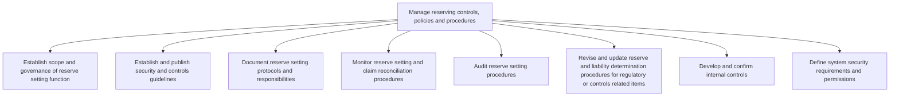

# Manage reserving controls, policies and procedures

> TODO: Business-as-Code definition for manage reserving controls, policies and procedures (unknown)

## Overview

TODO: Add process overview

## Process Hierarchy



## GraphDL

```yaml
manage:
  object: Reserving Controls, Policies And Procedures
  actor: TODO
  result: TODO
```

## Actions

| Action | Description |
|--------|-------------|
| TODO | TODO |

## Events

| Event | Description |
|-------|-------------|
| TODO | TODO |

## Searches

| Search | Description |
|--------|-------------|
| TODO | TODO |

## Process Flow


## RACI Matrix

| Activity | Responsible | Accountable | Consulted | Informed |
|----------|-------------|-------------|-----------|----------|
| TODO | TODO | TODO | TODO | TODO |

## Sub-Processes

| ID | Name | Description |
|----|------|-------------|
| 9.7.3.1 | Establish scope and governance of reserve setting function | TODO |
| 9.7.3.2 | Establish and publish security and controls guidelines | TODO |
| 9.7.3.3 | Document reserve setting protocols and responsibilities | TODO |
| 9.7.3.4 | Monitor reserve setting and claim reconciliation procedures | TODO |
| 9.7.3.5 | Audit reserve setting procedures | TODO |
| 9.7.3.6 | Revise and update reserve and liability determination procedures for regulatory or controls related items | TODO |
| 9.7.3.7 | Develop and confirm internal controls | TODO |
| 9.7.3.8 | Define system security requirements and permissions | TODO |

## Related Processes

| Process | Relationship |
|---------|-------------|
| TODO | TODO |

## Related Departments

| Department | Role |
|-----------|------|
| TODO | TODO |

## Related Occupations

| Occupation | Involvement |
|-----------|-------------|
| TODO | TODO |

## KPIs

| KPI | Description | Unit |
|-----|-------------|------|
| TODO | TODO | TODO |

## Usage

```typescript
import { TODO } from '@headlessly/manage-reserving-controls,-policies-and-procedures'

const client = TODO()

// TODO: Example action calls
```
