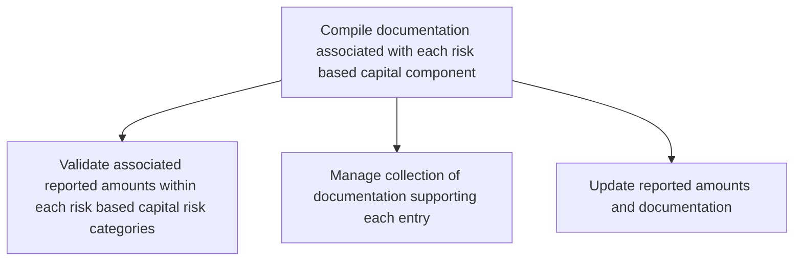

# Compile documentation associated with each risk based capital component

> TODO: Business-as-Code definition for compile documentation associated with each risk based capital component (unknown)

## Overview

TODO: Add process overview

## Process Hierarchy



## GraphDL

```yaml
compile:
  object: Documentation Associated With Each Risk Based Capital Component
  actor: TODO
  result: TODO
```

## Actions

| Action | Description |
|--------|-------------|
| TODO | TODO |

## Events

| Event | Description |
|-------|-------------|
| TODO | TODO |

## Searches

| Search | Description |
|--------|-------------|
| TODO | TODO |

## Process Flow


## RACI Matrix

| Activity | Responsible | Accountable | Consulted | Informed |
|----------|-------------|-------------|-----------|----------|
| TODO | TODO | TODO | TODO | TODO |

## Sub-Processes

| ID | Name | Description |
|----|------|-------------|
| 9.9.2.1 | Validate associated reported amounts within each risk based capital risk categories | TODO |
| 9.9.2.2 | Manage collection of documentation supporting each entry | TODO |
| 9.9.2.3 | Update reported amounts and documentation | TODO |

## Related Processes

| Process | Relationship |
|---------|-------------|
| TODO | TODO |

## Related Departments

| Department | Role |
|-----------|------|
| TODO | TODO |

## Related Occupations

| Occupation | Involvement |
|-----------|-------------|
| TODO | TODO |

## KPIs

| KPI | Description | Unit |
|-----|-------------|------|
| TODO | TODO | TODO |

## Usage

```typescript
import { TODO } from '@headlessly/compile-documentation-associated-with-each-risk-based-capital-component'

const client = TODO()

// TODO: Example action calls
```
