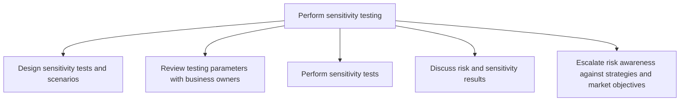

# Perform sensitivity testing

> TODO: Business-as-Code definition for perform sensitivity testing (unknown)

## Overview

TODO: Add process overview

## Process Hierarchy



## GraphDL

```yaml
perform:
  object: Sensitivity Testing
  actor: TODO
  result: TODO
```

## Actions

| Action | Description |
|--------|-------------|
| TODO | TODO |

## Events

| Event | Description |
|-------|-------------|
| TODO | TODO |

## Searches

| Search | Description |
|--------|-------------|
| TODO | TODO |

## Process Flow


## RACI Matrix

| Activity | Responsible | Accountable | Consulted | Informed |
|----------|-------------|-------------|-----------|----------|
| TODO | TODO | TODO | TODO | TODO |

## Sub-Processes

| ID | Name | Description |
|----|------|-------------|
| 9.9.5.1 | Design sensitivity tests and scenarios | TODO |
| 9.9.5.2 | Review testing parameters with business owners | TODO |
| 9.9.5.3 | Perform sensitivity tests | TODO |
| 9.9.5.4 | Discuss risk and sensitivity results | TODO |
| 9.9.5.5 | Escalate risk awareness against strategies and market objectives | TODO |

## Related Processes

| Process | Relationship |
|---------|-------------|
| TODO | TODO |

## Related Departments

| Department | Role |
|-----------|------|
| TODO | TODO |

## Related Occupations

| Occupation | Involvement |
|-----------|-------------|
| TODO | TODO |

## KPIs

| KPI | Description | Unit |
|-----|-------------|------|
| TODO | TODO | TODO |

## Usage

```typescript
import { TODO } from '@headlessly/perform-sensitivity-testing'

const client = TODO()

// TODO: Example action calls
```
