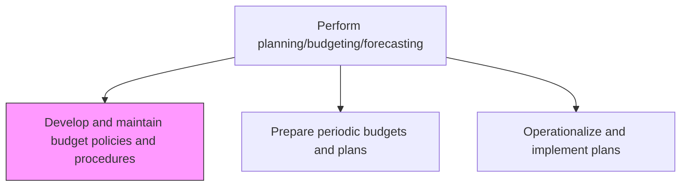
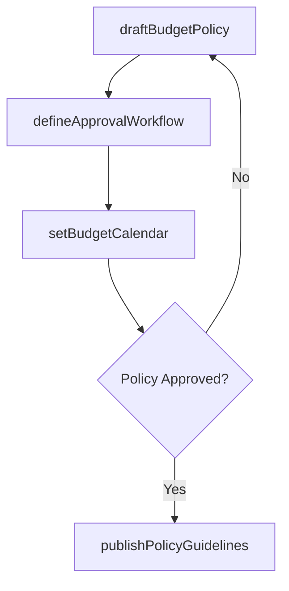

# Develop and maintain budget policies and procedures

> Business-as-Code definition for budget policy development and maintenance. Models the creation, review, and publication of budgetary guidelines, timelines, templates, and approval workflows.

## Overview

Formulating financial budgetary guidelines and strategies. Develop a framework for rules and regulations regarding budgets, including approval thresholds, timeline requirements, and template standards that govern the annual planning cycle. Well-defined budget policies reduce cycle time, ensure cross-departmental consistency, and provide the control framework that auditors and regulators expect. This process creates the step-by-step procedures cost center owners follow to request, justify, and gain authorization for resource allocations.

## Process Hierarchy



## GraphDL

```yaml
develop:
  object: And Maintain Budget Policies And Procedures
  actor: FPAManager
  result: BudgetPolicyDocument
```

## Actions

| Action | Description |
|--------|-------------|
| draftBudgetPolicy | Create or revise budgetary rules, timelines, and templates |
| defineApprovalWorkflow | Specify authorization levels for budget submissions and changes |
| setBudgetCalendar | Establish milestones and deadlines for the budget cycle |
| publishPolicyGuidelines | Distribute approved budget policies to all cost center owners |

## Events

| Event | Description |
|-------|-------------|
| budgetPolicyDrafted | Budget policy document created or revised |
| approvalWorkflowDefined | Budget authorization levels and routing rules established |
| budgetCalendarSet | Budget cycle milestones and deadlines published |
| policyGuidelinesPublished | Budget policies distributed to the organization |

## Searches

| Search | Description |
|--------|-------------|
| getBudgetPolicies | Retrieve current budget policies by category or effective date |
| getBudgetCalendar | Get budget cycle milestones and deadlines |
| getApprovalWorkflow | Query budget authorization levels by role or amount |

## Process Flow



## RACI Matrix

| Activity | Responsible | Accountable | Consulted | Informed |
|----------|-------------|-------------|-----------|----------|
| draftBudgetPolicy | FP&A Manager | CFO | Controller | Business Unit Heads |
| defineApprovalWorkflow | FP&A Manager | CFO | Internal Audit | All Managers |
| setBudgetCalendar | FP&A Manager | CFO | Operations Directors | All Departments |
| publishPolicyGuidelines | FP&A Analyst | FP&A Manager | IT | Cost Center Owners |

## Related Processes

| Process | Relationship |
|---------|-------------|
| 9.1.1.2 Prepare periodic budgets and plans | Downstream - policies guide budget preparation |
| 9.1.1.5 Perform variance analysis against forecasts and budgets | Downstream - policies set materiality thresholds for variance investigation |
| 9.3.1 Manage policies and procedures | Parallel - budget policies align with accounting policies |
| 9.1.4 Evaluate and manage financial performance | Downstream - budget framework sets performance measurement targets |

## Related Departments

| Department | Role |
|-----------|------|
| Financial Planning and Analysis | Primary owner of budget policy development |
| Accounting | Ensures alignment with accounting standards |
| Internal Audit | Reviews policy compliance and control adequacy |

## Related Occupations

| Occupation | Involvement |
|-----------|-------------|
| FP&A Manager | Leads policy drafting and stakeholder alignment |
| Budget Analyst | Maintains policy documentation and templates |

## KPIs

| KPI | Description | Unit |
|-----|-------------|------|
| Policy Update Frequency | Number of policy revisions per fiscal year | Count |
| Policy Compliance Rate | Percentage of budgets submitted per policy guidelines | % |
| Budget Calendar Adherence | Percentage of milestones met on schedule | % |
| Approval Cycle Time | Average days from budget submission to final authorization | Days |

## Usage

```typescript
import { developAndMaintainBudgetPoliciesAndProcedures } from '@headlessly/develop-and-maintain-budget-policies-and-procedures'

const budgetPolicy = developAndMaintainBudgetPoliciesAndProcedures()

// Draft a new budget policy for the fiscal year
const policy = await budgetPolicy.draftBudgetPolicy({
  fiscalYear: 2026,
  budgetMethod: 'zero-based',
  submissionDeadline: '2025-10-31'
})

// Publish approved guidelines
await budgetPolicy.publishPolicyGuidelines({
  policyId: policy.id,
  audience: 'all-cost-center-owners'
})
```
