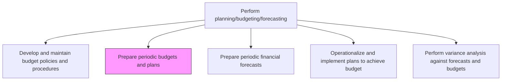
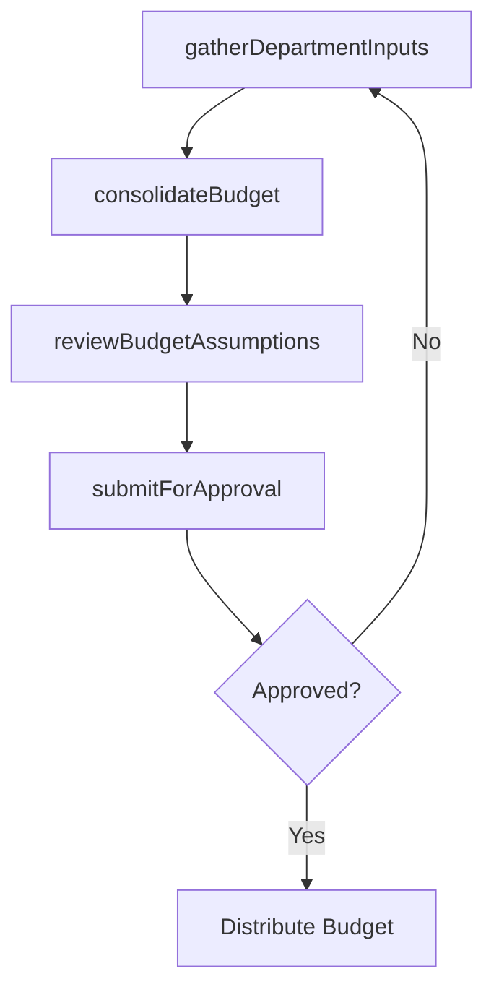

# Prepare periodic budgets and plans

> Business-as-Code definition for periodic budget and plan preparation. Models the compilation of department inputs, consolidation of operating budgets, and submission for executive approval.

## Overview

Creating reports on a quarterly or annual basis for fund allocation. Create a financial statement that estimates revenues and expenses over a specific period of time, leveraging budget methods such as cost-based and zero-based budgeting techniques in light of the periodic targets outlined during Develop and maintain budget policies and procedures [10771]. The budget preparation process drives organizational alignment by translating strategic objectives into departmental spending authorities and revenue targets. Effective budget preparation reduces over- and under-spending, supports capital allocation decisions, and establishes the baseline against which financial performance is measured throughout the fiscal period.

## Process Hierarchy



## GraphDL

```yaml
prepare:
  object: Periodic Budgets And Plans
  actor: BudgetAnalyst
  result: ConsolidatedBudget
```

## Actions

| Action | Description |
|--------|-------------|
| gatherDepartmentInputs | Collect revenue and expense projections from each cost center |
| consolidateBudget | Aggregate department submissions into a company-wide budget |
| reviewBudgetAssumptions | Validate volume, pricing, and cost assumptions |
| submitForApproval | Present consolidated budget to executive leadership for authorization |

## Events

| Event | Description |
|-------|-------------|
| departmentInputsGathered | All cost center budget submissions received |
| budgetConsolidated | Department budgets aggregated into consolidated view |
| budgetAssumptionsReviewed | Key assumptions validated and documented |
| budgetSubmittedForApproval | Consolidated budget presented for executive review |

## Searches

| Search | Description |
|--------|-------------|
| getBudgetSubmissions | List budget submissions by department and status |
| getConsolidatedBudget | Retrieve consolidated budget for a fiscal year |
| getBudgetAssumptions | Query key assumptions underlying the budget |

## Process Flow



## RACI Matrix

| Activity | Responsible | Accountable | Consulted | Informed |
|----------|-------------|-------------|-----------|----------|
| gatherDepartmentInputs | Budget Analyst | FP&A Manager | Department Managers | Controller |
| consolidateBudget | Budget Analyst | FP&A Manager | Revenue Operations | CFO |
| reviewBudgetAssumptions | FP&A Manager | Controller | Business Unit Heads | Internal Audit |
| submitForApproval | FP&A Manager | CFO | Board of Directors | All Departments |

## Related Processes

| Process | Relationship |
|---------|-------------|
| 9.1.1.1 Develop and maintain budget policies and procedures | Upstream - policies define the budget framework |
| 9.1.1.3 Operationalize and implement plans to achieve budget | Downstream - approved budgets become spending authorities |
| 9.1.1.4 Prepare periodic financial forecasts | Downstream - budget forms the baseline for rolling forecasts |
| 9.1.4 Evaluate and manage financial performance | Downstream - budget targets establish performance benchmarks |

## Related Departments

| Department | Role |
|-----------|------|
| Financial Planning and Analysis | Leads budget consolidation and review |
| All Departments | Submit budget requests and justify resource needs |
| Executive Leadership | Approves final consolidated budget |

## Related Occupations

| Occupation | Involvement |
|-----------|-------------|
| Budget Analyst | Compiles and validates departmental budget submissions |
| FP&A Manager | Reviews, consolidates, and presents budget to leadership |

## KPIs

| KPI | Description | Unit |
|-----|-------------|------|
| Budget Cycle Time | Days from kickoff to final budget approval | Days |
| Submission Completion Rate | Percentage of departments submitting budgets on time | % |
| Budget Iterations | Number of revision cycles before approval | Count |
| Budget Accuracy | Variance between approved budget and year-end actuals | % |

## Usage

```typescript
import { preparePeriodicBudgetsAndPlans } from '@headlessly/prepare-periodic-budgets-and-plans'

const budgets = preparePeriodicBudgetsAndPlans()

// Consolidate department budget submissions
const consolidated = await budgets.consolidateBudget({
  fiscalYear: 2026,
  method: 'zero-based'
})

// Submit for executive approval
await budgets.submitForApproval({
  budgetId: consolidated.id,
  reviewers: ['cfo@company.com', 'ceo@company.com']
})
```
