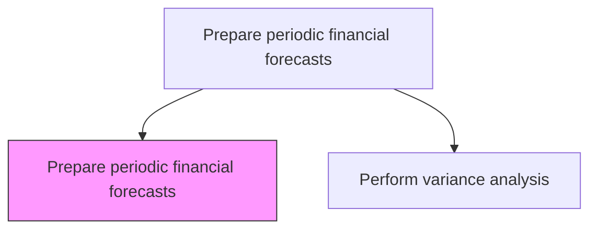
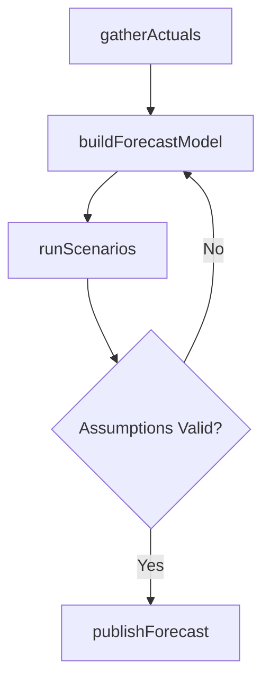

# Prepare periodic financial forecasts

> Business-as-Code definition for periodic financial forecast preparation. Models the development of revenue, expense, and cash flow projections using trend analysis, driver-based modeling, and scenario planning.

## Overview

Creating estimates of the projected income and expenses required over a predetermined time frame. Develop the projections of profit and loss statements, balance sheets, and the cash flow forecast using driver-based models, trend analysis, and scenario planning. Accurate financial forecasting enables leadership to anticipate cash shortfalls, reallocate resources proactively, and adjust strategy before variances become material. Rolling forecasts, updated monthly or quarterly, provide a more agile alternative to static annual budgets and improve organizational responsiveness to changing market conditions.

## Process Hierarchy



## GraphDL

```yaml
prepare:
  object: Periodic Financial Forecasts
  actor: FPAAnalyst
  result: RollingForecast
```

## Actions

| Action | Description |
|--------|-------------|
| gatherActuals | Collect year-to-date actual results as forecast baseline |
| buildForecastModel | Develop driver-based models for revenue, expense, and cash flow |
| runScenarios | Generate best-case, base-case, and worst-case projections |
| publishForecast | Distribute approved forecast to stakeholders |

## Events

| Event | Description |
|-------|-------------|
| actualsGathered | Year-to-date actual data collected for forecast baseline |
| forecastModelBuilt | Driver-based forecast model constructed with revenue, expense, and cash flow projections linked to operational drivers |
| scenariosRun | Multiple forecast scenarios generated and compared |
| forecastPublished | Approved forecast distributed to management |

## Searches

| Search | Description |
|--------|-------------|
| getForecastVersions | List forecast revisions by date and assumptions |
| getScenarioComparison | Compare best, base, and worst-case projections |
| getForecastAccuracy | Retrieve historical forecast accuracy metrics |

## Process Flow



## RACI Matrix

| Activity | Responsible | Accountable | Consulted | Informed |
|----------|-------------|-------------|-----------|----------|
| gatherActuals | FP&A Analyst | FP&A Manager | Accounting | Controller |
| buildForecastModel | FP&A Analyst | FP&A Manager | Revenue Ops | Controller |
| runScenarios | FP&A Analyst | FP&A Manager | Sales | CFO |
| publishForecast | FP&A Manager | CFO | Business Unit Heads | Board |

## Related Processes

| Process | Relationship |
|---------|-------------|
| 9.1.1.2 Prepare periodic budgets and plans | Upstream - budget provides the baseline for forecasts |
| 9.1.1.5 Perform variance analysis against forecasts and budgets | Downstream - forecast-to-actual comparison |
| 9.1.1.3 Operationalize and implement plans to achieve budget | Parallel - forecasts trigger mid-cycle resource reallocation |
| 9.4.1 Perform capital planning and project approval | Consumer - cash flow forecasts inform capital investment timing |

## Related Departments

| Department | Role |
|-----------|------|
| Financial Planning and Analysis | Builds and maintains forecast models |
| Sales | Provides pipeline and revenue projections |
| Operations | Supplies volume and capacity assumptions |

## Related Occupations

| Occupation | Involvement |
|-----------|-------------|
| FP&A Analyst | Builds forecast models and runs scenario analysis |
| FP&A Manager | Reviews, approves, and presents forecasts |

## KPIs

| KPI | Description | Unit |
|-----|-------------|------|
| Forecast Accuracy | Variance between forecast and actual results | % |
| Forecast Cycle Time | Days to produce a complete forecast update | Days |
| Reforecast Frequency | Number of forecast updates per fiscal year | Count |
| Scenario Coverage | Number of distinct scenarios modeled per forecast cycle | Count |

## Usage

```typescript
import { preparePeriodicFinancialForecasts } from '@headlessly/prepare-periodic-financial-forecasts'

const forecasting = preparePeriodicFinancialForecasts()

// Build a rolling 12-month forecast
const forecast = await forecasting.buildForecastModel({
  horizon: 12,
  method: 'driver-based',
  drivers: ['headcount', 'revenue-pipeline', 'unit-volume']
})

// Run scenario comparison
const scenarios = await forecasting.runScenarios({
  forecastId: forecast.id,
  scenarios: ['optimistic', 'base', 'conservative']
})
```
