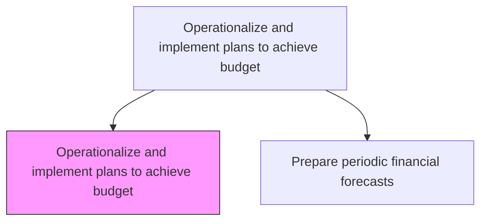
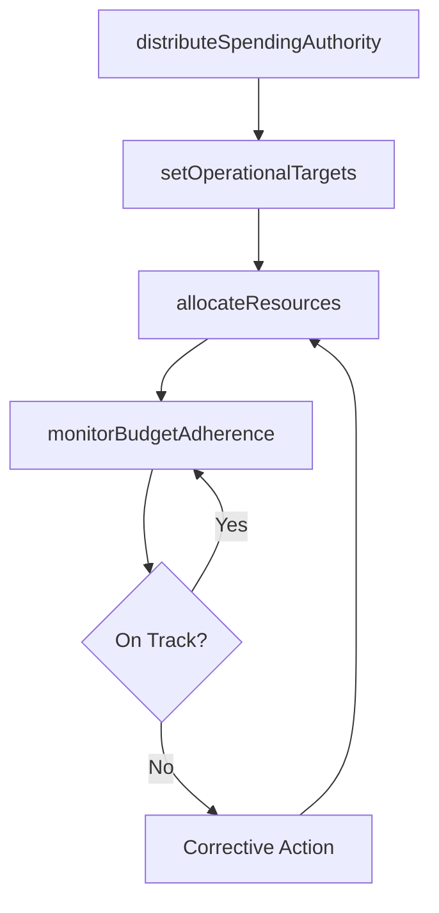

# Operationalize and implement plans to achieve budget

> Business-as-Code definition for budget operationalization. Models the translation of approved budgets into departmental spending authorities, resource allocations, and operational targets.

## Overview

Putting budgeting plans into practical use keeping within designated forecasting parameters. This process translates approved budgets into departmental spending authorities, headcount plans, and operational targets that managers use day-to-day to guide resource consumption. Effective operationalization ensures that strategic intent encoded in the budget is reflected in procurement approvals, hiring decisions, and capital deployment. Continuous monitoring of budget adherence provides early warning signals when spending deviates from plan, enabling corrective action before variances become material.

## Process Hierarchy



## GraphDL

```yaml
operationalize:
  object: And Implement Plans To Achieve Budget
  actor: BudgetOwner
  result: OperationalSpendingPlan
```

## Actions

| Action | Description |
|--------|-------------|
| distributeSpendingAuthority | Assign approved budget amounts to cost center owners |
| setOperationalTargets | Define measurable performance targets aligned with budget |
| allocateResources | Deploy staff, capital, and operating resources per budget plan |
| monitorBudgetAdherence | Track actual spending against authorized budget in real time |

## Events

| Event | Description |
|-------|-------------|
| spendingAuthorityDistributed | Budget allocations communicated to cost center owners |
| operationalTargetsSet | Performance targets aligned with budget published |
| resourcesAllocated | Staff and resources deployed per budget plan |
| budgetAdherenceMonitored | Spending versus budget tracking report generated |

## Searches

| Search | Description |
|--------|-------------|
| getSpendingAuthority | Retrieve approved budget for a cost center or project |
| getOperationalTargets | Query performance targets by department or metric |
| getBudgetUtilization | Get real-time spending versus authorized budget |

## Process Flow



## RACI Matrix

| Activity | Responsible | Accountable | Consulted | Informed |
|----------|-------------|-------------|-----------|----------|
| distributeSpendingAuthority | FP&A Manager | CFO | Controller | Department Managers |
| setOperationalTargets | Department Managers | Business Unit Heads | FP&A | HR |
| allocateResources | FP&A Manager | CFO | HR | Procurement |
| monitorBudgetAdherence | FP&A Analyst | FP&A Manager | Cost Center Owners | CFO |

## Related Processes

| Process | Relationship |
|---------|-------------|
| 9.1.1.2 Prepare periodic budgets and plans | Upstream - approved budgets drive operationalization |
| 9.1.1.5 Perform variance analysis against forecasts and budgets | Downstream - adherence data feeds variance analysis |
| 9.1.1.1 Develop and maintain budget policies and procedures | Upstream - policies define spending authority rules and thresholds |
| 7.4 Manage employee relations | Parallel - headcount budgets govern hiring and workforce planning |

## Related Departments

| Department | Role |
|-----------|------|
| Financial Planning and Analysis | Distributes budgets and monitors adherence |
| All Departments | Execute operations within authorized spending limits |
| Human Resources | Supports staffing aligned with budget headcount |

## Related Occupations

| Occupation | Involvement |
|-----------|-------------|
| Budget Owner | Manages spending within authorized limits |
| FP&A Analyst | Monitors budget utilization and flags deviations |

## KPIs

| KPI | Description | Unit |
|-----|-------------|------|
| Budget Utilization Rate | Percentage of approved budget consumed | % |
| Target Achievement Rate | Percentage of operational targets met | % |
| Spending Variance | Deviation of actual spending from budget | % |

## Usage

```typescript
import { operationalizeAndImplementPlansToAchieveBudget } from '@headlessly/operationalize-and-implement-plans-to-achieve-budget'

const ops = operationalizeAndImplementPlansToAchieveBudget()

// Distribute spending authority to cost centers
await ops.distributeSpendingAuthority({
  fiscalYear: 2026,
  costCenter: 'CC-Engineering',
  approvedAmount: 2400000
})

// Monitor budget adherence
const status = await ops.getBudgetUtilization({
  costCenter: 'CC-Engineering',
  asOfDate: '2026-06-30'
})
```
