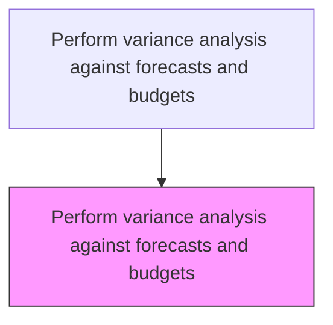
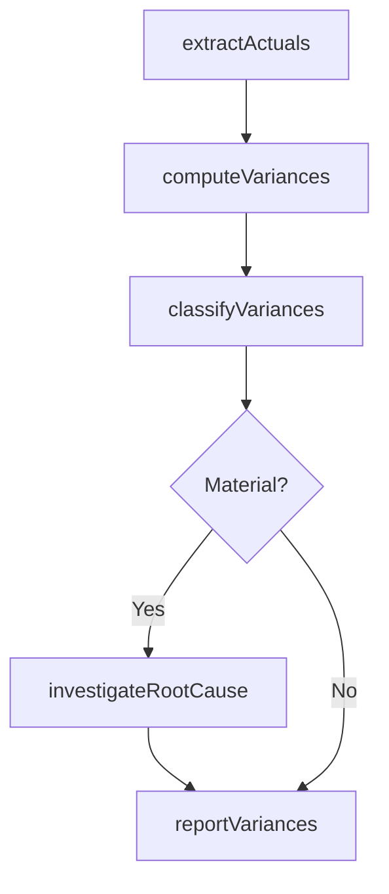

# Perform variance analysis against forecasts and budgets

> Business-as-Code definition for variance analysis against forecasts and budgets. Models the comparison of actual financial results to budgeted and forecasted amounts, identification of material deviations, and root cause investigation.

## Overview

Conducting a quantitative analysis between what was forecasted and budgeted and actual financial behavior. This process compares actual revenues, expenses, and cash flows against both the approved budget and the latest forecast, decomposing deviations into volume, rate, and mix components. Material variances are investigated for root cause and escalated to management with explanatory commentary. Rigorous variance analysis is the primary feedback loop in the planning cycle, enabling organizations to hold cost center owners accountable, recalibrate forecasts, and adjust operational plans before small deviations compound into significant financial misses.

## Process Hierarchy



## GraphDL

```yaml
perform:
  object: Variance Analysis Against Forecasts And Budgets
  actor: BudgetAnalyst
  result: VarianceReport
```

## Actions

| Action | Description |
|--------|-------------|
| extractActuals | Pull actual financial results from the general ledger |
| computeVariances | Calculate differences between actuals and budget/forecast amounts |
| classifyVariances | Categorize variances as favorable or unfavorable, volume or rate |
| investigateRootCause | Determine underlying drivers of material variances |
| reportVariances | Prepare and distribute variance commentary to management |

## Events

| Event | Description |
|-------|-------------|
| actualsExtracted | Actual financial data pulled for variance comparison |
| variancesComputed | Budget-to-actual and forecast-to-actual differences calculated |
| variancesClassified | Variances categorized by type and materiality |
| rootCauseInvestigated | Material variance root causes determined |
| variancesReported | Variance analysis report distributed to stakeholders |

## Searches

| Search | Description |
|--------|-------------|
| getVariancesByAccount | Retrieve variances for specific GL accounts or categories |
| getMaterialVariances | List variances exceeding the materiality threshold |
| getVarianceTrends | Query variance trends over multiple periods |

## Process Flow



## RACI Matrix

| Activity | Responsible | Accountable | Consulted | Informed |
|----------|-------------|-------------|-----------|----------|
| computeVariances | Budget Analyst | FP&A Manager | Accounting | Controller |
| investigateRootCause | Budget Analyst | FP&A Manager | Cost Center Owners | CFO |
| reportVariances | FP&A Manager | CFO | Business Unit Heads | Board |

## Related Processes

| Process | Relationship |
|---------|-------------|
| 9.1.1.4 Prepare periodic financial forecasts | Upstream - forecasts provide comparison baseline |
| 9.1.1.3 Operationalize and implement plans to achieve budget | Upstream - budget adherence data feeds variance calculations |
| 9.1.4 Evaluate and manage financial performance | Downstream - variances drive performance improvement actions |
| 9.3.2 Perform general accounting | Upstream - general ledger provides actual financial data for comparison |

## Related Departments

| Department | Role |
|-----------|------|
| Financial Planning and Analysis | Performs variance calculations and commentary |
| Accounting | Provides accurate actual financial data |
| All Departments | Explains variances within their areas of responsibility |

## Related Occupations

| Occupation | Involvement |
|-----------|-------------|
| Budget Analyst | Computes variances and investigates root causes |
| FP&A Manager | Reviews analysis and presents findings to leadership |

## KPIs

| KPI | Description | Unit |
|-----|-------------|------|
| Variance Reporting Timeliness | Days from period close to variance report delivery | Days |
| Material Variance Count | Number of variances exceeding materiality threshold | Count |
| Variance Explanation Rate | Percentage of material variances with documented root causes | % |

## Usage

```typescript
import { performVarianceAnalysisAgainstForecastsAndBudgets } from '@headlessly/perform-variance-analysis-against-forecasts-and-budgets'

const variance = performVarianceAnalysisAgainstForecastsAndBudgets()

// Compute variances for the quarter
const report = await variance.computeVariances({
  period: 'Q4-2025',
  compareTo: 'budget',
  materialityThreshold: 0.05
})

// Get material variances requiring investigation
const material = await variance.getMaterialVariances({
  period: 'Q4-2025',
  sortBy: 'absolute-amount'
})
```
