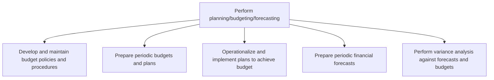
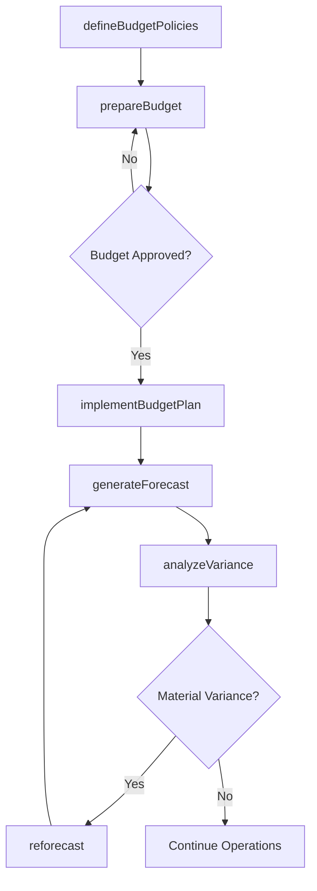

# Perform planning/budgeting/forecasting

> Business-as-Code definition for financial planning, budgeting, and forecasting. Models the full cycle of budget policy development, periodic budget preparation, plan operationalization, forecast generation, and variance analysis as programmable APIs.

## Overview

Allocating funds to meet future and current financial goals. Led by the chief financial officer, have the finance function plan, budget, and forecast in order to determine and describe long and short-term financial goals.

## Process Hierarchy



## GraphDL

```yaml
perform:
  object: Planning/budgeting/forecasting
  actor: BudgetAnalyst
  result: ApprovedBudget
```

## Actions

| Action | Description |
|--------|-------------|
| defineBudgetPolicies | Establish rules, timelines, and templates for budget preparation |
| prepareBudget | Compile department inputs into a consolidated operating budget |
| implementBudgetPlan | Translate approved budgets into operational spending authorities |
| generateForecast | Produce rolling financial forecasts using trend analysis |
| analyzeVariance | Compare actual results to budgets and forecasts to identify gaps |
| reforecast | Update forecasts based on variance analysis and changed assumptions |

## Events

| Event | Description |
|-------|-------------|
| budgetPoliciesDefined | Budget policies and procedures published for the cycle |
| budgetPrepared | Consolidated operating budget compiled and submitted for approval |
| budgetPlanImplemented | Approved budget distributed to departments as spending authority |
| forecastGenerated | Rolling financial forecast published to stakeholders |
| varianceAnalyzed | Budget-to-actual and forecast-to-actual variances reported |
| reforecasted | Revised forecast issued based on updated assumptions |

## Searches

| Search | Description |
|--------|-------------|
| getBudgetByDepartment | Retrieve approved budget amounts for a given department and period |
| getForecastVersions | List forecast revisions with assumptions for comparison |
| getVarianceSummary | Get variance amounts by account, department, or project |
| getBudgetTimeline | Retrieve budget cycle milestones and completion status |

## Process Flow



## RACI Matrix

| Activity | Responsible | Accountable | Consulted | Informed |
|----------|-------------|-------------|-----------|----------|
| defineBudgetPolicies | FP&A Manager | CFO | Controller | Business Unit Heads |
| prepareBudget | Budget Analyst | FP&A Manager | Department Managers | CFO |
| generateForecast | FP&A Analyst | FP&A Manager | Revenue Operations | Controller |
| analyzeVariance | Budget Analyst | FP&A Manager | Cost Center Owners | CFO |

## Sub-Processes

| ID | Name | Description |
|----|------|-------------|
| 9.1.1.1 | Develop and maintain budget policies and procedures | Formulating financial budgetary guidelines and strategies. Develop a framework for rules and regulat |
| 9.1.1.2 | Prepare periodic budgets and plans | Creating reports on a quarterly or annual basis for fund allocation. Create a financial statement th |
| 9.1.1.3 | Operationalize and implement plans to achieve budget | Putting budgeting plans into practical use keeping within designated forecasting parameters. |
| 9.1.1.4 | Prepare periodic financial forecasts | Creating estimates of the projected income and expenses required over a predetermined time frame. De |
| 9.1.1.5 | Perform variance analysis against forecasts and budgets | Conducting a quantitative analysis between what was forecasted and budgeted and actual financial beh |

## Related Processes

| Process | Relationship |
|---------|-------------|
| 9.1.2 Perform cost accounting and control | Downstream - budget feeds cost allocation targets |
| 9.1.4 Evaluate and manage financial performance | Downstream - variance data drives performance evaluation |
| 9.3 Perform general accounting and reporting | Parallel - actuals from GL inform budget comparisons |

## Related Departments

| Department | Role |
|-----------|------|
| Financial Planning and Analysis | Primary owner of budget development and forecasting |
| Accounting | Provides historical actuals for budget baseline |
| Operations | Submits volume assumptions and operational plans |
| Sales | Provides revenue projections and pipeline data |

## Related Occupations

| Occupation | Involvement |
|-----------|-------------|
| Budget Analyst | Compiles, validates, and consolidates budget submissions |
| Financial Analyst | Builds forecast models and performs variance analysis |
| FP&A Manager | Oversees the planning cycle and presents to leadership |

## KPIs

| KPI | Description | Unit |
|-----|-------------|------|
| Forecast Accuracy | Variance between forecast and actual results | % |
| Budget Cycle Time | Days from budget kickoff to final approval | Days |
| Number of Reforecasts | Count of forecast revisions per fiscal year | Count |
| Budget Participation Rate | Percentage of cost centers submitting budgets on time | % |

## Usage

```typescript
import { performPlanningBudgetingForecasting } from '@headlessly/perform-planning-budgeting-forecasting'

const planning = performPlanningBudgetingForecasting()

// Prepare consolidated budget for fiscal year
const budget = await planning.prepareBudget({
  fiscalYear: 2026,
  consolidationLevel: 'company-wide',
  baselineSource: 'prior-year-actuals'
})

// Analyze variances for the quarter
const variances = await planning.analyzeVariance({
  period: 'Q3-2025',
  materialityThreshold: 0.05
})
```
