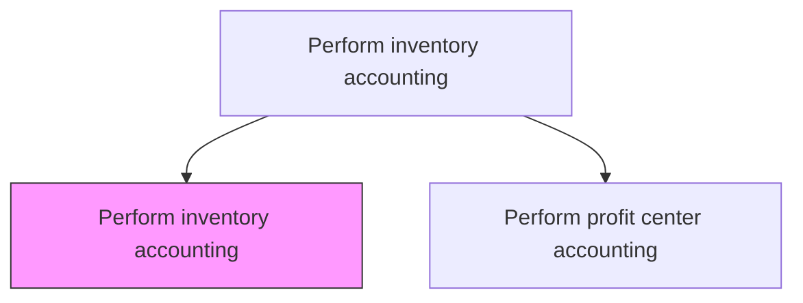
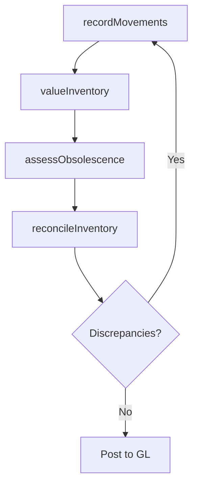

# Perform inventory accounting

> Business-as-Code definition for inventory accounting. Models inventory valuation, cost method application, obsolescence reserves, and inventory-to-GL reconciliation.

## Overview

Conducting accounting for assets, and finding reasons for changes such as depreciation, obsolescence, deterioration, changes in customer taste, increased demand, and decreased market supply. Inventory accounting applies valuation methods such as FIFO, LIFO, or weighted average to assign monetary values to on-hand stock, ensuring the balance sheet accurately reflects asset worth. The process also manages obsolescence reserves, reconciles physical counts to system records, and posts inventory transactions to the general ledger. Accurate inventory accounting directly impacts cost of goods sold, gross margin reporting, and tax obligations, making it essential for reliable financial statements and regulatory compliance.

## Process Hierarchy



## GraphDL

```yaml
perform:
  object: Inventory Accounting
  actor: CostAccountant
  result: InventoryValuationReport
```

## Actions

| Action | Description |
|--------|-------------|
| valueInventory | Calculate inventory balances using FIFO, LIFO, or weighted average |
| recordMovements | Post inventory receipts, issues, and transfers to the subledger |
| assessObsolescence | Evaluate slow-moving and obsolete inventory for write-down reserves |
| reconcileInventory | Match physical counts to system records and resolve discrepancies |

## Events

| Event | Description |
|-------|-------------|
| inventoryValued | Inventory cost valuation completed for the period |
| movementsRecorded | Inventory transactions posted to the subledger |
| obsolescenceAssessed | Slow-moving inventory reviewed and reserve adjustments recorded |
| inventoryReconciled | Physical inventory reconciled with system records |

## Searches

| Search | Description |
|--------|-------------|
| getInventoryValuation | Retrieve inventory value by location, category, or SKU |
| getObsolescenceReserve | Query reserve balances for slow-moving or obsolete items |
| getInventoryMovements | List receipts, issues, and transfers for a period |

## Process Flow



## RACI Matrix

| Activity | Responsible | Accountable | Consulted | Informed |
|----------|-------------|-------------|-----------|----------|
| valueInventory | Cost Accountant | Controller | Warehouse Manager | FP&A |
| assessObsolescence | Cost Accountant | Controller | Supply Chain | CFO |
| reconcileInventory | Cost Accountant | Controller | Warehouse | Internal Audit |

## Related Processes

| Process | Relationship |
|---------|-------------|
| 9.1.2.3 Perform cost of sales analysis | Downstream - inventory costs feed COGS calculation |
| 9.3.2 Perform general accounting | Downstream - inventory entries post to GL |
| 9.1.2.4 Perform product costing | Parallel - inventory valuation methods align with product cost standards |
| 9.5.2 Process accounts payable | Upstream - purchase receipts create inventory subledger entries |

## Related Departments

| Department | Role |
|-----------|------|
| Cost Accounting | Performs inventory valuation and reconciliation |
| Warehouse/Logistics | Provides physical inventory counts and movement data |
| Supply Chain | Manages inventory planning and obsolescence risk |

## Related Occupations

| Occupation | Involvement |
|-----------|-------------|
| Cost Accountant | Calculates inventory values and assesses obsolescence |
| Inventory Controller | Manages physical counts and discrepancy resolution |

## KPIs

| KPI | Description | Unit |
|-----|-------------|------|
| Inventory Accuracy | Match rate between physical count and system records | % |
| Inventory Turnover | Cost of goods sold divided by average inventory value | Ratio |
| Obsolescence Reserve Ratio | Reserve for obsolescence as a percentage of total inventory | % |

## Usage

```typescript
import { performInventoryAccounting } from '@headlessly/perform-inventory-accounting'

const inventory = performInventoryAccounting()

// Value inventory using weighted average
const valuation = await inventory.valueInventory({
  method: 'weighted-average',
  asOfDate: '2025-12-31',
  location: 'Warehouse-A'
})

// Assess obsolescence reserves
const reserve = await inventory.assessObsolescence({
  ageThreshold: 180,
  writeDownPercentage: 0.50
})
```
