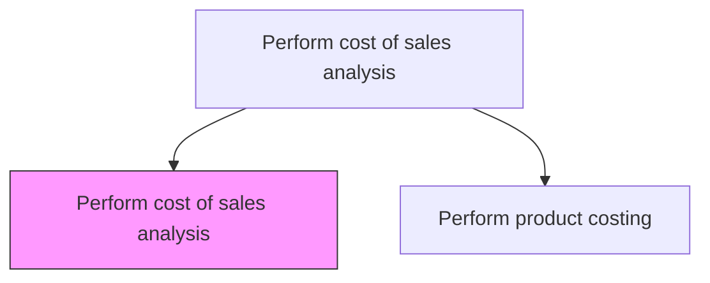
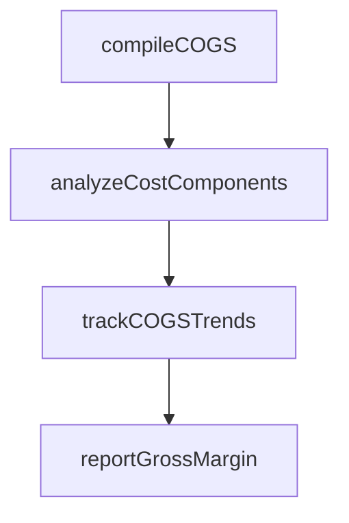

# Perform cost of sales analysis

> Business-as-Code definition for cost of sales analysis. Models the breakdown, tracking, and reporting of direct costs associated with producing goods sold, including materials, labor, and manufacturing overhead.

## Overview

Studying expenses directly associated with products sold during a period. Analyze the cost of sales, which encompasses raw materials, direct labor, and manufacturing overhead consumed in producing goods that generated revenue. This process breaks down COGS by cost element, product line, and channel to reveal margin drivers and identify cost escalation trends. Effective cost of sales analysis enables pricing adjustments, informs make-versus-buy decisions, and provides the gross margin visibility that leadership requires for strategic resource allocation.

## Process Hierarchy



## GraphDL

```yaml
perform:
  object: Cost Of Sales Analysis
  actor: CostAccountant
  result: COGSBreakdownReport
```

## Actions

| Action | Description |
|--------|-------------|
| compileCOGS | Aggregate materials, labor, and overhead into cost of goods sold |
| analyzeCostComponents | Break down COGS by cost element and product line |
| trackCOGSTrends | Monitor cost of sales trends over multiple periods |
| reportGrossMargin | Calculate and report gross margin by product or channel |

## Events

| Event | Description |
|-------|-------------|
| cogsCompiled | Cost of goods sold calculated for the period |
| costComponentsAnalyzed | COGS decomposed into materials, labor, and overhead by product line and channel |
| cogsTrendsTracked | Period-over-period cost trends documented |
| grossMarginReported | Gross margin report published to management |

## Searches

| Search | Description |
|--------|-------------|
| getCOGSByProduct | Retrieve cost of goods sold by product or product line |
| getGrossMarginTrends | Query gross margin percentages over time |
| getCostComponentBreakdown | Get COGS breakdown by materials, labor, and overhead |

## Process Flow



## RACI Matrix

| Activity | Responsible | Accountable | Consulted | Informed |
|----------|-------------|-------------|-----------|----------|
| compileCOGS | Cost Accountant | Controller | Manufacturing | FP&A |
| analyzeCostComponents | Cost Accountant | Controller | Procurement | Manufacturing Director |
| trackCOGSTrends | Cost Accountant | Controller | FP&A | Operations |
| reportGrossMargin | Cost Accountant | Controller | Sales | CFO |

## Related Processes

| Process | Relationship |
|---------|-------------|
| 9.1.2.1 Perform inventory accounting | Upstream - inventory values feed COGS calculation |
| 9.1.2.4 Perform product costing | Parallel - product costs are components of COGS |
| 9.1.2.6 Report on profitability | Downstream - gross margin data feeds profitability reports |
| 9.1.4.1 Assess customer and product profitability | Downstream - COGS by product supports profitability assessment |

## Related Departments

| Department | Role |
|-----------|------|
| Cost Accounting | Compiles and analyzes cost of sales data |
| Manufacturing | Provides production cost and volume data |
| Sales | Receives gross margin analysis for pricing decisions |

## Related Occupations

| Occupation | Involvement |
|-----------|-------------|
| Cost Accountant | Compiles COGS and performs component analysis |
| Financial Analyst | Uses COGS data for margin and pricing analysis |

## KPIs

| KPI | Description | Unit |
|-----|-------------|------|
| Gross Margin | Gross profit as a percentage of revenue | % |
| COGS as Percentage of Revenue | Total cost of goods sold relative to sales | % |
| Material Cost Ratio | Raw material costs as a percentage of total COGS | % |

## Usage

```typescript
import { performCostOfSalesAnalysis } from '@headlessly/perform-cost-of-sales-analysis'

const cogs = performCostOfSalesAnalysis()

// Get COGS breakdown by product line
const breakdown = await cogs.analyzeCostComponents({
  productLine: 'Industrial Equipment',
  period: 'Q4-2025'
})

// Track gross margin trends
const trends = await cogs.getGrossMarginTrends({
  periods: 8,
  granularity: 'quarterly'
})
```
