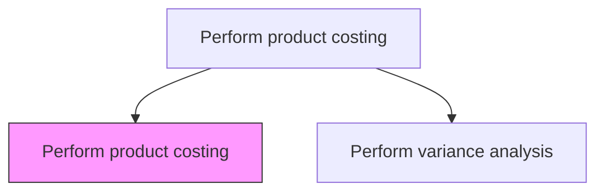
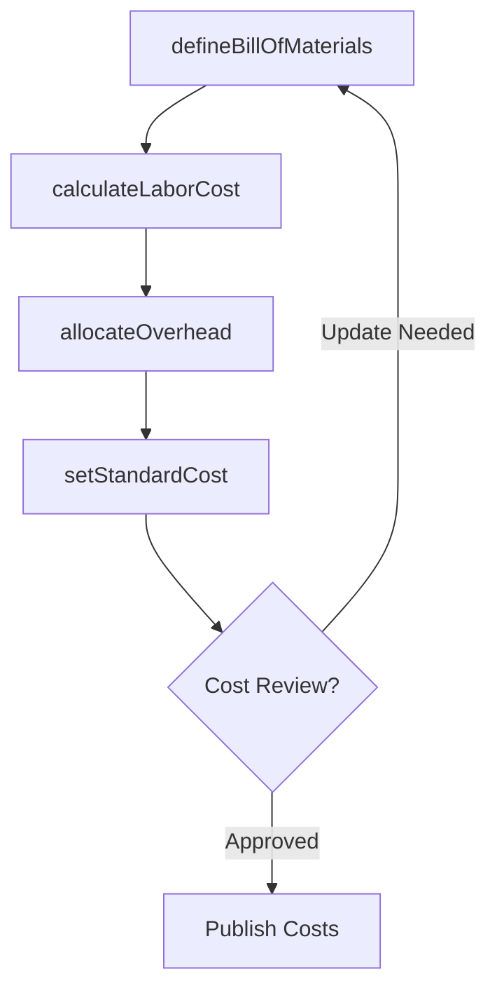

# Perform product costing

> Business-as-Code definition for product costing. Models the calculation of per-unit product costs including direct materials, direct labor, and allocated manufacturing overhead using standard or actual costing methods.

## Overview

Studying and finding out the relevant cost center for a product by studying every resource used in its making. Product costing calculates the per-unit cost of manufactured goods by aggregating direct materials from the bill of materials, direct labor from production routings, and allocated manufacturing overhead using activity-based or volume-based cost drivers. Standard costs established through this process serve as the pricing floor, the baseline for variance analysis, and the inventory valuation basis for financial statements. Maintaining accurate product costs is critical for profitable pricing decisions, make-versus-buy analysis, and identifying cost reduction opportunities in the production process.

## Process Hierarchy



## GraphDL

```yaml
perform:
  object: Product Costing
  actor: CostAccountant
  result: ProductCostSheet
```

## Actions

| Action | Description |
|--------|-------------|
| defineBillOfMaterials | Specify raw material quantities and costs for each product |
| calculateLaborCost | Compute direct labor cost per unit based on routing and rates |
| allocateOverhead | Apply manufacturing overhead to products using cost drivers |
| setStandardCost | Establish standard unit costs for pricing and variance analysis |

## Events

| Event | Description |
|-------|-------------|
| billOfMaterialsDefined | Product material specifications and costs established |
| laborCostCalculated | Direct labor cost per unit computed |
| overheadAllocated | Manufacturing overhead applied to product costs |
| standardCostSet | Standard product costs published for the period |

## Searches

| Search | Description |
|--------|-------------|
| getProductCostSheet | Retrieve detailed cost breakdown for a specific product |
| getStandardCosts | List current standard costs by product or category |
| getCostRollup | Get aggregated cost components across product lines |

## Process Flow



## RACI Matrix

| Activity | Responsible | Accountable | Consulted | Informed |
|----------|-------------|-------------|-----------|----------|
| defineBillOfMaterials | Cost Accountant | Controller | Engineering | Procurement |
| calculateLaborCost | Cost Accountant | Controller | Industrial Engineer | Manufacturing Director |
| allocateOverhead | Cost Accountant | Controller | Plant Controller | FP&A Manager |
| setStandardCost | Cost Accountant | Controller | Manufacturing | Product Manager |

## Related Processes

| Process | Relationship |
|---------|-------------|
| 9.1.2.3 Perform cost of sales analysis | Downstream - product costs feed COGS calculation |
| 9.1.2.5 Perform variance analysis | Downstream - standard costs provide baseline for variance analysis |
| 9.1.2.1 Perform inventory accounting | Parallel - product costs determine inventory valuation |
| 9.1.4.2 Evaluate new products | Consumer - product cost models inform new product feasibility |

## Related Departments

| Department | Role |
|-----------|------|
| Cost Accounting | Calculates and maintains product cost standards |
| Manufacturing | Provides production routing and labor data |
| Engineering | Defines bill of materials and product specifications |

## Related Occupations

| Occupation | Involvement |
|-----------|-------------|
| Cost Accountant | Calculates product costs and sets standards |
| Industrial Engineer | Provides routing and time study data for labor costing |

## KPIs

| KPI | Description | Unit |
|-----|-------------|------|
| Standard Cost Accuracy | Deviation of actual costs from standard costs | % |
| Cost Rollup Timeliness | Days to complete annual standard cost update | Days |
| Overhead Absorption Rate | Percentage of overhead absorbed versus actual overhead incurred | % |

## Usage

```typescript
import { performProductCosting } from '@headlessly/perform-product-costing'

const costing = performProductCosting()

// Calculate standard cost for a product
const cost = await costing.setStandardCost({
  productId: 'PRD-8200',
  effectiveDate: '2026-01-01',
  components: {
    materials: 42.50,
    labor: 18.75,
    overhead: 22.00
  }
})

// Get cost sheet for a product
const sheet = await costing.getProductCostSheet({
  productId: 'PRD-8200'
})
```
