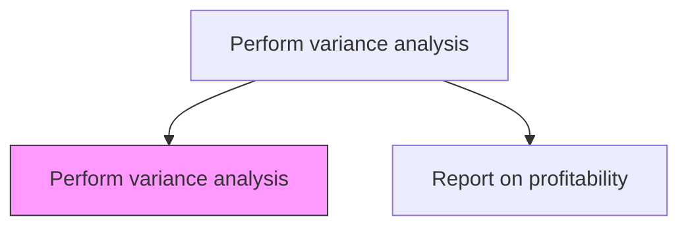
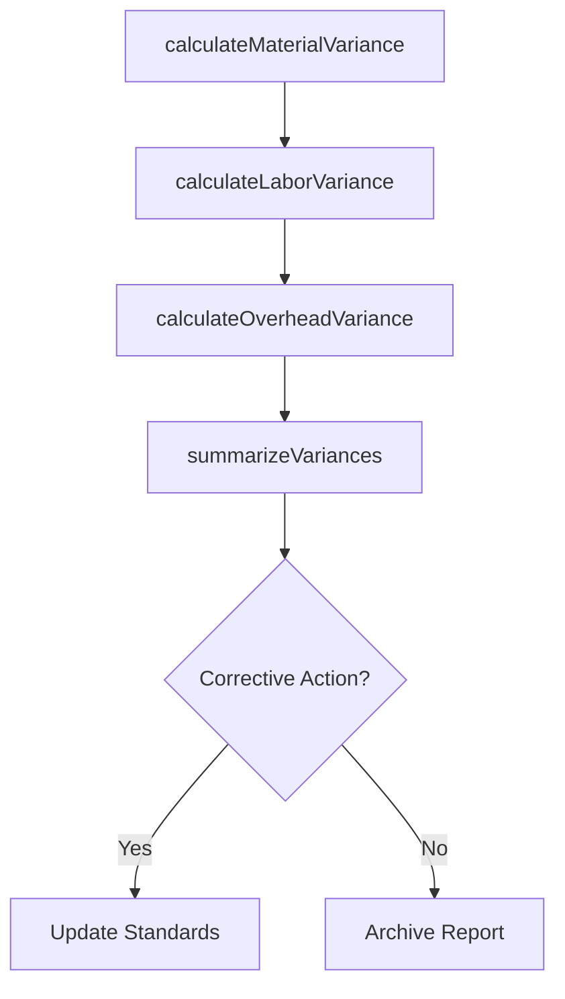

# Perform variance analysis

> Business-as-Code definition for cost variance analysis. Models the comparison of actual costs to standard or budgeted costs, decomposing deviations into material, labor, and overhead variances.

## Overview

Discovering the changes between forecasted and actual costing. Analyze actual and planned behavior by reviewing the amount of a variance on a trend line in order to maintain control over a business. This process decomposes cost deviations into material price and usage variances, labor rate and efficiency variances, and overhead spending and volume variances, providing granular visibility into where and why costs diverge from standards. Manufacturing and procurement leaders use these insights to negotiate better supplier contracts, improve production efficiency, and adjust standard costs. Timely variance analysis is essential for cost control, continuous improvement, and accurate product profitability assessment.

## Process Hierarchy



## GraphDL

```yaml
perform:
  object: Variance Analysis
  actor: CostAnalyst
  result: CostVarianceReport
```

## Actions

| Action | Description |
|--------|-------------|
| calculateMaterialVariance | Compute price and usage variances for raw materials |
| calculateLaborVariance | Determine rate and efficiency variances for direct labor |
| calculateOverheadVariance | Analyze spending and volume variances for manufacturing overhead |
| summarizeVariances | Consolidate all cost variances into a management report |

## Events

| Event | Description |
|-------|-------------|
| materialVarianceCalculated | Material price and usage variances computed |
| laborVarianceCalculated | Labor rate and efficiency variances determined |
| overheadVarianceCalculated | Overhead spending and volume variances analyzed |
| variancesSummarized | Cost variance summary report published |

## Searches

| Search | Description |
|--------|-------------|
| getVariancesByType | Retrieve variances by material, labor, or overhead category |
| getVarianceTrends | Query variance patterns over multiple periods |
| getMaterialVariances | List material price and usage variances by product |

## Process Flow



## RACI Matrix

| Activity | Responsible | Accountable | Consulted | Informed |
|----------|-------------|-------------|-----------|----------|
| calculateMaterialVariance | Cost Analyst | Controller | Procurement | Manufacturing |
| calculateLaborVariance | Cost Analyst | Controller | HR | Operations |
| summarizeVariances | Cost Analyst | Controller | FP&A | CFO |

## Related Processes

| Process | Relationship |
|---------|-------------|
| 9.1.2.4 Perform product costing | Upstream - standard costs provide variance baselines |
| 9.1.3 Perform cost management | Downstream - variances identify cost reduction targets |
| 9.1.2.6 Report on profitability | Downstream - variance data explains margin deviations in profitability reports |
| 9.1.1.5 Perform variance analysis against forecasts and budgets | Parallel - cost variances feed budget-level variance analysis |

## Related Departments

| Department | Role |
|-----------|------|
| Cost Accounting | Performs variance calculations and trend analysis |
| Manufacturing | Provides actual production cost data |
| Procurement | Explains material price variances |

## Related Occupations

| Occupation | Involvement |
|-----------|-------------|
| Cost Analyst | Calculates and decomposes cost variances |
| Cost Accountant | Reviews variances and recommends standard cost updates |

## KPIs

| KPI | Description | Unit |
|-----|-------------|------|
| Total Cost Variance | Aggregate deviation of actual from standard costs | USD |
| Favorable Variance Ratio | Percentage of variances that are favorable | % |
| Variance Investigation Rate | Percentage of material variances with documented root cause | % |

## Usage

```typescript
import { performVarianceAnalysis } from '@headlessly/perform-variance-analysis'

const variance = performVarianceAnalysis()

// Calculate material variances for the period
const materialVar = await variance.calculateMaterialVariance({
  period: '2025-12',
  productLine: 'Industrial Equipment'
})

// Get summarized variance report
const summary = await variance.summarizeVariances({
  period: '2025-12',
  includeTypes: ['material', 'labor', 'overhead']
})
```
