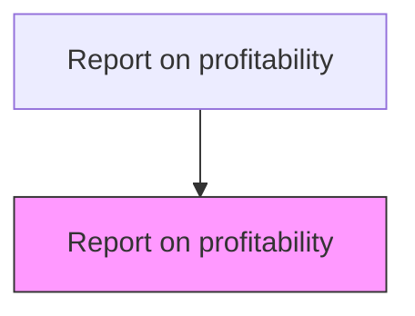
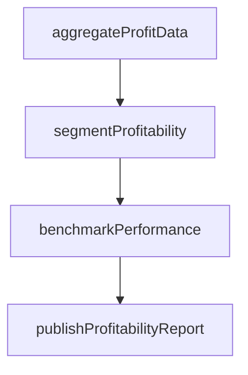

# Report on profitability

> Business-as-Code definition for profitability reporting. Models the preparation and distribution of profitability reports by product, customer segment, channel, and business unit.

## Overview

Making a report about revenues generated by the organization or business unit concerned. This process requires the organization to create a report which shows how business is generating profits. Profits are the part which is left after paying all expenses directly related to the generation of the revenue, such as producing a product, and other expenses related to conducting business activities.

## Process Hierarchy



## GraphDL

```yaml
report:
  object: On Profitability
  actor: ManagementAccountant
  result: ProfitabilityReport
```

## Actions

| Action | Description |
|--------|-------------|
| aggregateProfitData | Collect revenue, cost, and margin data across dimensions |
| segmentProfitability | Break down profitability by product, customer, and channel |
| benchmarkPerformance | Compare profitability metrics against targets and prior periods |
| publishProfitabilityReport | Distribute profitability analysis to management and stakeholders |

## Events

| Event | Description |
|-------|-------------|
| profitDataAggregated | Revenue and cost data consolidated for profitability analysis |
| profitabilitySegmented | Profitability calculated by product, customer, and channel |
| performanceBenchmarked | Profitability compared against targets and historical data |
| profitabilityReportPublished | Profitability report distributed to stakeholders |

## Searches

| Search | Description |
|--------|-------------|
| getProfitabilityBySegment | Retrieve profitability by product, customer, or channel |
| getProfitabilityTrends | Query profit margins over multiple periods |
| getTopPerformers | List highest and lowest profitability segments |

## Process Flow



## RACI Matrix

| Activity | Responsible | Accountable | Consulted | Informed |
|----------|-------------|-------------|-----------|----------|
| aggregateProfitData | Management Accountant | Controller | Accounting | FP&A |
| segmentProfitability | Management Accountant | Controller | FP&A | Sales Director |
| benchmarkPerformance | Management Accountant | Controller | FP&A Manager | Operations |
| publishProfitabilityReport | Management Accountant | CFO | Controller | Business Unit Heads |

## Related Processes

| Process | Relationship |
|---------|-------------|
| 9.1.2.2 Perform profit center accounting | Upstream - profit center data feeds profitability reports |
| 9.1.2.3 Perform cost of sales analysis | Upstream - COGS data provides the cost basis for margin calculations |
| 9.1.4.1 Assess customer and product profitability | Downstream - profitability data drives strategic decisions |
| 9.1.4.4 Optimize customer and product mix | Downstream - margin analysis informs portfolio mix adjustments |

## Related Departments

| Department | Role |
|-----------|------|
| Cost Accounting | Provides profitability data and analysis |
| Sales | Receives profitability insights for pricing decisions |
| Executive Leadership | Reviews profitability trends for strategic planning |

## Related Occupations

| Occupation | Involvement |
|-----------|-------------|
| Management Accountant | Prepares and distributes profitability reports |
| Financial Analyst | Analyzes profitability trends and benchmarks |

## KPIs

| KPI | Description | Unit |
|-----|-------------|------|
| Net Profit Margin | Net income as a percentage of total revenue | % |
| Contribution Margin | Revenue minus variable costs as a percentage of revenue | % |
| Report Distribution Timeliness | Days from period close to profitability report delivery | Days |

## Usage

```typescript
import { reportOnProfitability } from '@headlessly/report-on-profitability'

const profitReport = reportOnProfitability()

// Get profitability by customer segment
const segmented = await profitReport.segmentProfitability({
  dimension: 'customer-segment',
  period: 'Q4-2025'
})

// View top and bottom performers
const performers = await profitReport.getTopPerformers({
  dimension: 'product-line',
  period: '2025',
  count: 10
})
```
