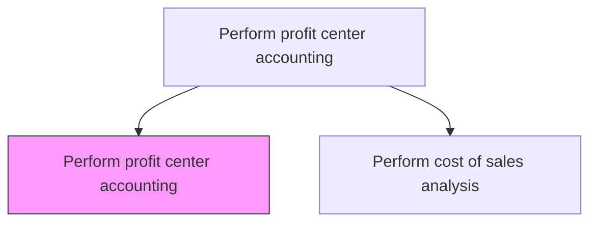
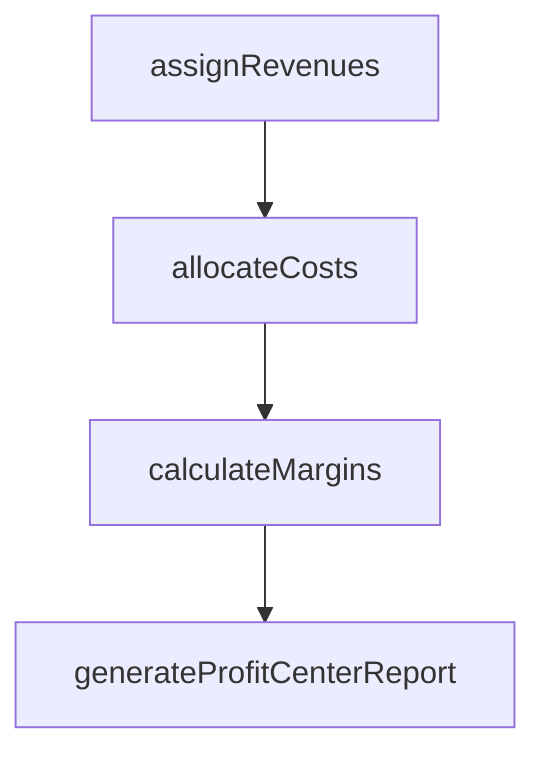

# Perform profit center accounting

> Business-as-Code definition for profit center accounting. Models the tracking of revenues, costs, and profit margins by business unit or profit center for internal management reporting.

## Overview

Determining the revenue, profits, and losses incurred by each unit within the organization that produces profit. Profit center accounting assigns revenues and allocates direct and shared costs to discrete business units, product lines, or geographic regions, producing internal income statements that reveal where the organization creates and destroys value. This process requires well-defined allocation rules for shared services, corporate overhead, and transfer pricing between segments. Accurate profit center results empower business unit leaders to manage their P&L, support investment decisions between segments, and provide the foundation for management incentive compensation.

## Process Hierarchy



## GraphDL

```yaml
perform:
  object: Profit Center Accounting
  actor: ManagementAccountant
  result: ProfitCenterStatement
```

## Actions

| Action | Description |
|--------|-------------|
| assignRevenues | Allocate revenue streams to the appropriate profit centers |
| allocateCosts | Distribute direct and shared costs to profit centers |
| calculateMargins | Compute contribution margin and operating profit by profit center |
| generateProfitCenterReport | Produce income statements for each profit center |

## Events

| Event | Description |
|-------|-------------|
| revenuesAssigned | Revenue allocated to profit centers for the period |
| costsAllocated | Costs distributed to profit centers using allocation rules |
| marginsCalculated | Contribution margins computed for each profit center |
| profitCenterReportGenerated | Profit center income statements published |

## Searches

| Search | Description |
|--------|-------------|
| getProfitCenterResults | Retrieve P&L by profit center and period |
| getProfitCenterRanking | List profit centers ranked by margin or revenue |
| getCostAllocations | Query cost allocation details by profit center |

## Process Flow



## RACI Matrix

| Activity | Responsible | Accountable | Consulted | Informed |
|----------|-------------|-------------|-----------|----------|
| assignRevenues | Management Accountant | Controller | Sales Director | Business Unit Heads |
| allocateCosts | Cost Accountant | Controller | Business Unit Heads | FP&A |
| calculateMargins | Management Accountant | Controller | FP&A Manager | Finance Director |
| generateProfitCenterReport | Management Accountant | CFO | Controller | Business Unit Heads |

## Related Processes

| Process | Relationship |
|---------|-------------|
| 9.1.2.6 Report on profitability | Downstream - profit center data feeds profitability reports |
| 9.1.2.3 Perform cost of sales analysis | Upstream - COGS data provides cost basis for profit center margins |
| 9.1.4.1 Assess customer and product profitability | Parallel - segment profitability uses profit center data |
| 9.1.1.2 Prepare periodic budgets and plans | Parallel - profit center budgets establish performance targets |

## Related Departments

| Department | Role |
|-----------|------|
| Cost Accounting | Manages allocation rules and profit center reporting |
| Business Units | Own their profit center results and cost management |
| Finance | Reviews profit center performance against targets |

## Related Occupations

| Occupation | Involvement |
|-----------|-------------|
| Management Accountant | Produces profit center statements and analysis |
| Cost Accountant | Defines and applies cost allocation methodologies |

## KPIs

| KPI | Description | Unit |
|-----|-------------|------|
| Profit Center Margin | Operating profit as a percentage of revenue by profit center | % |
| Cost Allocation Accuracy | Percentage of costs correctly attributed to profit centers | % |
| Reporting Timeliness | Days from period close to profit center report delivery | Days |

## Usage

```typescript
import { performProfitCenterAccounting } from '@headlessly/perform-profit-center-accounting'

const profitCenters = performProfitCenterAccounting()

// Generate profit center report
const report = await profitCenters.generateProfitCenterReport({
  profitCenter: 'PC-NorthAmerica',
  period: 'Q4-2025'
})

// Rank profit centers by margin
const ranking = await profitCenters.getProfitCenterRanking({
  period: '2025',
  metric: 'contribution-margin'
})
```
