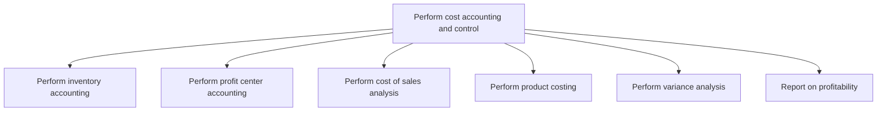
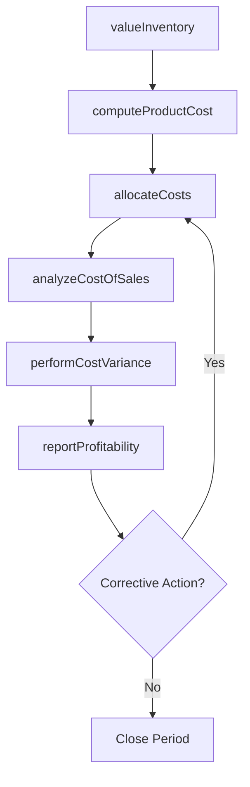

# Perform cost accounting and control

> Business-as-Code definition for cost accounting and control operations. Models inventory valuation, profit center reporting, cost-of-sales analysis, product costing, variance analysis, and profitability reporting as programmable APIs.

## Overview

Defining costs to be incurred and methods for optimum utilization. Determine the costs of products, processes, projects, etc. to compile in the financial statements, as well as to assist management in making decisions regarding planning and control. Control costs by managing and reducing business expenses.

## Process Hierarchy



## GraphDL

```yaml
perform:
  object: Cost Accounting And Control
  actor: CostAccountant
  result: CostAnalysisReport
```

## Actions

| Action | Description |
|--------|-------------|
| valueInventory | Calculate inventory costs using standard, average, or FIFO methods |
| allocateCosts | Assign direct and indirect costs to products, services, or profit centers |
| analyzeCostOfSales | Break down cost components of goods sold by product line |
| computeProductCost | Calculate full unit cost including materials, labor, and overhead |
| performCostVariance | Compare actual costs to standard or budgeted costs |
| reportProfitability | Generate profitability reports by product, customer, or segment |

## Events

| Event | Description |
|-------|-------------|
| inventoryValued | Inventory cost valuation completed for the period |
| costsAllocated | Cost allocation applied to products and profit centers |
| costOfSalesAnalyzed | Cost of goods sold breakdown completed |
| productCostComputed | Standard product cost calculated or updated |
| costVariancePerformed | Cost variance analysis completed for the period |
| profitabilityReported | Profitability report published to management |

## Searches

| Search | Description |
|--------|-------------|
| getProductCosts | Retrieve unit cost breakdown for specified products |
| getProfitCenterResults | Query profit and loss by profit center and period |
| getCostVariances | Get cost variances by type (material, labor, overhead) |
| getInventoryValuation | Retrieve inventory valuation summary by location or category |

## Process Flow



## RACI Matrix

| Activity | Responsible | Accountable | Consulted | Informed |
|----------|-------------|-------------|-----------|----------|
| valueInventory | Cost Accountant | Controller | Warehouse Manager | FP&A Manager |
| computeProductCost | Cost Accountant | Controller | Manufacturing | Product Manager |
| performCostVariance | Cost Analyst | Controller | Operations Manager | CFO |
| reportProfitability | Cost Accountant | Controller | Business Unit Heads | CFO |

## Sub-Processes

| ID | Name | Description |
|----|------|-------------|
| 9.1.2.1 | Perform inventory accounting | Conducting accounting for assets, and finding reasons for changes (depreciation, obsolescence, deter |
| 9.1.2.2 | Perform profit center accounting | Determining the revenue, profits, and losses incurred by each unit within the organization that prod |
| 9.1.2.3 | Perform cost of sales analysis | Studying expenses directly associated with product. Analyze the cost of sales, which is the cost of  |
| 9.1.2.4 | Perform product costing | Studying and finding out the relevant cost center for a product by studying every resource used in i |
| 9.1.2.5 | Perform variance analysis | Discovering the changes between forecasted and actual costing. Analyze actual and planned behavior b |
| 9.1.2.6 | Report on profitability | Making a report about revenues generated by the organization or business unit concerned. This proces |

## Related Processes

| Process | Relationship |
|---------|-------------|
| 9.1.1 Perform planning/budgeting/forecasting | Upstream - budget targets set cost benchmarks |
| 9.1.3 Perform cost management | Downstream - cost analysis identifies optimization opportunities |
| 9.3.2 Perform general accounting | Parallel - cost entries post to general ledger |

## Related Departments

| Department | Role |
|-----------|------|
| Cost Accounting | Primary owner of product costing and variance analysis |
| Manufacturing | Provides production data for cost allocation |
| Supply Chain | Supplies materials cost and inventory movement data |
| Finance | Uses cost data for profitability and performance reporting |

## Related Occupations

| Occupation | Involvement |
|-----------|-------------|
| Cost Accountant | Product costing, inventory valuation, and cost allocation |
| Cost Analyst | Variance analysis and profitability reporting |
| Management Accountant | Internal cost reporting and decision support |

## KPIs

| KPI | Description | Unit |
|-----|-------------|------|
| Standard Cost Accuracy | Deviation of actual costs from standard costs | % |
| Inventory Accuracy | Match rate between physical inventory and system records | % |
| Cost Allocation Timeliness | Days to complete cost allocation after period close | Days |
| Gross Margin by Product | Gross profit percentage by product line | % |

## Usage

```typescript
import { performCostAccountingAndControl } from '@headlessly/perform-cost-accounting-and-control'

const costing = performCostAccountingAndControl()

// Compute product cost for a product line
const cost = await costing.computeProductCost({
  productId: 'PRD-4520',
  method: 'standard',
  includeOverhead: true
})

// Get profitability by profit center
const profitability = await costing.reportProfitability({
  profitCenter: 'PC-West',
  period: 'Q4-2025'
})
```
