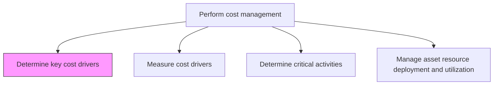
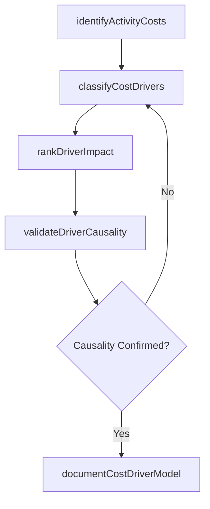

# Determine key cost drivers

> Business-as-Code definition for cost driver identification. Models the analysis and classification of factors that cause costs to increase or decrease across business activities and processes.

## Overview

Defining cost drivers for a particular activity. Cost drivers are the measurable factors -- such as transaction volume, machine hours, headcount, or order complexity -- that cause costs to increase or decrease as activity levels change. This process maps activities to their associated cost pools, classifies drivers by type, and validates statistical correlation between driver volumes and actual cost behavior. Identifying the right cost drivers is foundational to activity-based costing, enabling accurate product costing, meaningful overhead allocation, and targeted cost reduction efforts that address root causes rather than symptoms.

## Process Hierarchy



## GraphDL

```yaml
determine:
  object: Key Cost Drivers
  actor: CostAnalyst
  result: CostDriverCatalog
```

## Actions

| Action | Description |
|--------|-------------|
| identifyActivityCosts | Map activities to their associated cost pools and resource consumption |
| classifyCostDrivers | Categorize cost drivers as volume-based, transaction-based, or complexity-based |
| rankDriverImpact | Prioritize cost drivers by their relative impact on total costs |
| validateDriverCausality | Confirm statistical correlation between drivers and cost behavior |
| documentCostDriverModel | Record the cost driver framework and allocation methodology |

## Events

| Event | Description |
|-------|-------------|
| activityCostsIdentified | Activities mapped to cost pools with resource consumption patterns documented |
| costDriversClassified | Cost drivers categorized by type and behavior |
| driverImpactRanked | Cost drivers prioritized by financial impact |
| driverCausalityValidated | Statistical correlation between drivers and costs confirmed |
| costDriverModelDocumented | Cost driver framework published for use in allocation |

## Searches

| Search | Description |
|--------|-------------|
| getCostDriversByActivity | Retrieve cost drivers associated with a specific activity |
| getDriverImpactRanking | List cost drivers ranked by their impact on total costs |
| getCostDriverHistory | Query changes to cost driver classifications over time |

## Process Flow



## RACI Matrix

| Activity | Responsible | Accountable | Consulted | Informed |
|----------|-------------|-------------|-----------|----------|
| identifyActivityCosts | Cost Analyst | Controller | Operations Managers | FP&A |
| classifyCostDrivers | Cost Analyst | Controller | Process Owners | Finance Director |
| rankDriverImpact | Cost Analyst | Controller | FP&A | CFO |
| documentCostDriverModel | Cost Analyst | Controller | Internal Audit | Business Unit Heads |

## Related Processes

| Process | Relationship |
|---------|-------------|
| 9.1.3.2 Measure cost drivers | Downstream - identified drivers are quantified |
| 9.1.3.3 Determine critical activities | Parallel - activity analysis informs cost driver identification |
| 9.1.2.4 Perform product costing | Consumer - cost drivers feed product cost allocation |

## Related Departments

| Department | Role |
|-----------|------|
| Cost Accounting | Identifies and classifies cost drivers |
| Operations | Provides activity data and process insights |
| Finance | Reviews cost driver models for accuracy |
| Manufacturing | Supplies production volume and complexity data |

## Related Occupations

| Occupation | Involvement |
|-----------|-------------|
| Cost Analyst | Performs cost driver analysis and classification |
| Management Accountant | Integrates cost drivers into management reporting |
| Process Engineer | Provides activity-level data for driver identification |

## KPIs

| KPI | Description | Unit |
|-----|-------------|------|
| Cost Driver Coverage | Percentage of total costs explained by identified drivers | % |
| Driver Accuracy Rate | Correlation coefficient between drivers and actual cost behavior | R-squared |
| Model Update Frequency | How often the cost driver model is reviewed and refreshed | Per Year |

## Usage

```typescript
import { determineKeyCostDrivers } from '@headlessly/determine-key-cost-drivers'

const drivers = determineKeyCostDrivers()

// Identify cost drivers for a department
const departmentDrivers = await drivers.identifyActivityCosts({
  department: 'Manufacturing',
  period: 'Q4-2025'
})

// Rank drivers by impact
const ranked = await drivers.getDriverImpactRanking({
  scope: 'enterprise',
  threshold: 0.05
})
```
